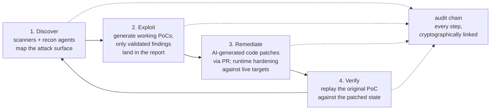
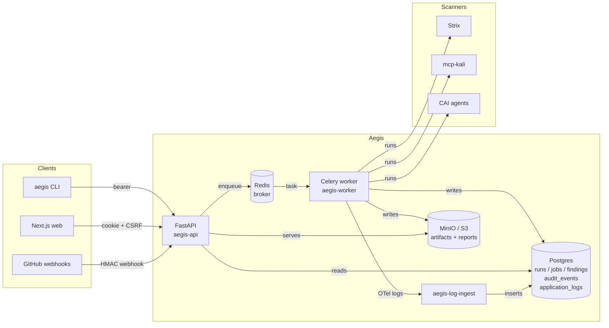

# Aegis

> **Discover. Exploit. Remediate. Harden.**
>
> A full-lifecycle AI security platform that closes the loop from
> *"we found a vulnerability"* to *"we shipped the fix"* — and proves
> the whole trail on a tamper-evident audit log.

Aegis unifies four production-grade open-source security tools —
[**Strix**](https://github.com/usestrix/strix) (autonomous DAST),
[**CAI**](https://github.com/aliasrobotics/cai) (multi-agent LLM
runtime), [**mcp-kali-server**](https://gitlab.com/kalilinux/packages/mcp-kali-server)
(offensive toolbelt over MCP), and [**vulnerability-fixer**](https://github.com/OpenHands/vulnerability-fixer)
(remediation harness) — into one multi-user platform. Every action,
from the first scan to the merged pull request, is gated by RBAC and
recorded on a hash-chained audit log, so the question *"what did the
platform do, against what target, on whose authority?"* always has a
verifiable answer.

---

## Why this exists

Modern security has three structural problems that point-tools don't
solve:

| Problem | What it looks like |
|---|---|
| **Security can't keep up.** | Teams deploy continuously; pentests happen annually. Vulnerabilities ship undetected for months. |
| **Finding isn't fixing.** | Pentest reports pile up while developers struggle to interpret findings. Mean-time-to-remediate stays high. |
| **Tools are siloed.** | Scanners, exploit tools, and remediation live in separate worlds. No platform closes the loop end-to-end. |

Aegis is the loop. One platform turns *"vulnerability detected"* into
*"PR merged, fix verified"* without manual hand-off.

---

## The lifecycle



Concretely, against a target you control:

```bash
aegis demo --repo /path/to/juice-shop --apply
```

…walks Strix → CAI → patch → verify → report in one command, with
the entire trail on `aegis audit verify ✓`.

---

## Where Aegis is today

Aegis is **operational software**, not a vision deck. The v0.8.0 tag
shipped June 2026 with 1211 tests passing (18 skipped offline) on Python
3.12 and 3.13.

| Capability | Status |
|---|---|
| Offline CLI lifecycle (`scan` → `fix` → `verify` → `report`) | ✅ Shipped |
| Multi-user FastAPI + Postgres + Celery backend | ✅ Shipped |
| Browser auth — Keycloak + NextAuth + Aegis-signed cookie | ✅ Shipped |
| CSRF double-submit, CSP-hardened HTML reports, WS Origin gate | ✅ Shipped |
| Hash-chained audit log with CLI / admin verifier | ✅ Shipped |
| GitHub PR-scoped scans with fork-restricted mode | ✅ Shipped |
| Three-profile observability (Postgres mirror / Loki / Elasticsearch) | ✅ Shipped |
| Scanner adapters: Strix · Trivy · Semgrep · Nuclei · ZAP · CodeQL · Bandit · Grype · Checkov · Trufflehog · SonarQube · Syft · Bumblebee · Deepsec | ✅ Shipped |
| Kali toolbelt via MCP — nmap, sqlmap, nikto, hydra, +6 more | ✅ Shipped |
| CAI agents: 16 wired (CodeAgent, BlueteamAgent, Recon, +13), runnable via `POST /v1/agents/{name}/run` | ✅ Shipped |
| Unified human-in-the-loop gate (propose → approve → act) across agents, Kali tools, and remediation | ✅ Shipped |
| Agentic remediation strategy (vuln-fixer engine) — diff by default, opens the human-reviewed PR on approval | ✅ Shipped |
| Multi-format finding ingestion (Snyk · Veracode · Trivy · SARIF → `AegisFinding`) | ✅ Shipped |
| Per-task LLM routing with budget caps | ✅ Shipped |
| `@aegis/design-system` workspace + Storybook | ✅ Shipped |
| 60+ specialized agents (full roster from the OnePager) | 🔨 Roadmap |
| 35+ security tools (currently 24: 10 Kali + 14 scanner adapters) | 🔨 Roadmap |
| Authenticated DAST flows | 🔨 Roadmap |
| Sandbox isolation per scan (gVisor / Firecracker) | 🔨 Roadmap |

See [`CHANGELOG.md`](CHANGELOG.md) for the per-release detail and
[`docs/architecture/overview.md`](docs/architecture/overview.md) §
"What's deferred" for the full roadmap list.

---

## What Aegis does for a single finding

When a scanner produces a finding, Aegis can:

1. **Validate** it by replaying / generating a proof-of-concept. Only
   findings with a working PoC reach the report — no severity-by-
   inspection hand-waves.
2. **Remediate** it. Either as a code patch landed via a GitHub PR
   (the CAI `CodeAgent` generates the diff; `aegis fix --apply
   --open-pr` ships it on a deterministic branch with auto-rollback
   on failure), or as a runtime hardening change against a live
   target (the CAI `BlueteamAgent`).
3. **Verify** the fix. The original PoC is replayed against the
   patched state; the verifier reports `verified` / `still_vulnerable` /
   `inconclusive` and lifts the result onto `findings.validation_state`.
4. **Report** the whole trail. Markdown / JSON / HTML reports stream
   from the API with strict CSP, `X-Content-Type-Options: nosniff`,
   and `Content-Disposition: inline`. The audit chain confirms what
   ran, who triggered it, against what target.

Every step is RBAC-checked server-side (the web `<RoleGated>` is
cosmetic) and emits a chained audit event *before* the worker task is
enqueued — a worker crash mid-enqueue can never produce a half-state.

---

## Get started

### Offline CLI (Python only, no Docker)

```bash
python -m venv .venv && source .venv/bin/activate
pip install -e ".[test,dev]"
aegis init                          # write a default aegis.yaml
aegis demo --repo /path/to/juice-shop --apply
aegis audit verify --all            # ✓
```

The offline path needs no Postgres, Keycloak, or Redis. Findings +
reports land in `./aegis_output/runs/<run-id>/`; audit events on a
local JSONL chain alongside.

### Full stack (Postgres, Keycloak, MinIO, API, worker, web)

```bash
cd deploy
make up            # default profile — API on :8000, web on :3300
make seed          # optional: Keycloak realm + sample project
```

Opt-in observability:

```bash
docker compose --profile obs up         # + OTel Collector + Loki + Jaeger
docker compose --profile obs-search up  # + Elasticsearch + Kibana
```

Sign in via Keycloak (`admin/adminpass` in dev), or — for scripted
access — set `AEGIS_TOKEN=dev:<email>` and run `aegis --api <cmd>`.

### Tests

```bash
pytest -q                                              # 237 + 3 skipped
AEGIS_E2E=1 AEGIS_DISABLE_LLM=1 pytest -q tests/e2e/   # deterministic E2E
pnpm --filter @aegis/web storybook                     # design-system stories
```

---

## Architecture



The architecture deep dive — full deployment topology, the
admission-vs-execution service split, the data model, every auth
path, the OTel pipeline — lives in
[`docs/architecture/overview.md`](docs/architecture/overview.md).

---

## Open-source foundation

| Component | Role | License |
|---|---|---|
| [`usestrix/strix`](https://github.com/usestrix/strix) | Application security engine — 21+ vulnerability classes, multi-agent DAST, headless CI/CD-friendly mode | Apache-2.0 |
| [`aliasrobotics/cai`](https://github.com/aliasrobotics/cai) | Multi-domain agent framework — red + blue + DFIR agents, 300+ LLM model routing via litellm | MIT |
| [`kalilinux/mcp-kali-server`](https://gitlab.com/kalilinux/packages/mcp-kali-server) | Tool execution layer — Kali Linux arsenal (nmap, Metasploit, sqlmap, hydra, …) over an MCP-style HTTP API | MIT |
| [`OpenHands/vulnerability-fixer`](https://github.com/OpenHands/vulnerability-fixer) | Remediation harness — common-schema parsing, AI fix generation, auto-PR | MIT |
| [`shadcn-ui/ui`](https://github.com/shadcn-ui/ui) | Design-system primitive registry — generated into `@aegis/design-system` via `pnpm dlx shadcn add` | MIT |
| [`opentelemetry-collector-contrib`](https://github.com/open-telemetry/opentelemetry-collector-contrib) | Observability fan-out (Loki + Jaeger + Postgres mirror via `aegis-log-ingest`) | Apache-2.0 |

Each upstream is vendored as a pinned-SHA submodule. See
[`project_repos/AEGIS_VENDORED.md`](project_repos/AEGIS_VENDORED.md)
for the manifest and the
[ADR](docs/adr/0001-vendored-submodules.md) for the rebase policy.

---

## Who Aegis is for

- **National security & DoD programs.** Continuous security testing
  with automatic remediation across mission-critical systems, plus a
  cryptographically verifiable audit trail for every action.
- **Federal civilian agencies.** Full-lifecycle automation from
  discovery through verified fix deployment, with FISMA-aligned RBAC
  + audit.
- **Enterprise DevSecOps.** Close the loop from finding to fix
  *inside* the CI/CD pipeline. PR-scoped scans, Check Run posting,
  bot-driven fix PRs — no manual hand-off.

---

## Documentation

A browseable docs site is built from the same markdown via MkDocs
Material:

```bash
pip install -e ".[docs]"
make docs-serve              # http://localhost:8001
make docs-build-strict       # fail on broken links / unreffed pages
```

Pushes to `main` deploy to GitHub Pages via
[`.github/workflows/docs.yml`](.github/workflows/docs.yml).

### Topic map

| Topic | Doc |
|---|---|
| System architecture (mermaid diagrams) | [`docs/architecture/overview.md`](docs/architecture/overview.md) |
| Auth — cookie / bearer / WS / worker SA | [`docs/architecture/auth.md`](docs/architecture/auth.md) |
| Hash-chained audit log | [`docs/architecture/audit-chain.md`](docs/architecture/audit-chain.md) |
| Logs, traces, metrics pipeline | [`docs/architecture/observability.md`](docs/architecture/observability.md) |
| `/v1/*` HTTP API reference | [`docs/api/v1.md`](docs/api/v1.md) |
| Production deployment runbook | [`docs/ops/deploy.md`](docs/ops/deploy.md) |
| Local development stack | [`docs/dev/local-stack.md`](docs/dev/local-stack.md) |
| Frontend (workspace, design system, Storybook) | [`docs/dev/frontend.md`](docs/dev/frontend.md) |
| Security posture | [`SECURITY.md`](SECURITY.md) |
| Fork-PR safety policy | [`docs/security/fork-prs.md`](docs/security/fork-prs.md) |
| Contributing | [`CONTRIBUTING.md`](CONTRIBUTING.md) |
| Vendored upstreams (pinned SHAs) | [`project_repos/AEGIS_VENDORED.md`](project_repos/AEGIS_VENDORED.md) |
| ADRs | [`docs/adr/0001-vendored-submodules.md`](docs/adr/0001-vendored-submodules.md) |

Legacy planning docs and phase-3 snapshots live under
[`docs/architecture/legacy/`](docs/architecture/legacy/README.md) —
kept for history, not for orientation.

### Release history

| Release | Theme | Tag |
|---|---|---|
| Phase 2 | Offline CLI: discover → fix → verify | (no tag) |
| Phase 3 | Multi-user backend platform | `v0.3.0` |
| Phase 4 v0.3.1 | Stabilization (audit, admission, project access) | `v0.3.1` |
| Phase 4 v0.4.0 | Identity & UX (NextAuth, CSRF, CSP, design system) | `v0.4.0` |
| Phase 4 v0.4.1 | Observability + GitHub PR scoping | `v0.4.1` |

Full per-release detail in [`CHANGELOG.md`](CHANGELOG.md).

---

## Project layout

```
aegis/                  Python package — services, API, workers, audit
  api/                  FastAPI app + routes + middleware
  audit/                hash-chained audit (chain, writers, forensic)
  cli/                  argparse entry point + --api dispatch client
  db/                   SQLAlchemy models + Alembic migrations
  log_ingest/           OTLP/Logs → Postgres mirror service
  policy/               CI gate policy (no Celery dependency)
  remediate/            CAI runner + patch / deps workflows
  scanners/             scanner adapters (Strix, Trivy, Semgrep, Nuclei)
  services/             admission + execution services (CLI + API + worker)
  workers/              Celery tasks + bootstrap

web/                    Next.js 14 app (@aegis/web workspace package)
  src/app/              App-router pages + NextAuth route
  src/lib/              api() helper, auth helpers
  src/hooks/            useRoles, etc.
  .storybook/           Storybook 8 config

project_repos/          Vendored upstreams pinned at SHAs
  cai, strix, mcp-kali-server, vulnerability-fixer
  shadcn-ui, opentelemetry-collector-contrib
  design-system/        @aegis/design-system workspace package

deploy/                 Docker compose stack + service Dockerfiles
docs/                   Architecture, API, ops, dev, security, ADRs
hooks/                  mkdocs build hooks (README-as-index)
tests/                  pytest suite (unit + integration markers)
```

---

## License

Apache-2.0 unless a vendored submodule states otherwise. See
[`project_repos/AEGIS_VENDORED.md`](project_repos/AEGIS_VENDORED.md)
for the upstream license matrix.
