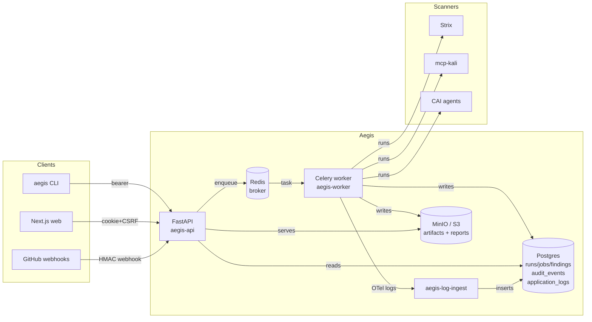

# Aegis

Aegis is a security platform that turns four open-source security
tools — **Strix** (dynamic scanner), **CAI** (LLM agent runtime),
**mcp-kali-server** (offensive tooling), **vulnerability-fixer**
(remediation harness) — into one auditable, multi-user pipeline that
finds vulnerabilities, fixes them, verifies the fix, and reports the
outcome.

Each step is gated by a hash-chained audit log, so the question
"what did the platform do, against what target, on whose authority?"
always has a verifiable answer.

| Release | Theme                                | Tag      |
|---------|--------------------------------------|----------|
| Phase 2 | Offline CLI: discover → fix → verify | (no tag) |
| Phase 3 | Multi-user backend platform          | `v0.3.0` |
| Phase 4 v0.3.1 | Stabilization (audit, admission)     | `v0.3.1` |
| Phase 4 v0.4.0 | Identity & UX (NextAuth, design sys) | `v0.4.0` |
| Phase 4 v0.4.1 | Observability + GitHub PR scoping    | `v0.4.1` |

See [`CHANGELOG.md`](CHANGELOG.md) for the full release history.

---

## Quickstart

### Offline CLI (Python only, no Docker)

```bash
python -m venv .venv && source .venv/bin/activate
pip install -e ".[test,dev]"
aegis init                          # write a default aegis.yaml
aegis demo --repo /path/to/juice-shop --apply
aegis audit verify --all            # should print ✓
```

The offline path needs no Postgres, no Keycloak, no Redis — it writes
findings + reports to `./aegis_output/runs/<run-id>/`, with audit
events on a JSONL chain alongside.

### Full stack (Postgres, Keycloak, MinIO, API, worker, web)

```bash
cd deploy
make up            # default profile — API on :8000, web on :3300
make seed          # optional: load Keycloak realm + sample project
```

Opt-in observability:

```bash
docker compose --profile obs up         # + OTel Collector + Loki + Jaeger
docker compose --profile obs-search up  # + Elasticsearch + Kibana
```

Sign in via Keycloak (`admin/adminpass` in dev), or, for scripted
access, set `AEGIS_TOKEN=dev:<email>` and run `aegis --api <cmd>`.

### Running the tests

```bash
pytest -q                                    # default — 237 + 3 skipped
AEGIS_E2E=1 AEGIS_DISABLE_LLM=1 pytest -q tests/e2e/   # deterministic E2E
pnpm --filter @aegis/web storybook           # design-system stories
```

---

## Where to read more

| Topic                     | Doc                                                                |
|---------------------------|--------------------------------------------------------------------|
| System architecture       | [`docs/architecture/overview.md`](docs/architecture/overview.md)   |
| Auth (cookie + bearer + WS + worker SA) | [`docs/architecture/auth.md`](docs/architecture/auth.md) |
| Hash-chained audit        | [`docs/architecture/audit-chain.md`](docs/architecture/audit-chain.md) |
| Logs, traces, metrics     | [`docs/architecture/observability.md`](docs/architecture/observability.md) |
| `/v1/*` HTTP API          | [`docs/api/v1.md`](docs/api/v1.md)                                 |
| Production deployment     | [`docs/ops/deploy.md`](docs/ops/deploy.md)                         |
| Local development stack   | [`docs/dev/local-stack.md`](docs/dev/local-stack.md)               |
| Frontend (workspace, DS)  | [`docs/dev/frontend.md`](docs/dev/frontend.md)                     |
| Security posture          | [`SECURITY.md`](SECURITY.md)                                       |
| Fork-PR safety            | [`docs/security/fork-prs.md`](docs/security/fork-prs.md)           |
| Contributing              | [`CONTRIBUTING.md`](CONTRIBUTING.md)                               |
| Vendored upstreams        | [`project_repos/AEGIS_VENDORED.md`](project_repos/AEGIS_VENDORED.md) |
| ADRs                      | [`docs/adr/`](docs/adr/)                                           |

Legacy planning docs and phase-3 snapshots live under
[`docs/architecture/legacy/`](docs/architecture/legacy/) — kept for
history, not for orientation.

---

## High-level architecture



For the full deployment topology (compose profiles, OTel Collector,
Loki, Jaeger, Elasticsearch), see
[`docs/architecture/overview.md`](docs/architecture/overview.md).

---

## Project layout

```
aegis/                  Python package — services, API, workers, audit
  api/                  FastAPI app + routes + middleware
  audit/                hash-chained audit (chain, writers, forensic)
  cli/                  argparse entry point + --api dispatch client
  db/                   SQLAlchemy models + Alembic migrations
  log_ingest/           OTLP/Logs → Postgres mirror service
  policy/               CI gate policy (no Celery dependency)
  remediate/            CAI runner + patch / deps workflows
  scanners/             scanner adapters (Strix, Trivy, Semgrep, Nuclei)
  services/             admission + execution services (CLI + API + worker)
  workers/              Celery tasks + bootstrap

web/                    Next.js 14 app (@aegis/web workspace package)
  src/app/              App-router pages + NextAuth route
  src/lib/              api() helper, auth helpers
  src/hooks/            useRoles, etc.
  .storybook/           Storybook 8 config

project_repos/          Vendored upstreams pinned at SHAs
  cai, strix, mcp-kali-server, vulnerability-fixer
  shadcn-ui, opentelemetry-collector-contrib
  design-system/        @aegis/design-system workspace package

deploy/                 Docker compose stack + service Dockerfiles
docs/                   Architecture, API, ops, dev, security, ADRs
tests/                  pytest suite (unit + integration markers)
```

---

## License

Apache-2.0 unless a vendored submodule states otherwise. See
[`project_repos/AEGIS_VENDORED.md`](project_repos/AEGIS_VENDORED.md)
for the upstream license matrix.
