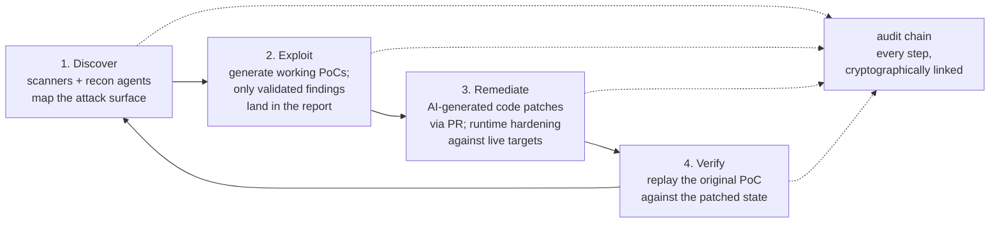
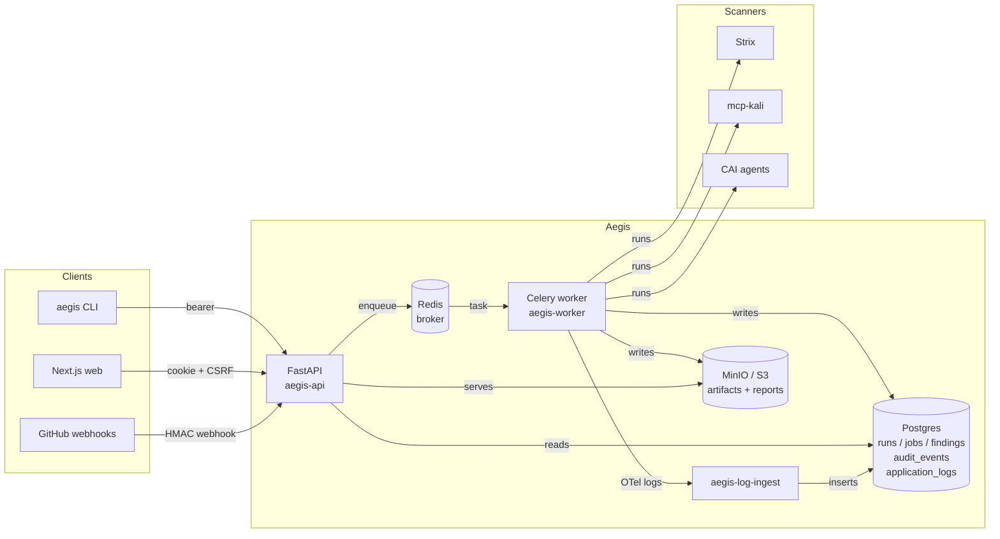

# Aegis

> **Discover. Exploit. Remediate. Harden.**
>
> A full-lifecycle AI security platform that closes the loop from
> *"we found a vulnerability"* to *"we shipped the fix"* — and proves
> the whole trail on a tamper-evident audit log.

Aegis unifies four production-grade open-source security tools —
[**Strix**](https://github.com/usestrix/strix) (autonomous DAST),
[**CAI**](https://github.com/aliasrobotics/cai) (multi-agent LLM
runtime), [**mcp-kali-server**](https://gitlab.com/kalilinux/packages/mcp-kali-server)
(offensive toolbelt over MCP), and [**vulnerability-fixer**](https://github.com/OpenHands/vulnerability-fixer)
(remediation harness) — into one multi-user, multi-tenant platform.
Every action, from the first scan to the merged pull request, is gated
by a fail-closed authorization policy engine and recorded on an
append-only, hash-chained audit log (enforced at the database, with
WORM export to S3 Object Lock), so the question *"what did the platform
do, against what target, on whose authority?"* always has a verifiable
answer. Cross-org tenants are isolated by Postgres Row-Level Security.

---

## Why this exists

Modern security has three structural problems that point-tools don't
solve:

| Problem | What it looks like |
|---|---|
| **Security can't keep up.** | Teams deploy continuously; pentests happen annually. Vulnerabilities ship undetected for months. |
| **Finding isn't fixing.** | Pentest reports pile up while developers struggle to interpret findings. Mean-time-to-remediate stays high. |
| **Tools are siloed.** | Scanners, exploit tools, and remediation live in separate worlds. No platform closes the loop end-to-end. |

Aegis is the loop. One platform turns *"vulnerability detected"* into
*"PR merged, fix verified"* without manual hand-off.

---

## The lifecycle



Concretely, against a target you control:

```bash
aegis demo --repo /path/to/juice-shop --apply
```

…walks Strix → CAI → patch → verify → report in one command, with
the entire trail on `aegis audit verify ✓`.

---

## Where Aegis is today

Aegis is **operational software**, not a vision deck. The v0.12.0 tag
shipped June 2026 with 1329 tests passing (21 skipped offline) on Python
3.12 and 3.13.

| Capability | Status |
|---|---|
| Offline CLI lifecycle (`scan` → `fix` → `verify` → `report`) | ✅ Shipped |
| Multi-user FastAPI + Postgres + Celery backend | ✅ Shipped |
| Browser auth — Keycloak + NextAuth + Aegis-signed cookie | ✅ Shipped |
| CSRF double-submit, CSP-hardened HTML reports, WS Origin gate | ✅ Shipped |
| Hash-chained audit log with CLI / admin verifier | ✅ Shipped |
| GitHub PR-scoped scans with fork-restricted mode | ✅ Shipped |
| Three-profile observability (Postgres mirror / Loki / Elasticsearch) + OTel security-log pipeline (host audit sources, secrets redacted before export) | ✅ Shipped |
| Scanner adapters: Strix · Trivy · Semgrep · Nuclei · ZAP · CodeQL · Bandit · Grype · Checkov · Trufflehog · SonarQube · Syft · Bumblebee · Deepsec | ✅ Shipped |
| Authenticated DAST flows — encrypted auth profiles (form / bearer / header / cookie) injected into ZAP + Nuclei scans, secrets redacted everywhere | ✅ Shipped |
| Kali toolbelt via MCP — nmap, sqlmap, nikto, hydra, +6 more | ✅ Shipped |
| Unified tool catalog: 42 effect-classified tools (10 Kali + 14 scanner adapters + 17 CAI function-tools + Camoufox OSINT web search) | ✅ Shipped |
| CAI agents: 36 wired + 5 multi-agent patterns (offsec / redteam-swarm / bb-triage / 2 red-blue), incl. 12 Aegis-native authored specialists, runnable via `POST /v1/agents/{name}/run`; active specialists reach the live Kali belt over MCP | ✅ Shipped |
| Unified human-in-the-loop gate (propose → approve → act) across agents, Kali tools, and remediation | ✅ Shipped |
| Agentic remediation strategy (vuln-fixer engine) — diff by default, opens the human-reviewed PR on approval | ✅ Shipped |
| Multi-format finding ingestion (Snyk · Veracode · Trivy · SARIF → `AegisFinding`) | ✅ Shipped |
| Bidirectional ticket sync — Jira / ServiceNow / Linear (default-off, env-selected) | ✅ Shipped |
| Cloud-target ownership verification (DNS TXT / GitHub repo linkage) gating `verified` | ✅ Shipped |
| Backport / release-train awareness for generated fix PRs | ✅ Shipped |
| Per-task LLM routing with budget caps | ✅ Shipped |
| Cross-org multi-tenancy — Postgres RLS (`FORCE`) on tenant tables, per-tenant monthly budget + LLM routing, `/cost` chargeback dashboard | ✅ Shipped |
| `@aegis/design-system` workspace + Storybook — curated domain components over ported shadcn base primitives (table / card / alert / input / …) plus Radix/`cmdk` interactive primitives (alert-dialog / tooltip / command) | ✅ Shipped |
| Web UI for the full backend surface — cancel run, delete target, report / vulnfixer-export downloads, `/agents` + `/tools` run pages, `/audit` chain visualization, dark mode, Cmd/Ctrl-K command palette (all RBAC-gated) | ✅ Shipped |
| Production Helm chart — hardened pod specs (non-root / dropped caps / seccomp), `*.enabled` dep toggles, gVisor sandbox, HA Keycloak | ✅ Shipped |
| Air-gapped vendor mirror (`AEGIS_OFFLINE_VENDOR_HOST`) for offline submodule fetches | ✅ Shipped |
| SOC 2 / ISO 27001 / FedRAMP compliance evidence pack (`aegis evidence-pack`) | ✅ Shipped |
| 60+ specialized agents (full roster from the OnePager; 36 wired + 5 patterns today) | 🔨 Roadmap |
| Per-scan sandbox isolation — Firecracker microVM (gVisor `RuntimeClass` shipped) | 🔨 Roadmap |

See [`CHANGELOG.md`](CHANGELOG.md) for per-release detail and the
consolidated [`docs/roadmap.md`](docs/roadmap.md) for the full
forward-looking roadmap.

---

## What Aegis does for a single finding

When a scanner produces a finding, Aegis can:

1. **Validate** it by replaying / generating a proof-of-concept. Only
   findings with a working PoC reach the report — no severity-by-
   inspection hand-waves.
2. **Remediate** it. Either as a code patch landed via a GitHub PR
   (the CAI `CodeAgent` generates the diff; `aegis fix --apply
   --open-pr` ships it on a deterministic branch with auto-rollback
   on failure), or as a runtime hardening change against a live
   target (the CAI `BlueteamAgent`).
3. **Verify** the fix. The original PoC is replayed against the
   patched state; the verifier reports `verified` / `still_vulnerable` /
   `inconclusive` and lifts the result onto `findings.validation_state`.
4. **Report** the whole trail. Markdown / JSON / HTML reports stream
   from the API with strict CSP, `X-Content-Type-Options: nosniff`,
   and `Content-Disposition: inline`. The audit chain confirms what
   ran, who triggered it, against what target.

Every step is RBAC-checked server-side (the web `<RoleGated>` is
cosmetic) and emits a chained audit event *before* the worker task is
enqueued — a worker crash mid-enqueue can never produce a half-state.

---

## Get started

### Prerequisites

| Tool | Version | Notes |
|---|---|---|
| Python | 3.12.x | `torch` and `adversarial-robustness-toolbox` do not publish wheels for 3.14 yet. `make install` finds a 3.12 for you. |
| Node.js | 20 or newer | |
| pnpm | 10 or newer | Workspaces are declared in `pnpm-workspace.yaml`. |

### Install

```bash
make install
```

Creates `.venv` when it is missing, picking an interpreter in this order:
pyenv's newest 3.12.x, then `python3.12` on `PATH`, then `python3`. It then
runs `pip install -e ".[dev]"` and `pnpm install` for the `web` and
`packages/design-system` workspaces. Re-running it is safe and does not
recreate an existing venv.

### Run

```bash
make dev
```

Runs the Python test suite once as a sanity check, then serves the Next.js app
on <http://localhost:3000> in the foreground.

There is no backend process to start yet. `redsim/api/__init__.py` is a
one-line stub with no FastAPI app, and `redsim/cli.py` does not exist, so the
`redsim` console script declared in `pyproject.toml` is a dangling entry point.
The recipe already runs its services under `make -j`, so adding the API later
is a `dev-api` target plus one word on that line. `web/src/lib/api.ts` defaults
to `http://localhost:8000`, which is the port it will expect.

### Targets

| Target | What it runs |
|---|---|
| `make install` | Venv, `pip install -e ".[dev]"`, `pnpm install` |
| `make dev` | pytest, then the web dev server on :3000 |
| `make test` | `pytest -q` plus `pnpm --filter @redsim/web test` |
| `make test-cov` | pytest with `--cov=redsim --cov-report=term-missing` |
| `make lint` | `ruff check redsim tests`, then `next lint` |
| `make typecheck` | `mypy redsim`, then `tsc --noEmit` |
| `make check` | lint, typecheck, test |

Both halves of `lint` and `typecheck` are available on their own as `lint-py`,
`lint-web`, `typecheck-py` and `typecheck-web`. Recipes call the venv
interpreter by path, so no target needs an activated shell.

Every target except `install` stops immediately when the tree is not installed:

```
error: .venv is missing. Run 'make install' first.
```

### Known gaps

`make lint` does not pass on a clean checkout, and `make check` inherits that.
`lint-py` reports nine pre-existing ruff findings, seven of them fixable with
`.venv/bin/ruff check redsim tests --fix`. `lint-web` runs `next lint` in a
workspace that has no ESLint config, which drops into Next's interactive setup
prompt, so it needs `eslint` and `eslint-config-next` added as dev dependencies
before it can work unattended.

`make test` and `make typecheck` both pass. The pytest suite currently covers
only the Pythia client, not the suite described in section 7 of the design
spec.

---

## Architecture



The architecture deep dive — full deployment topology, the
admission-vs-execution service split, the data model, every auth
path, the OTel pipeline — lives in
[`docs/architecture/overview.md`](docs/architecture/overview.md).

---

## Open-source foundation

| Component | Role | License |
|---|---|---|
| [`usestrix/strix`](https://github.com/usestrix/strix) | Application security engine — 21+ vulnerability classes, multi-agent DAST, headless CI/CD-friendly mode | Apache-2.0 |
| [`aliasrobotics/cai`](https://github.com/aliasrobotics/cai) | Multi-domain agent framework — red + blue + DFIR agents, 300+ LLM model routing via litellm | MIT |
| [`kalilinux/mcp-kali-server`](https://gitlab.com/kalilinux/packages/mcp-kali-server) | Tool execution layer — Kali Linux arsenal (nmap, Metasploit, sqlmap, hydra, …) over an MCP-style HTTP API | MIT |
| [`OpenHands/vulnerability-fixer`](https://github.com/OpenHands/vulnerability-fixer) | Remediation harness — common-schema parsing, AI fix generation, auto-PR | MIT |
| [`perplexityai/bumblebee`](https://github.com/perplexityai/bumblebee) | Supply-chain / MCP-host exposure scanner (NDJSON) — `supply_chain` capability | Apache-2.0 |
| [`vercel-labs/deepsec`](https://github.com/vercel-labs/deepsec) | AI whole-repo code audit (SAST) — `code_audit` capability | Apache-2.0 |
| [`shadcn-ui/ui`](https://github.com/shadcn-ui/ui) | Design-system primitive registry — generated into `@aegis/design-system` via `pnpm dlx shadcn add` | MIT |
| [`opentelemetry-collector-contrib`](https://github.com/open-telemetry/opentelemetry-collector-contrib) | Observability fan-out (Loki + Jaeger + Postgres mirror via `aegis-log-ingest`) | Apache-2.0 |

Each upstream is vendored as a pinned-SHA submodule. See
[`project_repos/AEGIS_VENDORED.md`](project_repos/AEGIS_VENDORED.md)
for the manifest and the
[ADR](docs/adr/0001-vendored-submodules.md) for the rebase policy.

---

## Who Aegis is for

- **National security & DoD programs.** Continuous security testing
  with automatic remediation across mission-critical systems, plus a
  cryptographically verifiable audit trail for every action.
- **Federal civilian agencies.** Full-lifecycle automation from
  discovery through verified fix deployment, with FISMA-aligned RBAC
  + audit.
- **Enterprise DevSecOps.** Close the loop from finding to fix
  *inside* the CI/CD pipeline. PR-scoped scans, Check Run posting,
  bot-driven fix PRs — no manual hand-off.

---

## Documentation

The `docs-serve`, `docs-build`, `docs-build-strict` and `docs-clean` targets
are still in the Makefile, but nothing backs them yet. There is no `mkdocs.yml`
in the tree and `mkdocs` is not a dependency in `pyproject.toml`, so all four
fail until both are added. Section 6 of the design spec lists `mkdocs.yml`
among the files removed when redsim was stripped out of aegis.

The docs that do exist:

| Doc | What it is |
|---|---|
| [`docs/brief.md`](docs/brief.md) | The team project brief. Authoritative: where it and the design spec disagree, the brief wins. |
| [`docs/superpowers/specs/2026-09-08-redsim-design.md`](docs/superpowers/specs/2026-09-08-redsim-design.md) | The design spec that every stub in `redsim/` defers to. |
| [`docs/adversarial-ml-redteam-spec.md`](docs/adversarial-ml-redteam-spec.md) | An earlier hackathon spec, also rendered as `.html`. It assumes building on the Aegis platform and audit chain, which the brief drops, so read it for the ART and SHAP framing rather than for architecture. |

### Topic map

| Topic | Doc |
|---|---|
| Roadmap (forward-looking work) | [`docs/roadmap.md`](docs/roadmap.md) |
| System architecture (mermaid diagrams) | [`docs/architecture/overview.md`](docs/architecture/overview.md) |
| Auth — cookie / bearer / WS / worker SA | [`docs/architecture/auth.md`](docs/architecture/auth.md) |
| Hash-chained audit log | [`docs/architecture/audit-chain.md`](docs/architecture/audit-chain.md) |
| Logs, traces, metrics pipeline | [`docs/architecture/observability.md`](docs/architecture/observability.md) |
| `/v1/*` HTTP API reference | [`docs/api/v1.md`](docs/api/v1.md) |
| Integrations (ticket sync · ownership verification · backports) | [`docs/integrations/index.md`](docs/integrations/index.md) |
| Production deployment runbook | [`docs/ops/deploy.md`](docs/ops/deploy.md) |
| Local development stack | [`docs/dev/local-stack.md`](docs/dev/local-stack.md) |
| Frontend (workspace, design system, Storybook) | [`docs/dev/frontend.md`](docs/dev/frontend.md) |
| Security posture | [`SECURITY.md`](SECURITY.md) |
| Fork-PR safety policy | [`docs/security/fork-prs.md`](docs/security/fork-prs.md) |
| Contributing | [`CONTRIBUTING.md`](CONTRIBUTING.md) |
| Vendored upstreams (pinned SHAs) | [`project_repos/AEGIS_VENDORED.md`](project_repos/AEGIS_VENDORED.md) |
| ADRs — vendoring · registry seam · agent execution · effect-class gate | [`0001`](docs/adr/0001-vendored-submodules.md) · [`0002`](docs/adr/0002-registry-seam-and-runners.md) · [`0003`](docs/adr/0003-agent-execution-path.md) · [`0004`](docs/adr/0004-unified-effect-class-gate.md) |

Legacy planning docs and phase-3 snapshots live under
[`docs/architecture/legacy/`](docs/architecture/legacy/README.md) —
kept for history, not for orientation.

### Release history

| Release | Theme | Tag |
|---|---|---|
| Phase 2 | Offline CLI: discover → fix → verify | (no tag) |
| Phase 3 | Multi-user backend platform | `v0.3.0` |
| Phase 4 v0.3.1 | Stabilization (audit, admission, project access) | `v0.3.1` |
| Phase 4 v0.4.0 | Identity & UX (NextAuth, CSRF, CSP, design system) | `v0.4.0` |
| Phase 4 v0.4.1 | Observability + GitHub PR scoping | `v0.4.1` |
| Phase 4 v0.4.2 | Forensic/wireless agents + 8 scanner adapters | `v0.4.2` |
| v0.5.0 | Hardened registry seam (plugin discovery, open capabilities) | `v0.5.0` |
| v0.5.1 | Bumblebee supply-chain scanner | `v0.5.1` |
| v0.5.2 | Corrected Bumblebee + Strix adapters; `scan_mode` | `v0.5.2` |
| v0.6.0 | Agent execution path wired + read-only recon agent; toolbelt 3→10 | `v0.6.0` |
| v0.7.0 | Deepsec AI code-audit scanner (`code_audit`) | `v0.7.0` |
| v0.8.0 | Unified human-in-the-loop gate + agentic remediation + finding ingestion | `v0.8.0` |
| v0.9.0 | Live Kali tool belt over MCP + CAI multi-agent patterns | `v0.9.0` |
| v0.10.0 | Strix code-scope depth + real Kali tool args | `v0.10.0` |
| v0.11.0 | OTel security-log pipeline + design-system base primitives | `v0.11.0` |
| v0.12.0 | Finish the seams: multi-scanner dispatch, budget caps, API sunsets | `v0.12.0` |

Full per-release detail in [`CHANGELOG.md`](CHANGELOG.md).

---

## Project layout

```
aegis/                  Python package — services, API, workers, audit
  agents/               CAI agent definitions + multi-agent patterns
  api/                  FastAPI app + routes + middleware
  audit/                hash-chained audit (chain, writers, forensic)
  cli/                  argparse entry point + --api dispatch client
  db/                   SQLAlchemy models + Alembic migrations
  integrations/         external service clients (GitHub App, …)
  llm/                  per-task LLM routing + budget caps
  log_ingest/           OTLP/Logs → Postgres mirror service
  migrate/              data / schema migration helpers
  policy/               CI gate policy (no Celery dependency)
  remediate/            CAI runner + patch / deps workflows
  runners/              subprocess runners + finding converter (Strix, Trivy, vuln-fixer)
  scanners/             14 scanner adapters (Strix · Trivy · Semgrep · Nuclei · ZAP · CodeQL · Bandit · Grype · Checkov · Trufflehog · SonarQube · Syft · Bumblebee · Deepsec)
  services/             admission + execution services (CLI + API + worker)
  state/                run-state persistence (RunStateAPI Protocol, filesystem + Postgres backends, open_run_state factory)
  storage/              pluggable blob storage (BlobStore Protocol, filesystem + S3/MinIO backends, open_blob_store factory)
  tools/                Kali toolbelt + MCP tool wrappers
  workers/              Celery tasks + bootstrap

web/                    Next.js 14 app (@aegis/web workspace package)
  src/app/              App-router pages + NextAuth route
  src/lib/              api() helper, auth helpers
  src/hooks/            useRoles, etc.
  .storybook/           Storybook 8 config

project_repos/          Vendored upstreams pinned at SHAs
  cai, strix, mcp-kali-server, vulnerability-fixer
  bumblebee, deepsec    scanner upstreams (supply_chain, code_audit)
  shadcn-ui, opentelemetry-collector-contrib
  design-system/        @aegis/design-system workspace package

deploy/                 Docker compose stack + service Dockerfiles
docs/                   Architecture, API, ops, dev, security, ADRs
hooks/                  mkdocs build hooks (README-as-index)
tests/                  pytest suite (unit + integration markers)
```

---

## License

Apache-2.0 unless a vendored submodule states otherwise. See
[`project_repos/AEGIS_VENDORED.md`](project_repos/AEGIS_VENDORED.md)
for the upstream license matrix.
