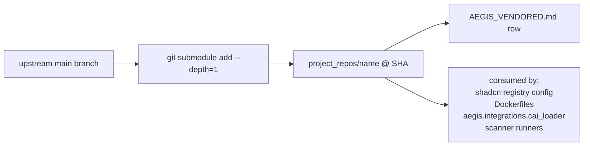

# ADR 0001 — Vendored upstream submodules with pinned SHAs

- **Status:** Accepted
- **Date:** 2026-05-28 (refreshed for v0.11.0)
- **Scope:** every project under `project_repos/`

## Context

Aegis depends on eight upstream projects that are themselves under
active development:

- `cai`, `strix`, `mcp-kali-server`, `vulnerability-fixer` — the
  scanner / agent / fixer surfaces.
- `bumblebee`, `deepsec` — additional scanner adapters (supply-chain
  exposure and AI code-audit, added in v0.5.1 / v0.7.0).
- `shadcn-ui` — the UI primitive registry the design system reads
  from at component-generation time.
- `opentelemetry-collector-contrib` — the source-of-truth fork for
  the Collector image we run under the `obs` profile.

Tracking the moving tip of every upstream would mean:

- Reproducibility breaks: a `pnpm install` or a Collector image build
  on Monday might disagree with the same on Friday.
- Security review breaks: there's no single SHA we can attest to.
- SLSA / supply-chain claims break: we can't say what we actually
  shipped against.

## Decision

Every upstream we depend on is added to `project_repos/` as a git
submodule pinned at a specific SHA. The matrix lives in
[`project_repos/AEGIS_VENDORED.md`](https://github.com/IntelliBridge/aegis/blob/main/project_repos/AEGIS_VENDORED.md).

Rules:

1. **Pin in `AEGIS_VENDORED.md`.** Every submodule has a row
   recording the SHA, the vendor date, the license, and what we use
   it for. The pin is the source of truth — `.gitmodules` only
   carries the URL.

2. **Rebases are explicit.** Bumping a submodule pointer to a newer
   SHA is its own commit, with a one-line ADR addendum (this file)
   summarising what changed and why. Routine builds never bump
   pointers as a side effect.

3. **Never import from `project_repos/<name>` at runtime** when the
   upstream is consumed via a generated artifact:

   - `shadcn-ui` — consumed by `pnpm dlx shadcn add`, which copies
     into `@aegis/design-system/src/primitives/`. The runtime
     imports from the workspace package, never from the clone.
   - `opentelemetry-collector-contrib` — consumed by an upstream
     Docker image at the matching release tag. The clone is a
     source-of-truth / fork target for SLSA and patches we may need
     to carry; it is not what runs in production.

   The other four (`cai`, `strix`, `mcp-kali-server`,
   `vulnerability-fixer`) are runtime-imported via their submodule
   paths — `cai_loader.load_cai` injects `cai/src` onto `sys.path`;
   `strix` runs as a subprocess from the cloned tree; etc. Those
   pin policies remain the same: a bump is explicit.

4. **License compatibility is checked at vendor time.** The
   `AEGIS_VENDORED.md` license column documents the upstream license
   and confirms it's redistributable under Aegis's Apache-2.0. New
   submodules with copyleft licenses (GPL / AGPL) require a separate
   ADR.

## Consequences

**Positive.**

- The repo is fully self-contained: a fresh clone + `git submodule
  update --init --recursive` reproduces the build inputs exactly.
- Security review has a single SHA to attest to per upstream.
- Forks happen by checking out a branch in the submodule; no
  upstream renames or vendor changes can surprise us.
- The Collector + shadcn use cases get the same hygiene as the
  scanner integrations they grew alongside.

**Negative / accepted trade-offs.**

- Cloning the repo takes longer (the shadcn-ui + collector-contrib
  trees are large). Acceptable; `--depth=1` keeps it bounded.
- Bumps need to be done deliberately; "let's just take the latest"
  isn't a thing. This is the point — surprises in upstream behaviour
  should land in a reviewable commit.
- Each bump may require a small migration if the upstream changed a
  contract we depended on. We accept that as an explicit cost.

## Out of scope

- A fully reproducible build (Nix / SLSA Level 3 attestations) is
  beyond the current scope. The vendoring policy here is necessary but
  not sufficient.
- Mirroring submodules onto an internal Git host for air-gapped
  deploys is a deployment concern (an `AEGIS_OFFLINE_VENDOR_HOST`
  env knob would land if/when there's demand).

## Bumps log

| Date       | Submodule                          | From SHA | To SHA   | Reason                                                              |
|------------|------------------------------------|----------|----------|---------------------------------------------------------------------|
| 2026-05-28 | `shadcn-ui`                        | (none)   | `360e8a1` | Initial vendoring (v0.4.0 F15).                                     |
| 2026-05-28 | `opentelemetry-collector-contrib`  | (none)   | `d7957a2` | Initial vendoring (v0.4.1 F19).                                     |
| 2026-05-29 | `bumblebee`                        | (none)   | `c240898` | Initial vendoring (v0.5.1) — supply-chain scanner adapter (tag v0.1.1). |
| 2026-06-01 | `deepsec`                          | (none)   | `9e3832d` | Initial vendoring (v0.7.0) — AI code-audit scanner adapter (`code_audit`); owner PII stripped. |

The other four (`cai`, `strix`, `mcp-kali-server`,
`vulnerability-fixer`) were added in Phase 1/2; their pins live in
`.gitmodules` and `AEGIS_VENDORED.md` without per-SHA tracking. When
the next bump happens, that's the time to start a row here.
