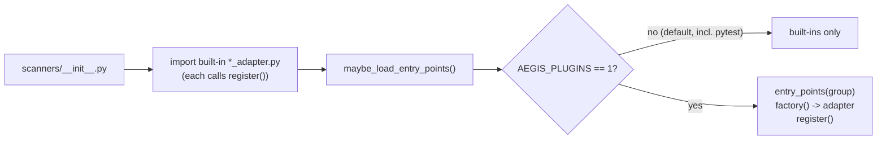

# ADR 0002 — Registry seam + runner/adapter split

- **Status:** Accepted
- **Date:** 2026-05-29
- **Scope:** the registry / runner layer (`aegis/registry.py`,
  `aegis/scanners/`, `aegis/agents/`, `aegis/runners/`)

## Context

The scanner and agent subsystems each maintained a structurally
identical `_REGISTRY` dict with their own `register` / `get` / `list`
helpers. That duplication was a maintenance hazard, and it left two
follow-on problems unsolved:

- **No supported extension path.** Adding a scanner or agent meant
  editing the `aegis` package. Downstream packages had no way to ship an
  adapter without patching core, and the capability vocabulary was a
  closed allow-list — a new capability meant a code change in core.
- **A naming collision in the adapter layer.** The package
  `aegis/adapters/` held subprocess runners, a finding converter, and an
  exporter — none of them registered adapters. Worse, it contained a
  `strix_adapter.py` whose name collided with the genuinely registered
  `aegis/scanners/strix_adapter.py` (`StrixAdapter`, which implements the
  `ScannerAdapter` Protocol). The two files were impossible to tell apart
  by name, and "adapter" meant two different things in two packages.

## Decision

Three changes land together.

**(a) Extract a generic `Registry[T]`.** A single
`aegis.registry.Registry[T]` (a `name -> item` table over items with a
`.name`) now backs both subsystems. The scanner and agent registries
each instantiate one and expose thin module-level wrappers
(`register` / `get` / `list_scanners` / `list_agents`). The historical
`_REGISTRY` dict handles are kept pointing at the registry's live
backing store, so callers and tests that pop/iterate them directly are
unaffected.

**(b) Activate the entry-point plugin seam, gated by
`AEGIS_PLUGINS=1`; open the capability vocabulary.**
`Registry.maybe_load_entry_points(group)` discovers third-party adapters
via Python entry points in the groups `aegis.scanners` and
`aegis.agents`. Each subsystem `__init__` calls its no-arg wrapper
*after* eagerly importing the built-ins, so first-party adapters are
always present and plugins layer on top. Discovery is **opt-in via the
`AEGIS_PLUGINS=1` environment variable** — off by default — so the
offline test path stays deterministic and an installed plugin can never
perturb `pytest`. In tandem, scanner capabilities became an open
vocabulary: `KNOWN_CAPABILITIES` is the first-party set, and a capability
outside it **logs a warning but still registers**, so a plugin can
introduce a new capability without patching core.

**(c) Rename `aegis/adapters/` → `aegis/runners/` and
`strix_adapter.py` → `strix_converter.py`.** The package now names what
it is: subprocess **runners** (`strix_runner.py`, `trivy_runner.py`), a
finding **converter** (`strix_converter.py`, holding
`convert_strix_finding`), and an **exporter** (`vulnfixer_adapter.py`).
None of these are registered. The only registered scanner adapters are
the `*_adapter.py` modules under `aegis/scanners/`. The rename kills the
`strix_adapter.py` collision and makes "adapter" mean exactly one thing.

See [Extending Aegis](../dev/extending.md) for the contributor-facing
view of all three.

## Consequences

**Positive.**

- One registry implementation to reason about, test, and harden;
  duplication between scanners and agents is gone.
- A documented, supported plugin path: downstream packages ship adapters
  via entry points with no edit to `aegis`.
- The plugin seam is inert in tests by default — `AEGIS_PLUGINS` unset
  means deterministic offline runs regardless of what's installed.
- New capabilities no longer require a core change; promotion to
  first-party is a one-line append to `KNOWN_CAPABILITIES`.
- `aegis/runners/` vs. `aegis/scanners/*_adapter.py` is now
  self-describing: runners/converter/exporter on one side, registered
  adapters on the other.

**Negative / accepted trade-offs.**

- The plugin path is only exercised when `AEGIS_PLUGINS=1`, so it needs
  its own dedicated test rather than riding the default suite. We accept
  that as the cost of a deterministic offline path.
- "Warn but register" means a typo'd capability still registers (with a
  log line) rather than failing loudly. We accept that to keep the
  vocabulary open for plugins.
- The rename touched import sites across the tree (a one-time churn) and
  invalidates any external references to the old `aegis/adapters/` path.
