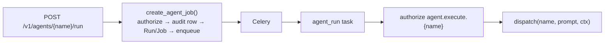

# ADR 0003 — Agent execution path + read-only recon composition

- **Status:** Accepted
- **Date:** 2026-06-01
- **Scope:** the agent seam (`aegis/agents/`, `aegis/integrations/cai_loader.py`,
  `aegis/services/agents.py`, `aegis/api/v1/agents.py`,
  `aegis/workers/tasks/agent.py`, `aegis/api/policy.py`)

## Context

The agent registry shipped wired but **orphaned**: `aegis.agents.dispatch`
existed and 15 adapters were registered, yet no running code reached them.
Remediation called `cai.Runner` directly for `codeagent` / `blueteam_agent`,
bypassing the registry entirely, so the other 13 adapters were unreachable
from any API route, service, or task. The capability matrix in
[overview.md](../architecture/overview.md) recorded this as the agent-seam
gap.

Two further defects sat behind that gap:

- **Six specialist slots resolved to fallbacks.** The CAI loader never
  imported `bug_bounter_agent`, `redteam_agent`, `dfir_agent`,
  `retester_agent`, `reporting_agent`, or `web_pentester_agent`, so the
  `_WIRED` table silently mapped those names onto generic agents instead of
  their real CAI counterparts.
- **The `recon` domain was empty.** `Domain` already enumerated `recon`, but
  no agent occupied it, so reconnaissance had no registered entry.

## Decision

Three changes land together.

**(a) An admission/execution split for agents, mirroring `scan.start`.**
A new `POST /v1/agents/{agent_name}/run` route does **admission only**:
RBAC check (`agent.run`, `remediator+`) → `create_agent_job(...)`, which
emits a chained `agent.run` audit row **before** the Run/Job rows are
created and **before** Celery is touched, then enqueues. The new
`agent_run` Celery task does **execution only**: it re-authorizes
`agent.execute.{name}` against the worker-side allowlist (never trusting
the admission-time decision) and then calls `dispatch(name, prompt,
AgentContext(...))`. No business logic lives in the route; no admission
logic lives in the task. This is the same F6 boundary the scan path uses,
so a worker crash mid-enqueue can never produce a Job row without a
matching chain event.

**(b) Load the six real specialist agents.** `cai_loader.py` now imports
each specialist inside a tolerant try/except that **degrades the whole
group to `None`** when CAI is not importable (offline-safe), and
`builtins._WIRED` maps each slot to its real agent. No slot resolves to a
fallback any more.

**(c) Compose a read-only recon agent.** A `recon` agent is composed from
CAI's reconnaissance tools — `nmap`, `shodan_search`, `shodan_host_info`,
`curl`, `netcat`, `netstat` — and registered in the `recon` domain,
bringing the roster to **16**. The composition is wrapped in a broad
`except Exception` (not just `ImportError`) because constructing the model
client instantiates `AsyncOpenAI()`, which raises without an API key; that
path must degrade to `None` offline like every other CAI import.

## Consequences

**Positive.**

- The agent registry is no longer orphaned: every registered adapter is
  reachable through a documented, audited, RBAC-gated path.
- The agent path reuses the exact F6 admission/execution contract the scan
  path established — one boundary shape to reason about and test.
- The six specialist slots now resolve to their real CAI agents; the
  roster is honest (16 wired, all six domains populated).

**Negative / accepted trade-offs.**

- The recon composition and the specialist imports only execute when CAI
  is importable **and** an LLM key is present, so they cannot run on the
  offline test path; they degrade to `None` and the loader short-circuits.
  Those import/compose lines are therefore exercised only in a live
  environment, not by `pytest` — the same profile as the pre-existing
  `extended` agent block.
- The recon agent is deliberately **read-only**: it gets recon/observation
  tools only, never `generic_linux_command` / `exec_code`. Broadening its
  toolset would require a new ADR.
