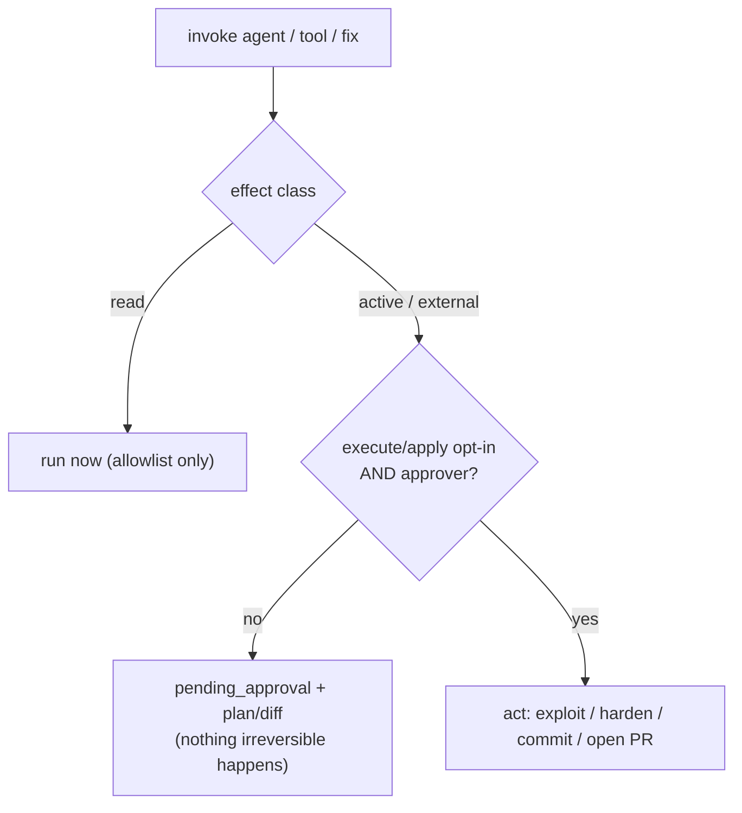

# ADR 0004 — Unified effect-class human-in-the-loop gate

- **Status:** Accepted
- **Date:** 2026-06-01
- **Scope:** the gate spine (`aegis/effects.py`), the agent seam
  (`aegis/agents/registry.py`, `aegis/agents/cai/builtins.py`,
  `aegis/api/policy.py`, `aegis/services/agents.py`, `aegis/api/v1/agents.py`,
  `aegis/workers/tasks/agent.py`), the Kali tool route (`aegis/api/v1/tools.py`),
  and the fix service (`aegis/services/fixes.py`,
  `aegis/runners/vulnfixer_runner.py`)

## Context

Aegis's purpose is the full loop — **scan code + infra → pentest → remediate** —
with a human in the loop on anything that changes the world. Before v0.8.0 that
gate existed only for *code fixes*: `fix.apply` defaulted to `False`, needed the
`approver` role, and produced a diff for review otherwise. Three other paths
that are at least as consequential had **no** propose→approve→act step:

- **Offensive agents** (`red_teamer`, `web_pentester`, `bug_bounter`, …) ran the
  moment `dispatch()` was called — gated only by the target allowlist and the
  `remediator` role. An exploit was *easier* to fire than a code change was to
  apply.
- **Defensive / live-hardening agents** (`blueteam_agent`, and the `live` fix
  strategy) mutated a running target with the same low bar.
- **Active Kali tools** (`sqlmap`, `hydra`, `metasploit`, `wpscan`) ran on a
  plain `tool.invoke` (`remediator`).

Meanwhile the vendored **vulnerability-fixer** ships an autonomous OpenHands
loop that clones, edits, commits, pushes, and opens a PR. The first cut wired it
as *diff-only* to avoid "autonomy". That was the wrong call: **the pull-request
review is itself the human gate** — a reviewer approves before merge — so
forbidding the engine from opening a PR removes its whole value without adding
safety.

## Decision

**Introduce one abstraction — the *effect class* — and gate on it everywhere.**

`aegis/effects.py` (deliberately dependency-free, so both the agent registry and
the API layer import it without a cycle) classifies every capability:

- **`read`** — no meaningful side effect: recon, enumeration, static analysis,
  SBOM, generating a diff or a plan, dry-run. Runs freely; the target allowlist
  is the only gate.
- **`active`** — attack / state-changing against a live system: exploitation,
  brute-force, an exploit module, live hardening. Gated.
- **`external`** — leaves the sandbox: pushing a branch, opening a PR, egress.
  Gated.

The gate is one rule: a `read` capability runs; an `active`/`external` one
performs its irreversible step **only** when the caller explicitly opts in
(`execute=true` / `apply=true` / `open_pr=true`) **and** holds the `approver`
role. Otherwise it returns a reviewable **proposal** — an attack plan, a
hardening plan, or a diff — and the underlying agent/tool is never run.

**Effect is not a function of domain.** An `android_sast` agent is *offensive*
by domain but only reads bytecode → `read`; a `retester` is *audit* by domain
but re-fires exploits → `active`. So effect is an explicit per-agent column in
`builtins._WIRED`, with `domain_default_effect()` as the fallback. An unknown
domain or unlisted Kali tool defaults to **`active`** — it fails *safe* (gated),
never open.

**The gate lives at the chokepoints, not in each adapter:**

- **Agents** — enforced in `agents.registry.dispatch()`, the single path that
  covers built-ins *and* plugins. An `active` agent dispatched without
  `context.execute` returns `AgentResult(status="pending_approval", plan=…)`
  and `invoke()` is never reached. `AGENT_EXECUTE` is added to the RBAC table at
  `approver` (mirroring `FIX_APPLY`); `AGENT_RUN` stays `remediator`. The route
  picks the action by the `execute` flag; the worker re-authorizes
  `agent.execute.{name}` vs `agent.run.{name}` accordingly.
- **Kali tools** — `aegis/api/v1/tools.py` classifies via `kali_tool_effect()`.
  The generic `command` shell stays hard-blocked (403) for every role.
  `active` tools without `execute=true` return `pending_approval`; with it they
  require `approver`. `read` tools keep `tool.invoke` / `remediator`.
- **Remediation** — `live` hardening is gated on `apply` (propose returns a
  hardening plan, never invokes the blue-team agent). The new **`agentic`**
  strategy drives the vuln-fixer engine: propose → diff (`pending_apply`);
  `apply` → local rollback-safe commit; `apply + open_pr` → **the engine opens
  the human-reviewed PR itself**. In PR mode the GitHub token flows only through
  the subprocess *environment*, never argv.

## Consequences

**Positive.**

- One mental model — *effect class* — covers scanners, agents, and tools.
  "Is this gated?" has a single, testable answer (`requires_approval(effect)`).
- The dangerous paths (exploit, live change, PR) are now *at least* as hard to
  trigger as a code apply was, and a proposal is always produced for review.
- Fail-safe by construction: an unclassified domain/tool is `active` (gated).
- The vuln-fixer engine keeps its value — it opens the PR, and the PR review is
  the gate — without Aegis pushing anything unless `apply + open_pr` are set.

**Negative / accepted trade-offs.**

- Every `active` agent now needs `execute=true` to actually run; callers that
  previously got an immediate run get a proposal instead. This is the intended
  behavior change, and the roster's effect column must be kept honest (a
  mis-tagged `active` agent marked `read` would skip the gate — covered by
  tests asserting each slot's effect and that `dispatch` never invokes a gated
  agent without `execute`).
- PR mode depends on `GITHUB_TOKEN` in the worker environment; absent it, the
  agentic engine soft-degrades to a failed outcome rather than opening a PR.
