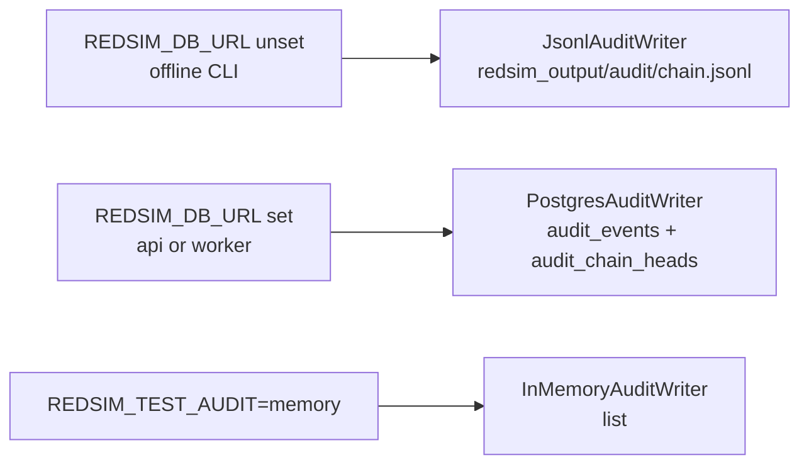
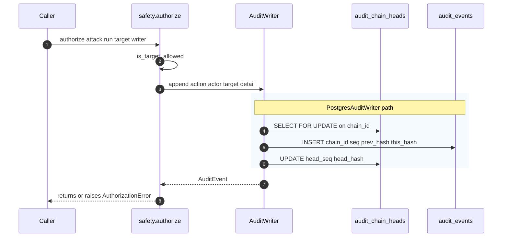

# Audit chain

Every mutating operation Redsim takes (start a scan, cancel a run,
manage a target, query the log mirror and, as the ML vertical lands,
register a model, run an attack, explain, harden and verify) lands as an
event on a **hash-chained** audit log. Each event commits to the previous event's hash, so any
tampering with history breaks every event downstream.

```
event_n.this_hash = sha256(event_n.prev_hash || canonical_json(event_n))
event_n.prev_hash = event_{n-1}.this_hash
```

The chain has three load-bearing properties:

1. **Append-only.** Writers acquire a row-level lock on
   `audit_chain_heads` so two concurrent appends serialise.
2. **Verifiable in isolation.** `redsim audit verify --all` walks each
   chain end-to-end and recomputes every hash; a mismatch tells you
   which event broke the chain.
3. **Partitioned by `chain_id`.** Run-scoped events go on
   `run:<run_id>`; project-scoped events go on `project:<project_id>`;
   global events go on the single `system` chain. There's no global
   lock for verification.

---

## Event shape

```jsonc
{
  "chain_id": "project:proj-a",
  "seq": 42,
  "ts": "2026-09-08T12:34:56.789+00:00",
  "actor": "user:alice@example.com",
  "action": "attack.run",
  "target": null,
  "allowlist_check": "n/a",
  "override": false,
  "success": true,
  "detail": {
    "target_id": "tgt-…",
    "attack_ids": ["fgsm", "pgd"],
    "norm": "linf",
    "eps_grid": [0.01, 0.03, 0.1],
    "reference_eps": 0.03,
    "n_samples": 200,
    "seed": 0,
    "dataset_id": "leibnitz-lab/military_vehicles",
    "settings_hash": "9f2c…"
  },
  "run_id": null,
  "project_id": "proj-a",
  "prev_hash": "ee5b…",
  "this_hash": "47b1…"
}
```

The example is the planned `attack.run` admission event (spec section
5.11). Today's events (`scan.start`, `verify.replay`, `run.cancel`,
`target.manage` and the rest of the table below) carry the same envelope.
For an in-boundary ML artifact the `target` argument is `None` and
`allowlist_check` records `n/a`, because the allowlist is a network-scope
control and the audit row itself is the point. Chain ids follow
`redsim.audit.chain._chain_id`: `run:<run_id>` when a run exists, else
`project:<project_id>`, else `system`.

`detail` carries forensic context. For tool and subprocess invocations
the shape is the one produced by `redsim.audit.forensic.tool_detail`:
**digests + refs, not raw bytes**. stdout / stderr land in the blob
store and the audit row carries `{sha256, location, kind}` so a large
tool output never inflates an audit row. The ML vertical follows the
same convention (spec 10.5): ids, counts, hashes and blob references,
never model bytes, images, dataset rows, prompt text or secrets.

`redsim.audit.chain.redact_audit_detail` runs at write-time to scrub
known-sensitive keys (tokens, passwords, etc.).

---

## Writer modes

Each Redsim caller mode resolves to one `AuditWriter` instance:



Construction:

```python
from redsim.audit.writers import open_writer

writer = open_writer("api")        # explicit
writer = open_writer(None)         # infer from env
writer = open_writer("test")       # in-memory for assertions
```

Every service call site passes the writer explicitly into
`safety.authorize(writer=…)`. The old "no writer ⇒ writes to a flat
JSONL via `_append_audit`" fallback was removed in v0.3.1 F7 — calling
`authorize()` with no writer and no `run_path` is now a `RuntimeError`.

---

## Append flow



The `FOR UPDATE` lock on `audit_chain_heads` is what serialises
concurrent appends to the same chain. Different chains run in
parallel.

---

## Verification

CLI:

```bash
redsim audit verify --all          # walk every chain
redsim audit verify --run run-abc  # one run
redsim audit verify --project proj-a
```

API (admin only):

```bash
curl -H "Authorization: Bearer …" \
  "$REDSIM_API_URL/v1/audit/verify?all=1"
```

The verifier checks, for each chain:

- `seq` starts at 1 and increments by 1.
- `prev_hash` of event N equals `this_hash` of event N-1.
- `this_hash` recomputed from `(prev_hash || canonical_json(event))`
  matches the stored value.
- `audit_chain_heads.head_seq` / `head_hash` agree with the last
  event.

On mismatch the API returns the first broken event so an operator
knows where to look.

---

## WORM archival (Object Lock)

Tamper-resistance of the audit chain is a **three-layer** model. The first
two live in (or next to) the live database; the third moves a copy
off-DB into immutable object storage:

1. **DB append-only trigger** (migration `0004`). `audit_events` is
   insert-only *at the database*: a `BEFORE UPDATE OR DELETE OR TRUNCATE`
   trigger `RAISE EXCEPTION`s for everyone — table owner and superuser
   included. A privileged operator can't quietly rewrite a row.
2. **Cryptographic hash-chain verification** (`verify_chain`, above). Even
   if the trigger were dropped (which needs `redsim_owner` DDL, itself
   pgaudit-logged), re-signing a chain end-to-end is detectable: every
   downstream `this_hash` would have to be recomputed and the
   `audit_chain_heads` pointer rewritten in lockstep.
3. **Off-DB WORM export with Object Lock retention.** Each chain is
   exported to an S3 / MinIO bucket created with **Object Lock** in
   `COMPLIANCE` mode. Once written, the archived copy can't be overwritten
   or deleted until its retention period expires — not by an attacker who
   owns the database, and not by one who owns the bucket credentials (in
   `COMPLIANCE` mode, not even by root). This is what makes the chain
   tamper-*resistant* off-DB, not merely tamper-*evident*.

`redsim/storage/worm.py` holds `WormArchive`, which wraps the S3 blob store
pointed at the WORM bucket.

### Export object layout

`archive_chain(chain_id, events, *, verified=…)` writes two objects per
chain head under a stable, content-derived key prefix
`audit/{chain_id}/{head_seq}-{sha8}`:

- **`…{head_seq}-{sha8}.jsonl`** — the chain's events as canonical JSONL,
  one event per line, serialized with the same `sort_keys` / compact
  separators as the chain's `canonical_json` but **including** `this_hash`,
  so the file round-trips straight back into `verify_chain`.
- **`…{head_seq}-{sha8}.manifest.json`** — a manifest carrying
  `chain_id`, `event_count`, `head_seq`, `head_hash`, `verified`,
  `exported_at`, `retention_until`, `lock_mode`, and `jsonl_sha256`.

`sha8` is the first 8 hex chars of the JSONL's sha256. Both objects are put
with the bucket's Object Lock retention (`retain_until` =
now + `REDSIM_WORM_RETENTION_DAYS`).

### Idempotency

The key is derived from the head sequence **and** the content sha, so
re-exporting an unchanged chain resolves to the same key and is a no-op —
`archive_chain` probes for the existing object and returns `None`. A chain
whose contents changed at the same `head_seq` (e.g. a tampered re-export)
gets a different `sha8` and lands as a distinct object, leaving the
original in place under Object Lock.

### Running an export

A broken chain is still archived (so the evidence is preserved) but its
manifest records `verified: false` and the chain id lands in
`ExportSummary.broken_chains`.

- **Daily beat task.** `redsim.export_chains_to_worm`
  (`redsim/workers/tasks/worm_export.py`) is registered in
  `celery beat` at interval `REDSIM_WORM_INTERVAL` (default 86400s / daily).
  It **self-gates**: when `REDSIM_WORM_EXPORT` is off it early-returns
  `{"status": "disabled"}`, so a deployment without WORM configured no-ops
  on every tick. Each successful run emits an `audit.worm_export` event
  (summary counts only — no creds, no event contents) back onto the chain.
- **On-demand CLI.** `redsim audit export` archives chains immediately:

  ```bash
  redsim audit export --all                 # every chain
  redsim audit export --chain run:run-abc   # one chain
  redsim audit export --all --no-verify     # skip the pre-archive verify
  ```

  With WORM disabled or misconfigured the command prints an actionable
  message and exits non-zero.

### Re-verifying an archived chain

The archive is self-describing. To prove a stored chain is intact, download
the JSONL object and feed it back through the verifier:

```python
import json
from redsim.audit.chain import verify_chain

events = [json.loads(line) for line in jsonl_bytes.decode().splitlines()]
result = verify_chain(events)        # walks seq / prev_hash / this_hash
assert result.verified
```

Because the JSONL preserves `this_hash`, the recomputation is byte-identical
to the live `redsim audit verify` walk; the manifest's `jsonl_sha256` lets you
confirm the downloaded bytes match what was sealed.

---

## What lands on the chain

Live on `main` today:

| Action | Emitted by |
|---|---|
| `scan.start` | `services.scans.create_scan_job` (admission) and `start_scan` (the offline `redsim scan` re-check) |
| `scan.execute.<scanner>` | `workers.tasks.scan` before dispatching a scanner adapter |
| `verify.replay` | `services.verify.create_verify_job` (admission) and `verify` (worker re-check) |
| `run.cancel` | `services.runs.cancel_run` |
| `target.manage` | `services.targets.create_target` / `delete_target` |
| `auth_profile.create` / `auth_profile.delete` | `services.auth_profiles` |
| `logs.queried` | `GET /v1/logs` (audit the auditors) |
| `audit.worm_export` | the WORM export beat task and `redsim audit export` |
| `tenant.integrity_check` | the `redsim.verify_tenant_integrity` beat task |

`GET /v1/audit/verify` and `redsim audit verify` read the chain and do
not append to it.

A new action type only needs to thread `authorize()` correctly. The
chain backend handles serialisation, hash linking, and persistence.

### Planned ML events

The ML vertical adds the actions below (spec section 5.11, emission order
per task in 10.5). None of the emitters is on `main` yet: admission
events land with the WS4 routes, worker events with the WS4 tasks. Every
one goes through `redsim.safety.authorize`, `detail` passes through
`redact_audit_detail`, and no row carries model bytes, images, dataset
rows, prompt text or secrets.

| Action | Emitted by | Chain |
|---|---|---|
| `model.register` | `POST /v1/models` admission (bundled pick or upload, `success=False` for a refused upload) | project |
| `model.validate` | worker, from the sandboxed `model.validate` job | run (`ml.ingest`) |
| `attack.run` | `POST /v1/models/{id}/attacks` admission, before any `Run` or `Job` row | project |
| `model.load` | worker, at the start of every campaign or verify job | run |
| `attack.execute.<attack_id>` | worker re-check before each attack (mirrors `scan.execute.<scanner>`) | run |
| `explain.run` | `POST /v1/findings/{id}/explain` admission or the campaign chain | run |
| `explain.execute` | worker | run |
| `campaign.score` | worker, when the `MRIRecord` is written (carries the score record hash and `settings_hash`) | run |
| `harden.recommend` | `POST /v1/findings/{id}/harden` admission or the campaign chain | run |
| `harden.execute` | worker (rules fired, narrative outcome, redacted Pythia settings, prompt and completion digests, token counts) | run |
| `verify.replay` (existing) | `POST /v1/findings/{id}/verify` admission | project, then the verify run |
| `verify.execute` | worker (defense, outcome, ΔMRI and per-dimension deltas) | run (`ml.verify`) |
| `job.complete` | worker, at the end of every ML task | run |
| `finding.review` | `PATCH /v1/findings/{id}/status` | run |
| `finding.annotate` | reviewer notes and finding notes routes | run |
| `report.render` | worker | run |
| `run.cancel`, `target.manage` (existing) | admission | run / project |

Because every worker event shares the campaign's `run:<run_id>` chain
and the admission events carry the resulting `run_id` in `detail`,
`redsim audit verify --run <run_id>` proves a whole campaign's trail.
Offline (`redsim ml attack`, CI) the same `authorize()` calls resolve to
`JsonlAuditWriter` at `<run_path>/audit.jsonl` and `verify_chain` walks
either.

---

## Forensic detail shape (tools)

Tool and subprocess invocations land on the canonical chain with the
shape `redsim.audit.forensic.tool_detail` produces:

```jsonc
{
  "tool": "<tool name>",
  "params": { "...": "resolved params, obvious secrets redacted" },
  "return_code": 0,
  "duration_ms": 1247,
  "stdout_sha256": "f31a…",
  "stdout_bytes": 18432,
  "stderr_sha256": "e3b0…",
  "stderr_bytes": 0,
  "artifact_refs": [
    { "sha256": "f31a…",
      "location": "s3://redsim/blobs/runs/run-1/tools/<tool>.stdout",
      "kind": "stdout" }
  ],
  "request_id": "req-…"
}
```

`_redact_params` scrubs obvious secret-bearing params and truncates
values longer than 1 KiB at this layer, and the chain's
`redact_audit_detail` scrubs known secret keys before write.
The full stdout / stderr stays in the blob store. The row carries only
the descriptor. Attribute payloads are capped at `MAX_AUDIT_ATTRS_BYTES`
(64 KiB).

---

## Reading the chain

Postgres:

```sql
-- Latest 20 events for a run
SELECT seq, ts, action, actor, success, detail->>'tool' AS tool
FROM audit_events
WHERE chain_id = 'run:run-abc123'
ORDER BY seq DESC
LIMIT 20;

-- Find the audit row that authorised a given Celery task
SELECT *
FROM audit_events
WHERE detail->>'request_id' = 'req-…';
```

Offline JSONL (per chain file):

```bash
jq -r '. | "\(.seq)\t\(.action)\t\(.target)\t\(.success)"' \
  redsim_output/audit/run:run-abc123.jsonl
```

The CLI's `redsim audit verify` is the canonical reader; treat raw
queries as a forensic / dashboards tool.
