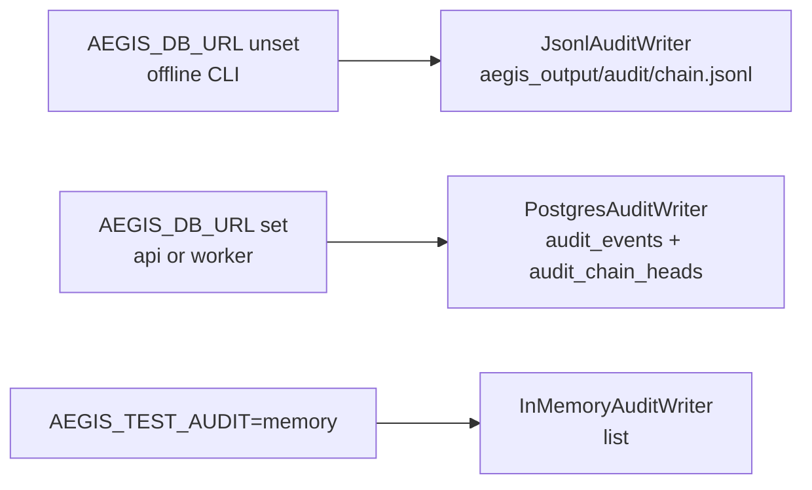

# Audit chain

Every operation Aegis takes — start a scan, apply a fix, run a Kali
tool, query the log mirror — lands as an event on a **hash-chained**
audit log. Each event commits to the previous event's hash, so any
tampering with history breaks every event downstream.

```
event_n.this_hash = sha256(event_n.prev_hash || canonical_json(event_n))
event_n.prev_hash = event_{n-1}.this_hash
```

The chain has three load-bearing properties:

1. **Append-only.** Writers acquire a row-level lock on
   `audit_chain_heads` so two concurrent appends serialise.
2. **Verifiable in isolation.** `aegis audit verify --all` walks each
   chain end-to-end and recomputes every hash; a mismatch tells you
   which event broke the chain.
3. **Partitioned by `chain_id`.** Run-scoped events go on
   `run:<run_id>`; project-scoped events go on `project:<project_id>`;
   global events go on the single `system` chain. There's no global
   lock for verification.

---

## Event shape

```jsonc
{
  "chain_id": "run:run-abc123",
  "seq": 42,
  "ts": "2026-05-28T12:34:56.789+00:00",
  "actor": "user:alice@example.com",
  "action": "scan.start",
  "target": "http://localhost:3000",
  "allowlist_check": "pass",
  "override": false,
  "success": true,
  "detail": {
    "actor": "user:alice@example.com",
    "scanner": "strix",
    "target": "http://localhost:3000",
    "instruction_set": false
  },
  "run_id": "run-abc123",
  "project_id": "proj-a",
  "prev_hash": "ee5b…",
  "this_hash": "47b1…"
}
```

`detail` carries forensic context. For Kali tool invocations, the
shape is the one produced by
`aegis.audit.forensic.tool_detail` — **digests + refs, not raw
bytes**: stdout / stderr land in the blob store and the audit row
carries `{sha256, location, kind}` so a 50 MB scanner output never
inflates an audit row.

`aegis.audit.chain.redact_audit_detail` runs at write-time to scrub
known-sensitive keys (tokens, passwords, etc.).

---

## Writer modes

Each Aegis caller mode resolves to one `AuditWriter` instance:



Construction:

```python
from aegis.audit.writers import open_writer

writer = open_writer("api")        # explicit
writer = open_writer(None)         # infer from env
writer = open_writer("test")       # in-memory for assertions
```

Every service call site passes the writer explicitly into
`safety.authorize(writer=…)`. The old "no writer ⇒ writes to a flat
JSONL via `_append_audit`" fallback was removed in v0.3.1 F7 — calling
`authorize()` with no writer and no `run_path` is now a `RuntimeError`.

---

## Append flow


The `FOR UPDATE` lock on `audit_chain_heads` is what serialises
concurrent appends to the same chain. Different chains run in
parallel.

---

## Verification

CLI:

```bash
aegis audit verify --all          # walk every chain
aegis audit verify --run run-abc  # one run
aegis audit verify --project proj-a
```

API (admin only):

```bash
curl -H "Authorization: Bearer …" \
  "$AEGIS_API_URL/v1/audit/verify?all=1"
```

The verifier checks, for each chain:

- `seq` starts at 1 and increments by 1.
- `prev_hash` of event N equals `this_hash` of event N-1.
- `this_hash` recomputed from `(prev_hash || canonical_json(event))`
  matches the stored value.
- `audit_chain_heads.head_seq` / `head_hash` agree with the last
  event.

On mismatch the API returns the first broken event so an operator
knows where to look.

---

## WORM archival (Object Lock)

Tamper-resistance of the audit chain is a **three-layer** model. The first
two live in (or next to) the live database; the third moves a copy
off-DB into immutable object storage:

1. **DB append-only trigger** (migration `0004`). `audit_events` is
   insert-only *at the database*: a `BEFORE UPDATE OR DELETE OR TRUNCATE`
   trigger `RAISE EXCEPTION`s for everyone — table owner and superuser
   included. A privileged operator can't quietly rewrite a row.
2. **Cryptographic hash-chain verification** (`verify_chain`, above). Even
   if the trigger were dropped (which needs `aegis_owner` DDL, itself
   pgaudit-logged), re-signing a chain end-to-end is detectable: every
   downstream `this_hash` would have to be recomputed and the
   `audit_chain_heads` pointer rewritten in lockstep.
3. **Off-DB WORM export with Object Lock retention.** Each chain is
   exported to an S3 / MinIO bucket created with **Object Lock** in
   `COMPLIANCE` mode. Once written, the archived copy can't be overwritten
   or deleted until its retention period expires — not by an attacker who
   owns the database, and not by one who owns the bucket credentials (in
   `COMPLIANCE` mode, not even by root). This is what makes the chain
   tamper-*resistant* off-DB, not merely tamper-*evident*.

`aegis/storage/worm.py` holds `WormArchive`, which wraps the S3 blob store
pointed at the WORM bucket.

### Export object layout

`archive_chain(chain_id, events, *, verified=…)` writes two objects per
chain head under a stable, content-derived key prefix
`audit/{chain_id}/{head_seq}-{sha8}`:

- **`…{head_seq}-{sha8}.jsonl`** — the chain's events as canonical JSONL,
  one event per line, serialized with the same `sort_keys` / compact
  separators as the chain's `canonical_json` but **including** `this_hash`,
  so the file round-trips straight back into `verify_chain`.
- **`…{head_seq}-{sha8}.manifest.json`** — a manifest carrying
  `chain_id`, `event_count`, `head_seq`, `head_hash`, `verified`,
  `exported_at`, `retention_until`, `lock_mode`, and `jsonl_sha256`.

`sha8` is the first 8 hex chars of the JSONL's sha256. Both objects are put
with the bucket's Object Lock retention (`retain_until` =
now + `AEGIS_WORM_RETENTION_DAYS`).

### Idempotency

The key is derived from the head sequence **and** the content sha, so
re-exporting an unchanged chain resolves to the same key and is a no-op —
`archive_chain` probes for the existing object and returns `None`. A chain
whose contents changed at the same `head_seq` (e.g. a tampered re-export)
gets a different `sha8` and lands as a distinct object, leaving the
original in place under Object Lock.

### Running an export

A broken chain is still archived (so the evidence is preserved) but its
manifest records `verified: false` and the chain id lands in
`ExportSummary.broken_chains`.

- **Daily beat task.** `aegis.export_chains_to_worm`
  (`aegis/workers/tasks/worm_export.py`) is registered in
  `celery beat` at interval `AEGIS_WORM_INTERVAL` (default 86400s / daily).
  It **self-gates**: when `AEGIS_WORM_EXPORT` is off it early-returns
  `{"status": "disabled"}`, so a deployment without WORM configured no-ops
  on every tick. Each successful run emits an `audit.worm_export` event
  (summary counts only — no creds, no event contents) back onto the chain.
- **On-demand CLI.** `aegis audit export` archives chains immediately:

  ```bash
  aegis audit export --all                 # every chain
  aegis audit export --chain run:run-abc   # one chain
  aegis audit export --all --no-verify     # skip the pre-archive verify
  ```

  With WORM disabled or misconfigured the command prints an actionable
  message and exits non-zero.

### Re-verifying an archived chain

The archive is self-describing. To prove a stored chain is intact, download
the JSONL object and feed it back through the verifier:

```python
import json
from aegis.audit.chain import verify_chain

events = [json.loads(line) for line in jsonl_bytes.decode().splitlines()]
result = verify_chain(events)        # walks seq / prev_hash / this_hash
assert result.verified
```

Because the JSONL preserves `this_hash`, the recomputation is byte-identical
to the live `aegis audit verify` walk; the manifest's `jsonl_sha256` lets you
confirm the downloaded bytes match what was sealed.

---

## What lands on the chain

| Action prefix       | Emitted by                                                  |
|---------------------|-------------------------------------------------------------|
| `scan.start`        | `services.scans.create_scan_job` (admission), worker re-check |
| `scan.execute.<scanner>` | worker before dispatching the scanner                  |
| `fix.generate` / `fix.apply` | `services.fixes.create_fix_job` (admission)        |
| `patch.apply` / `patch.commit` | `services.fixes.generate_fix` (execution)        |
| `verify.replay`     | `services.verify.create_verify_job` (admission), worker re-check |
| `run.cancel`        | `services.runs.cancel_run`                                  |
| `target.manage`     | `services.targets.create_target` / `delete_target`          |
| `kali.<tool>`       | `aegis.tools.kali_client._audit` per invocation             |
| `cai.live_hardening` | `services.fixes._generate_live_fix`                        |
| `deps.bump`         | `services.fixes._generate_deps_fix`                         |
| `github.open_pr`    | CLI / service when opening a PR via the GitHub App          |
| `logs.queried`      | `GET /v1/logs` (audit-the-auditors)                         |
| `audit.verify`      | the verifier itself                                         |
| `audit.worm_export` | the WORM export beat task / CLI on each run                 |

A new action type only needs to thread `authorize()` correctly — the
chain backend handles serialisation, hash linking, and persistence.

---

## Forensic detail shape (tools)

Phase-4 v0.3.1 F8 retired the per-tool side-channel
(`tool-calls.jsonl`). Every Kali tool invocation now lands on the
canonical chain with the shape `aegis.audit.forensic.tool_detail`
produces:

```jsonc
{
  "tool": "nmap",
  "params": { "target": "127.0.0.1", "scan_type": "-sV" },
  "return_code": 0,
  "duration_ms": 1247,
  "stdout_sha256": "f31a…",
  "stdout_bytes": 18432,
  "stderr_sha256": "e3b0…",
  "stderr_bytes": 0,
  "artifact_refs": [
    { "sha256": "f31a…",
      "location": "s3://aegis/blobs/runs/run-1/kali/nmap.stdout",
      "kind": "stdout" }
  ],
  "request_id": "req-…"
}
```

Param values longer than 1 KiB get truncated at this layer; the
chain's `redact_audit_detail` then scrubs known secret-keys before
write. The full stdout / stderr stays in the blob store; the row
carries only the descriptor.

---

## Threat model

| Threat                                                | Defence                                                                         |
|-------------------------------------------------------|---------------------------------------------------------------------------------|
| Operator silently rewrites an old event               | `this_hash` mismatch on verify; downstream events also break.                   |
| Operator deletes the last event                       | `audit_chain_heads.head_seq` no longer matches `MAX(seq)`.                       |
| Two concurrent appends to one chain                   | `audit_chain_heads … FOR UPDATE` serialises them; `seq` is strictly increasing. |
| Append succeeded but Celery enqueue failed (worker crash) | Chain has the event, job stays `queued`. Reapeable, never a half-state.    |
| Raw scanner output exfiltrates secrets via audit rows | Forensic detail carries digests + blob refs only; raw bytes stay out.            |
| Multi-megabyte audit rows                             | Detail capped at 64 KiB; oversize attrs spill to the blob store with a logged warning. |
| Privileged operator re-signs a chain end-to-end       | `audit_events` is append-only **at the database**: a `BEFORE UPDATE OR DELETE`/`TRUNCATE` trigger `RAISE EXCEPTION`s for everyone (owner + superuser included). Re-signing needs `DROP TRIGGER`/owner DDL, which only `aegis_owner` holds and pgaudit logs. (Migration `0004`.) |
| Attacker with full DB control rewrites *and* re-signs the chain | Chains are exported off-DB to an Object-Lock bucket (`COMPLIANCE` mode). The sealed copy can't be overwritten or deleted before its retention expires; download the JSONL and re-run `verify_chain` to compare against the live DB. (WORM archival, above.) |

The off-DB tamper-resistance the chain used to lack is now in place — see
**WORM archival (Object Lock)** above. The residual surfaces are narrow:

- Database-side append-only enforcement (migration `0004`): a
  row-immutability trigger blocks `UPDATE`/`DELETE`/`TRUNCATE` on
  `audit_events` even for the table owner, the runtime `aegis_app` role is
  granted only `INSERT, SELECT` on it, and `pgaudit` logs DDL + role/GRANT
  changes out-of-band. Only a holder of `aegis_owner` (DDL) can
  `DROP`/`DISABLE` the trigger or set `session_replication_role = replica`,
  and any such action is itself pgaudit-logged. Cryptographic verification
  (`verify_chain`) and the WORM archive stay as layered controls. See
  SECURITY.md and `docs/ops/deploy.md`.
- Replay of an external HTTP call. Webhook delivery IDs get the 10-min
  TTL replay-prevention set in `github_webhooks._check_replay`.

---

## Reading the chain

Postgres:

```sql
-- Latest 20 events for a run
SELECT seq, ts, action, actor, success, detail->>'tool' AS tool
FROM audit_events
WHERE chain_id = 'run:run-abc123'
ORDER BY seq DESC
LIMIT 20;

-- Find the audit row that authorised a given Celery task
SELECT *
FROM audit_events
WHERE detail->>'request_id' = 'req-…';
```

Offline JSONL (per chain file):

```bash
jq -r '. | "\(.seq)\t\(.action)\t\(.target)\t\(.success)"' \
  aegis_output/audit/run:run-abc123.jsonl
```

The CLI's `aegis audit verify` is the canonical reader; treat raw
queries as a forensic / dashboards tool.
