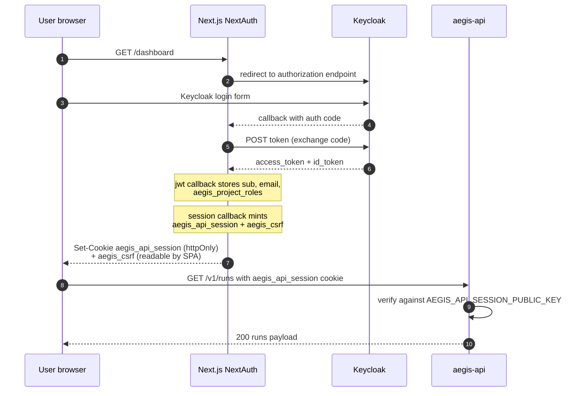
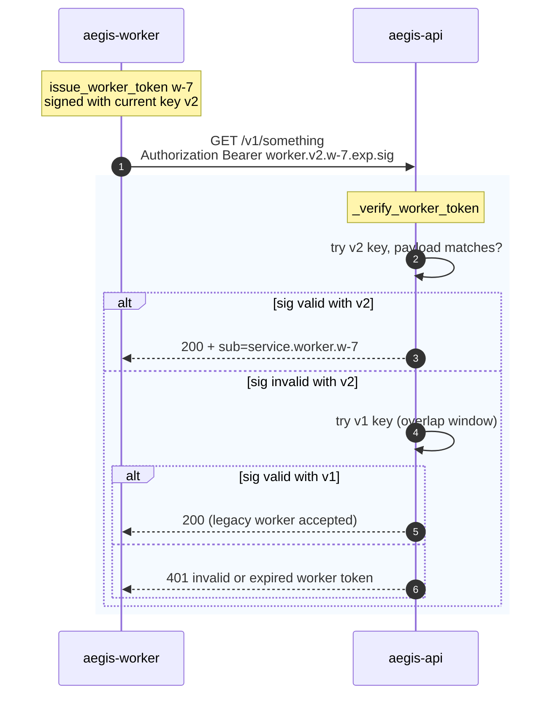

# Auth flows

Aegis carries four distinct auth paths into the API, plus one
defence-in-depth surface (the WebSocket upgrade). They all converge
on `aegis.api.auth.get_current_user`, which returns a `CurrentUser`
to the route handler.

| Path                    | Caller                       | Auth header / cookie                                  | Where it's verified                              |
|-------------------------|------------------------------|-------------------------------------------------------|--------------------------------------------------|
| Browser cookie          | Web SPA                      | `aegis_api_session` cookie (RS256 JWT)                | Aegis public key (`AEGIS_API_SESSION_PUBLIC_KEY`) |
| CLI / CI bearer         | `aegis --api …` + scripts    | `Authorization: Bearer <jwt|dev:email|worker:…>`      | Keycloak JWKS / dev table / worker SA verifier   |
| Worker SA bearer        | aegis-worker → API           | `Authorization: Bearer worker:v<ver>.<id>.<exp>.<sig>` | `AEGIS_WORKER_SIGNING_KEY` + rotation overlap    |
| WebSocket subprotocol   | Programmatic WS clients      | `Sec-WebSocket-Protocol: aegis.bearer.<token>`        | Same as CLI bearer                               |
| WebSocket cookie        | Browser WS                   | `aegis_api_session` cookie (rides along the upgrade)  | Same as browser cookie                           |

When more than one is present, **`Authorization: Bearer …` wins.**
That keeps the CLI / CI path simple and prevents a stale cookie from
silently downgrading a bearer call.

---

## Browser auth (NextAuth + Aegis-signed cookie)

The Keycloak code flow is owned by NextAuth; FastAPI never sees the
upstream access token. NextAuth's callback mints a separate
`aegis_api_session` cookie that FastAPI verifies against an
Aegis-managed RSA key — three concerns, three keys:

| Concern         | Holder            | Key                                                  |
|-----------------|-------------------|------------------------------------------------------|
| Identity        | Keycloak          | Keycloak signing keys (rotated by Keycloak)          |
| Browser session | NextAuth          | `NEXTAUTH_SECRET` (HMAC-ish, opaque to Aegis)        |
| API session    | Aegis             | `AEGIS_API_SESSION_PRIVATE_KEY` (RS256)              |



The Aegis cookie's claims:

```jsonc
{
  "iss": "aegis-api-session",
  "aud": "aegis-api",
  "sub": "<keycloak sub>",
  "email": "alice@example.com",
  "name": "Alice",
  "aegis_project_roles": { "proj-a": "admin", "proj-b": "scanner" },
  "iat": 1717000000,
  "exp": 1717000900,   // iat + AEGIS_API_SESSION_TTL_SECONDS (default 900)
  "jti": "0c…f3"
}
```

Header carries `alg=RS256` and `kid=aegis-api-session-v1` (configurable
via `AEGIS_API_SESSION_KEY_ID`). Rotation is "issue with the new
private key; serve the new public key alongside the old one for a
grace window" — same pattern as the worker SA path below.

### CSRF (double-submit cookie)

Every cookie-authenticated mutation (POST / PUT / PATCH / DELETE)
must echo the `aegis_csrf` cookie via the `X-Aegis-CSRF` header. The
middleware in `aegis/api/middleware/csrf.py` skips the check entirely
when:

- `Authorization: Bearer …` is present (programmatic callers exempt), or
- there is no `aegis_api_session` cookie (no session to forge against),
  or
- the request method is read-only.

Match is constant-time via `secrets.compare_digest`. The SPA's
`api()` helper auto-attaches the header when the cookie is present:

```ts
// web/src/lib/api.ts
if (!bearer && MUTATING.has(method) && _hasSessionCookie()) {
  const csrf = _readCookie(CSRF_COOKIE);
  if (csrf) headers[CSRF_HEADER] = csrf;
}
```

CORS is hardened in tandem — `allow_credentials=True` only against the
explicit origin list (`AEGIS_CORS_ORIGINS` + `AEGIS_WEB_ORIGIN`),
methods enumerated, headers scoped to `Authorization` / `Content-Type`
/ `X-Aegis-CSRF` / `X-Aegis-Request-ID`.

---

## CLI / programmatic bearer

The CLI's `--api` mode and any scripted caller send
`Authorization: Bearer …`. Token formats supported:

| Format                       | Resolver                                           | Dev / prod                  |
|------------------------------|----------------------------------------------------|-----------------------------|
| `dev:alice@aegis.local`      | `_dev_user`                                         | dev only — rejected in prod |
| `worker:v<ver>.<id>.<exp>.<sig>` | `_verify_worker_token` (see below)              | both                        |
| `worker:<legacy-hmac>`       | legacy static-HMAC path; sub=`service:worker:legacy` | both, transitional       |
| `eyJhbGc…` (JWT)             | Keycloak JWKS via authlib                          | both                        |

Token source priority in `aegis.cli.api_client.load_token`:

1. `AEGIS_TOKEN` env var.
2. First non-empty line of `~/.config/aegis/token`.

The CLI never carries cookie state.

---

## Worker service-account auth

When workers need to call the API (currently rare; v0.4.1+ paths only
post log batches and Check Run updates), they mint a time-bound
token with `aegis.api.auth.issue_worker_token(worker_id)`. The
format:

```
worker:v<key_version>.<worker_id>.<exp_unix>.<hex_sig>
```

where `hex_sig = HMAC-SHA256(current_signing_key, "v<ver>.<id>.<exp>")`.



Rotation knobs (env on the API side):

- `AEGIS_WORKER_SIGNING_KEY` — current key (`v<version>`).
- `AEGIS_WORKER_SIGNING_KEY_PREVIOUS` — previous key, accepted during
  the overlap.
- `AEGIS_WORKER_SIGNING_KEY_VERSION` — current version integer
  (default `1`).
- `AEGIS_WORKER_KEY_OVERLAP_SECONDS` — how long the previous key is
  accepted past version bump (default `300`).
- `AEGIS_WORKER_TOKEN_TTL_SECONDS` — token lifetime (default `300`).

Workers refresh their token every `ttl - margin` seconds; the API
maps every accepted token to actor `service:worker:<worker_id>` for
audit.

The Phase-3 static-HMAC worker token format
(`worker:<hex-sig-of-"aegis-worker">`) is still accepted by the
verifier and lands as `sub=service:worker:legacy` — there for a
single rolling restart, removed once every worker emits v1+ tokens.

---

## WebSocket auth

`/v1/runs/{run_id}/events` is gated by both an `Origin` check and a
multi-source token resolver. Failures close with code `1008` (policy
violation) and a short reason string.


The legacy `?token=…` query-parameter fallback has been removed; WebSocket
clients authenticate via the `aegis.bearer.<token>` subprotocol, the
`Authorization` header, or the session cookie.

---

## RBAC

Action authorization on top of identity is project-scoped. Each role
has a rank; each action requires a minimum rank.

| Role       | Rank | What they can do                                        |
|------------|------|---------------------------------------------------------|
| `scanner`  | 1    | start scans                                             |
| `remediator` | 2  | generate fixes (dry-run), trigger verifies, run scans   |
| `approver` | 3    | apply patches + open PRs, plus everything below          |
| `admin`    | 4    | manage targets, verify audit, settings — everything below |

| Action            | Min role     |
|-------------------|--------------|
| `scan.start`      | `scanner`    |
| `fix.generate`    | `remediator` |
| `verify.replay`   | `remediator` |
| `run.cancel`      | `remediator` |
| `tool.invoke`     | `remediator` |
| `fix.apply`       | `approver`   |
| `target.manage`   | `admin`      |
| `auth_profile.manage` | `admin`  |
| `audit.verify`    | `admin`      |

System callers (workers via `is_system=True`) bypass the check —
their identity is established at the bearer-resolution step instead.

The full source of truth is `aegis/api/policy.py`. The `<RoleGated>`
React component is **UX only** — every protected route and worker
entry re-runs the same check server-side.

---

## Common failure modes

| Symptom                                | Likely cause                                                                                              |
|----------------------------------------|-----------------------------------------------------------------------------------------------------------|
| `401 authentication required`          | No bearer header AND no `aegis_api_session` cookie.                                                       |
| `401 invalid token: …`                 | JWT verification failed (bad signature, expired, wrong audience).                                          |
| `401 invalid session cookie`           | Cookie not signed by the configured private key, or expired.                                              |
| `401 invalid or expired worker token`  | Worker token outside the overlap window, or signed with an unknown key version.                            |
| `403 CSRF token missing or mismatched` | Cookie-authed POST without `X-Aegis-CSRF`. CLI bearer is exempt.                                          |
| `403 no membership on project …`       | RBAC: user not in `aegis_project_roles` for that project (read), or below the action's minimum rank (write). |
| WebSocket close `1008 origin not allowed` | Browser origin not in `AEGIS_CORS_ORIGINS` / `AEGIS_WEB_ORIGIN`.                                        |
| WebSocket close `1008 no project membership` | Run belongs to a project the user doesn't have membership on.                                       |
