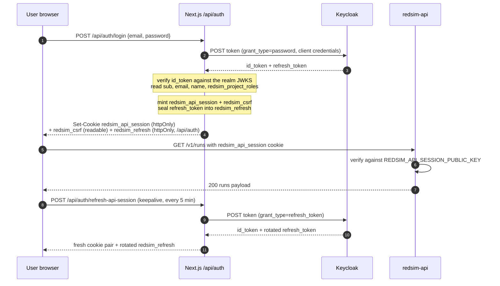
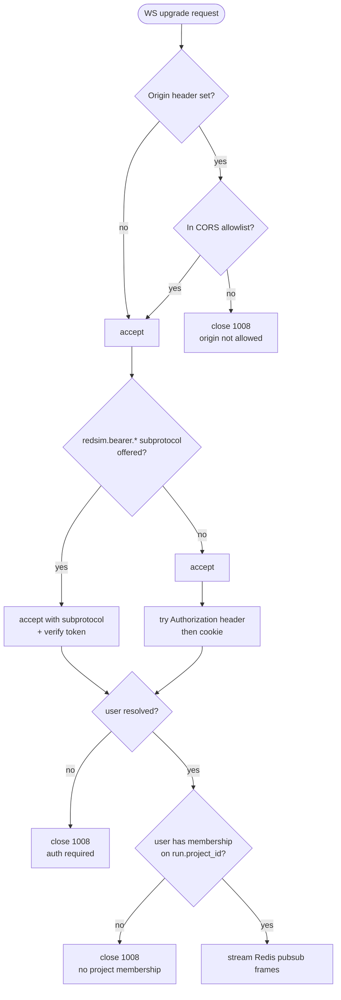

# Auth flows

Redsim carries four distinct auth paths into the API, plus one
defence-in-depth surface (the WebSocket upgrade). They all converge
on `redsim.api.auth.get_current_user`, which returns a `CurrentUser`
to the route handler.

| Path                    | Caller                       | Auth header / cookie                                  | Where it's verified                              |
|-------------------------|------------------------------|-------------------------------------------------------|--------------------------------------------------|
| Browser cookie          | Web SPA                      | `redsim_api_session` cookie (RS256 JWT)                | Redsim public key (`REDSIM_API_SESSION_PUBLIC_KEY`) |
| CLI / CI bearer         | `redsim --api …` + scripts    | `Authorization: Bearer <jwt|dev:email|worker:…>`      | Keycloak JWKS / dev table / worker SA verifier   |
| Worker SA bearer        | redsim-worker → API           | `Authorization: Bearer worker:v<ver>.<id>.<exp>.<sig>` | `REDSIM_WORKER_SIGNING_KEY` + rotation overlap    |
| WebSocket subprotocol   | Programmatic WS clients      | `Sec-WebSocket-Protocol: redsim.bearer.<token>`        | Same as CLI bearer                               |
| WebSocket cookie        | Browser WS                   | `redsim_api_session` cookie (rides along the upgrade)  | Same as browser cookie                           |

When more than one is present, **`Authorization: Bearer …` wins.**
That keeps the CLI / CI path simple and prevents a stale cookie from
silently downgrading a bearer call.

---

## Browser auth (branded login page + Redsim-signed cookie)

The browser signs in on the app's own page: an email and password form at
`/login`. There is no redirect to the identity provider's page, no dev
token and no bypass. The Next server owns the exchange:

1. `POST /api/auth/login` (same-origin only) forwards the email and
   password once to the realm's token endpoint as the OAuth 2 password
   grant (Keycloak's "direct access grants", enabled on the `redsim-web`
   client), with the client secret when the client is confidential.
2. It verifies the returned ID token against the realm's JWKS (signature,
   expiry, audience, and an issuer that is either `KEYCLOAK_ISSUER` or
   `KEYCLOAK_PUBLIC_ISSUER`), and reads `sub`, `email`, `name` and
   `redsim_project_roles` from it.
3. It mints the `redsim_api_session` cookie FastAPI verifies, the readable
   `redsim_csrf` cookie beside it, and seals the realm's refresh token into
   a third httpOnly cookie, `redsim_refresh`, scoped to `/api/auth`.

The password never reaches FastAPI, the browser bundle or a log. The
realm's error text never reaches the browser either: the route answers a
code (`invalid_credentials`, `account_disabled`, `account_locked`,
`not_configured`, `unavailable`) and `web/src/lib/login-messages.ts` turns
it into a sentence. Three concerns, three keys:

| Concern         | Holder            | Key                                                  |
|-----------------|-------------------|------------------------------------------------------|
| Identity        | Keycloak          | Keycloak signing keys (rotated by Keycloak)          |
| Refresh cookie  | Next server       | `REDSIM_WEB_SESSION_SECRET` (seals `redsim_refresh`)  |
| API session     | Redsim            | `REDSIM_API_SESSION_PRIVATE_KEY` (RS256)              |

The web tier keeps no session store. The session pair lives
`REDSIM_API_SESSION_TTL_SECONDS` (900 by default); while a tab is open the
keepalive posts `/api/auth/refresh-api-session`, which opens the sealed
cookie, trades the refresh token at the realm, re-mints the pair and rotates
the refresh cookie. The refresh cookie lives as long as the realm said the
refresh token does (its `refresh_expires_in`, so the realm's SSO idle
timeout bounds the browser session), capped at 24 hours. A refresh token the
realm no longer honours clears every credential, so the next page load lands
on `/login?reason=rejected` rather than looping on 401. Sign-out
(`POST /api/auth/signout-redsim`) revokes the refresh token at the realm's
logout endpoint, best effort, and clears the three cookies.

Trade-offs of the password grant, accepted for this deployment: the realm's
browser flow is bypassed, so a user with OTP or another second factor cannot
sign in through this page, and there is no "forgot password" link (the page
says to contact an administrator). Brute-force protection still applies,
because the realm enforces it on the token endpoint.



The Redsim cookie's claims:

```jsonc
{
  "iss": "redsim-api-session",
  "aud": "redsim-api",
  "sub": "<keycloak sub>",
  "email": "alice@example.com",
  "name": "Alice",
  "redsim_project_roles": { "proj-a": "admin", "proj-b": "scanner" },
  "iat": 1717000000,
  "exp": 1717000900,   // iat + REDSIM_API_SESSION_TTL_SECONDS (default 900)
  "jti": "0c…f3"
}
```

Header carries `alg=RS256` and `kid=redsim-api-session-v1` (configurable
via `REDSIM_API_SESSION_KEY_ID`). Rotation is "issue with the new
private key; serve the new public key alongside the old one for a
grace window" — same pattern as the worker SA path below.

### CSRF (double-submit cookie)

Every cookie-authenticated mutation (POST / PUT / PATCH / DELETE)
must echo the `redsim_csrf` cookie via the `X-Redsim-CSRF` header. The
middleware in `redsim/api/middleware/csrf.py` skips the check entirely
when:

- `Authorization: Bearer …` is present (programmatic callers exempt), or
- there is no `redsim_api_session` cookie (no session to forge against),
  or
- the request method is read-only.

Match is constant-time via `secrets.compare_digest`. The SPA's
`api()` helper auto-attaches the header when the cookie is present:

```ts
// web/src/lib/api.ts
if (MUTATING.has(method)) {
  const csrf = readCookie(CSRF_COOKIE);
  if (csrf) headers[CSRF_HEADER] = csrf;
}
```

CORS is hardened in tandem — `allow_credentials=True` only against the
explicit origin list (`REDSIM_CORS_ORIGINS` + `REDSIM_WEB_ORIGIN`),
methods enumerated, headers scoped to `Authorization` / `Content-Type`
/ `X-Redsim-CSRF` / `X-Redsim-Request-ID`.

---

## CLI / programmatic bearer

The CLI's `--api` mode and any scripted caller send
`Authorization: Bearer …`. Token formats supported:

| Format                       | Resolver                                           | Dev / prod                  |
|------------------------------|----------------------------------------------------|-----------------------------|
| `dev:alice@redsim.local`      | `_dev_user`                                         | dev only — rejected in prod |
| `worker:v<ver>.<id>.<exp>.<sig>` | `_verify_worker_token` (see below)              | both                        |
| `eyJhbGc…` (JWT)             | Keycloak JWKS via authlib                          | both                        |

Token source priority in `redsim.cli.api_client.load_token`:

1. `REDSIM_TOKEN` env var.
2. First non-empty line of `~/.config/redsim/token`.

The CLI never carries cookie state.

---

## Worker service-account auth

When a worker needs to call the API (rare today, since workers write
Postgres directly), it mints a time-bound token with
`redsim.api.auth.issue_worker_token(worker_id)`. The
format:

```
worker:v<key_version>.<worker_id>.<exp_unix>.<hex_sig>
```

where `hex_sig = HMAC-SHA256(current_signing_key, "v<ver>.<id>.<exp>")`.


Rotation knobs (env on the API side):

- `REDSIM_WORKER_SIGNING_KEY` — current key (`v<version>`).
- `REDSIM_WORKER_SIGNING_KEY_PREVIOUS` — previous key, accepted during
  the overlap.
- `REDSIM_WORKER_SIGNING_KEY_VERSION` — current version integer
  (default `1`).
- `REDSIM_WORKER_KEY_OVERLAP_SECONDS` — how long the previous key is
  accepted past version bump (default `300`).
- `REDSIM_WORKER_TOKEN_TTL_SECONDS` — token lifetime (default `300`).

Workers refresh their token every `ttl - margin` seconds; the API
maps every accepted token to actor `service:worker:<worker_id>` for
audit.

The pre-v0.3.1 constant-payload form (`worker:<hex-sig>`) is rejected
outright: `_parse_worker_token` accepts only the versioned, time-bound
format, and there is no legacy fallback.

---

## WebSocket auth

`/v1/runs/{run_id}/events` is gated by both an `Origin` check and a
multi-source token resolver. Failures close with code `1008` (policy
violation) and a short reason string.



The legacy `?token=…` query-parameter fallback has been removed; WebSocket
clients authenticate via the `redsim.bearer.<token>` subprotocol, the
`Authorization` header, or the session cookie.

---

## RBAC

Action authorization on top of identity is project-scoped. Each role
has a rank and each action requires a minimum rank. `viewer` ranks 0:
it passes every membership (read) gate and fails every `check()` on a
gated action, the same as an unknown role.

| Role         | Rank | What they can do                                                                 |
|--------------|------|----------------------------------------------------------------------------------|
| `viewer`     | 0    | read runs, findings, artifacts and the scorecard                                 |
| `scanner`    | 1    | start scans and attack campaigns, request explanations, export reports           |
| `remediator` | 2    | register models, request hardening, trigger verifies, cancel runs, annotate, plus everything below |
| `approver`   | 3    | review (dismiss) findings, plus everything below                                 |
| `admin`      | 4    | manage targets and auth profiles, verify audit, project settings, everything below |

| Action                | Min role     | Status                                        |
|-----------------------|--------------|-----------------------------------------------|
| `scan.start`          | `scanner`    | live (the offline `redsim scan` admission)    |
| `attack.run`          | `scanner`    | ML, routes land with WS4                      |
| `explain.run`         | `scanner`    | ML, routes land with WS4                      |
| `report.export`       | `scanner`    | ML                                            |
| `verify.replay`       | `remediator` | live (`POST /v1/findings/{id}/verify`)        |
| `run.cancel`          | `remediator` | live                                          |
| `model.register`      | `remediator` | ML                                            |
| `harden.recommend`    | `remediator` | ML                                            |
| `finding.annotate`    | `remediator` | ML                                            |
| `finding.review`      | `approver`   | ML                                            |
| `target.manage`       | `admin`      | live (targets, project settings)              |
| `auth_profile.manage` | `admin`      | live                                          |
| `audit.verify`        | `admin`      | live                                          |

The seven ML members (spec section 7.4) are on `main` so that the WS4
routes can gate on them. `model.register` sits at `remediator` because
an upload admits untrusted bytes that only the sandboxed worker ever
opens. Endpoint registration (Phase B) is `target.manage`. Finding
dismissal (`finding.review`) also carries an independence rule in the
service layer, not in the policy engine: the reviewer may not be the
campaign creator and may not be a system principal (spec 7.7). That
check is not built yet.

The table is mirrored verbatim in `deploy/opa/redsim-authz.rego` and
`deploy/cedar/redsim-policy.cedar`. Change all three together: an
unknown action fails closed. Two places still lag: `viewer` is not yet
a realm role in `deploy/keycloak/realm-export.json`, and the
design-system `ROLES` tuple
(`packages/design-system/src/components/role-gated.tsx`) still lists
four roles.

System callers (workers via `is_system=True`) bypass the check. Their
identity is established at the bearer-resolution step instead.

The full source of truth is `redsim/api/policy.py`. The `<RoleGated>`
React component is **UX only**: every protected route and worker
entry re-runs the same check server-side.

---

## Policy engine

The role-rank decision above is **pluggable**. The route-level gate
(`redsim.api.policy.check`) no longer inlines the rule table; it builds a
normalized request and asks the configured `PolicyEngine`
(`redsim/policy/engine.py`) for a decision. A deny still raises the same
`HTTPException(403)`, carrying the engine's `reason`. Every call site is
unchanged.

This is the route-level RBAC layer only. It is distinct from, and runs
in addition to, the target-allowlist + audit gate
(`redsim.safety.authorize`). Both layers run on a mutating request: the
`PolicyEngine` answers "may this role do this action on this project?"
and `authorize()` answers "is this target allowlisted, and record it".
For ML artifact targets `authorize()` is called with `target=None`, so
`allowlist_check` records `n/a` and the audit row is the point. Swapping
the policy engine does not touch `authorize()`. The effect-class
human-in-the-loop gate of
[ADR 0004](../adr/0004-unified-effect-class-gate.md) gated the upstream
agents and tools and left with the pentest domain.

### The three engines

| Engine | `REDSIM_POLICY_ENGINE` | Behaviour |
|--------|-----------------------|-----------|
| `StaticPolicyEngine` | `static` (**default**) | The built-in role-rank table above, **behaviour-identical** to the historical inline check. No network. |
| `OPAPolicyEngine`    | `opa`    | POSTs the decision input to an [Open Policy Agent](https://www.openpolicyagent.org/) data endpoint; reads `result.allow` (bool) + optional `result.reason`. |
| `CedarPolicyEngine`  | `cedar`  | POSTs the request to a `cedar-agent`-style REST endpoint; reads a `decision` of `Allow`/`Deny` + optional `reason`. |

The static engine is the default; running with it is byte-for-byte the
same authorization behaviour as before this seam existed. The example
OPA / Cedar policies that ship with Redsim replicate the same role-rank
table, so `opa` / `cedar` are drop-in equivalents — see
[deploy.md](../ops/deploy.md) § "External policy engine (optional)".

### Fail closed

Both external engines **fail closed**. Any connection error, timeout
(the gate is on the hot path of every mutating request, so the HTTP
timeout is short), non-2xx response, or malformed/missing decision body
yields a **deny** — the request gets a `403`, and the failure is logged
(no request body or secrets are logged). A misconfigured or unreachable
OPA / Cedar server fails *safe*: it locks the platform down, never opens
it up.

### Decision input

`check()` normalizes the question into a `PolicyRequest` whose
`to_input()` is the JSON document external engines evaluate. OPA receives
it wrapped as `{"input": <document>}`; Cedar receives `subject` /
`context` plus `action` / `resource` as `principal` / `context` /
`action` / `resource`. The document:

```json
{
  "subject": {
    "sub": "<keycloak sub>",
    "email": "alice@example.com",
    "project_memberships": { "proj-a": "admin", "proj-b": "scanner" },
    "is_system": false
  },
  "action": "attack.run",
  "resource": {
    "project_id": "proj-a"
  },
  "context": {}
}
```

`resource` may also carry `target` / `run_id` / `effect_class`;
`context` may carry request-time flags such as `override_authorized`.
System principals (workers) arrive with `is_system: true` and are
allowed by every engine, mirroring the static bypass.

### Switching engines

Selection mirrors the blob-store / audit-writer backend pattern: read
once per process from the environment, with a reset hook for tests.

| Var | Default | Used by |
|-----|---------|---------|
| `REDSIM_POLICY_ENGINE` | `static` | api, worker — `static` \| `opa` \| `cedar` |
| `REDSIM_OPA_URL`       | `http://localhost:8181` | `opa` engine base URL |
| `REDSIM_OPA_PATH`      | `/v1/data/redsim/authz`  | `opa` engine data path |
| `REDSIM_CEDAR_URL`     | `http://localhost:8180` | `cedar` engine base URL |

An unknown `REDSIM_POLICY_ENGINE` value logs a warning and falls back to
`static`. The ops-side runbook for standing up an OPA / Cedar sidecar
lives in [deploy.md](../ops/deploy.md).

---

## Common failure modes

| Symptom                                | Likely cause                                                                                              |
|----------------------------------------|-----------------------------------------------------------------------------------------------------------|
| `401 authentication required`          | No bearer header AND no `redsim_api_session` cookie.                                                       |
| `401 invalid token: …`                 | JWT verification failed (bad signature, expired, wrong audience).                                          |
| `401 invalid session cookie`           | Cookie not signed by the configured private key, or expired.                                              |
| `401 invalid or expired worker token`  | Worker token outside the overlap window, or signed with an unknown key version.                            |
| `403 CSRF token missing or mismatched` | Cookie-authed POST without `X-Redsim-CSRF`. CLI bearer is exempt.                                          |
| `403 no membership on project …`       | RBAC: user not in `redsim_project_roles` for that project (read), or below the action's minimum rank (write). |
| `403 policy engine unavailable: …`     | External `opa` / `cedar` engine errored / timed out / returned a malformed decision — the engine failed closed (deny). Check the OPA / Cedar sidecar. |
| WebSocket close `1008 origin not allowed` | Browser origin not in `REDSIM_CORS_ORIGINS` / `REDSIM_WEB_ORIGIN`.                                        |
| WebSocket close `1008 no project membership` | Run belongs to a project the user doesn't have membership on.                                       |
