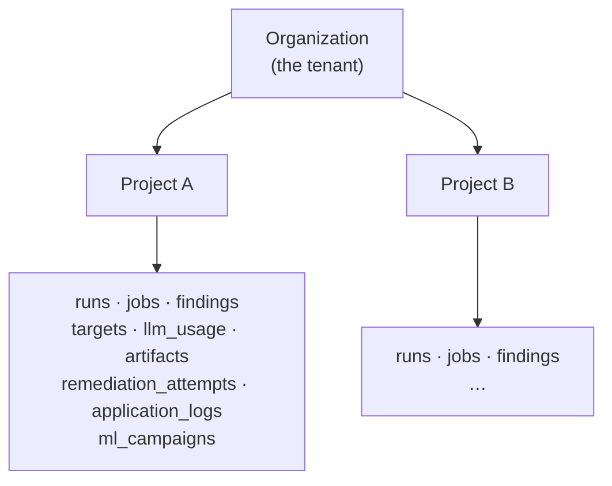
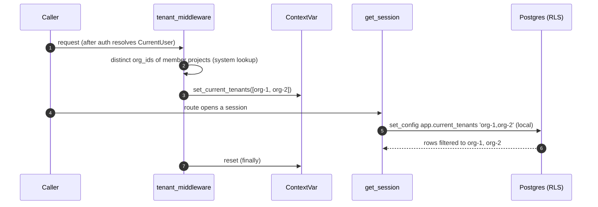

# Multi-tenancy

Redsim is multi-tenant on the **Organization**. An org is the top entity
in the data model; every `Project` carries an `org_id`, and every
project-scoped row (runs, findings, jobs, …) belongs to exactly one org
through its project. The tenant boundary *is* the org boundary.

Isolation is **layered**. The app layer already scopes every read to the
caller's project memberships (`ensure_project_access` / `ensure_run_access`
in `redsim/api/policy.py`). The database layer adds **Postgres Row-Level
Security (RLS)** keyed on `org_id` as defense-in-depth: a single forgotten
`WHERE` clause can no longer leak rows across tenants, because the database
itself refuses to return another org's rows.

```
caller → route auth dependency (project membership)   ← app layer
       → tenant middleware sets app.current_tenants    ← seam
       → Postgres RLS filters on org_id                ← DB layer
```

The DB layer is **belt-and-suspenders behind** the route auth, not a
replacement for it. Both filter on the same `org_id`, so they agree.

---

## The tenancy model



- **Organization = tenant.** It is the tenant root, not itself a
  project-scoped table.
- **Project belongs to one org** (`Project.org_id`).
- **Every project-scoped row belongs to one org** through its project,
  and now carries a denormalized `org_id` of its own (see below).

---

## DB-enforced org isolation (migration `0006_tenant_rls`)

Migration `0006` makes the database enforce the org boundary. It touches
`projects` (which already carries `org_id`) plus the eight project-scoped
tables: `targets`, `runs`, `jobs`, `findings`, `llm_usage`, `artifacts`,
`remediation_attempts`, `application_logs`. Migration `0010_ml_vertical`
adds a ninth scoped table, `ml_campaigns`, with the same column, triggers
and policy (section 4 below).

### 1. Denormalized `org_id` + a backfill trigger

Each scoped table gains a denormalized `org_id VARCHAR(64) REFERENCES
organizations(id)` column (indexed). A join-free *local* column is what
lets the RLS policy be a simple column comparison — a policy that
subqueried `projects` would recurse through that table's own RLS.

- **Existing rows** are backfilled from `projects.org_id`.
- **New rows** need no insert-code changes: a per-table `BEFORE INSERT`
  trigger resolves `org_id` from the row's `project_id` when it is `NULL`.
  `project_id` is `NOT NULL` on every scoped table, so the lookup always
  resolves.

### 2. `ENABLE` + `FORCE ROW LEVEL SECURITY` + one policy

Each RLS table (`projects` plus every scoped table) gets RLS **enabled
and forced**, plus a single policy `redsim_tenant_isolation`:

```sql
ALTER TABLE <t> ENABLE ROW LEVEL SECURITY;
ALTER TABLE <t> FORCE  ROW LEVEL SECURITY;   -- also binds the table OWNER

CREATE POLICY redsim_tenant_isolation ON <t>
  USING (
    coalesce(current_setting('app.current_tenants', true), '') = ''
    OR org_id = ANY (string_to_array(current_setting('app.current_tenants', true), ','))
  )
  WITH CHECK ( … same predicate … );
```

The policy reads a per-transaction GUC `app.current_tenants` — a
comma-separated list of org ids the caller may see:

- **Empty / unset GUC ⇒ full access.** This is the **system / worker**
  path. `current_setting(…, true)` returns `NULL` when unset; it is
  coalesced to `''`, and the explicit `= ''` short-circuits before the
  `ANY()`.
- **Otherwise** the row's `org_id` must appear in the list.

`FORCE` makes the table **owner** subject to the policy (`ENABLE` alone exempts
the owner). `ENABLE` already binds ordinary roles.

!!! danger "RLS requires a non-superuser DB role"
    A Postgres **superuser bypasses RLS unconditionally** — `FORCE` does **not**
    bind superusers, only the table owner. So org isolation only enforces when
    the application connects as a **non-superuser** role. Production must point
    `REDSIM_DB_URL` at the restricted **`redsim_app`** role (provisioned in
    migration `0004` + the [deploy runbook](../ops/deploy.md)); the dev
    docker-compose uses the `redsim` superuser for convenience, where RLS is a
    no-op. `redsim.db.session` logs a one-time **warning** when it detects a
    superuser connection with a tenant scope in effect. The Postgres-gated
    `tests/test_tenant_rls.py` therefore `SET ROLE`s to a dedicated
    non-superuser role to exercise the policies faithfully.

!!! note "Why `organizations` itself isn't in the RLS set"
    `organizations` is the tenant *root*, not a project-scoped table, so
    `0006` does not force RLS on it (and `0007`, which adds org columns,
    needs no RLS change). The scoped tables plus `projects` are the rows
    that carry a tenant key. Also outside the RLS set: `users`,
    `project_memberships`, `auth_profiles` (app-scoped by `project_id`
    checks), `audit_events` and `audit_chain_heads` (append-only,
    chain-scoped, `project_id` nullable) and `finding_tickets`.

### 3. `org_id` drift guard on UPDATE (migration `0009_tenant_org_id_guard`)

The insert trigger only fires on INSERT, so an UPDATE could drive a row's
`org_id` out of sync with its project's org, and the system path (empty
GUC) bypasses the policy's `WITH CHECK`. Migration `0009` adds a
`BEFORE UPDATE` trigger per scoped table (`redsim_check_org_id_<table>`)
that raises `check_violation` whenever the new `org_id` differs from the
org owning the row's project. A `NULL` `org_id` is backfilled instead of
rejected, mirroring the insert trigger. `application_logs` rows with a
`NULL` `project_id` (system-scoped logs) are left alone because there is
no owning org to enforce against.

### 4. `ml_campaigns` parity (migration `0010_ml_vertical`)

The campaign and score record of the ML vertical (`ml_campaigns`, one row
per ML `Run`, spec section 5.6) joins the scoped set with the identical
denormalized `org_id` column, the `redsim_set_org_id_ml_campaigns` insert
backfill, the `redsim_check_org_id_ml_campaigns` update guard, `ENABLE`
plus `FORCE ROW LEVEL SECURITY` and the `redsim_tenant_isolation` policy
over the same GUC. The trigger, guard and policy SQL is copied from `0006`
and `0009` with only the table name substituted. ML code never sets
`org_id` (spec 7.6). The same migration adds the nullable `targets.detail`
JSONB column that holds the `MLModelManifest` for `ml_model_artifact` and
`ml_model_endpoint` targets. It is `NULL` for every other kind, so no
existing row changes meaning. On `main` the ORM does not yet map either
the column or the table. Only the migration exists.

---

## The session / middleware seam

The GUC is set per request and cleared after.

- **`redsim/db/session.py`** — `set_current_tenants(org_ids)` pins a
  request-scoped `ContextVar`; `get_session()` issues
  `SELECT set_config('app.current_tenants', :v, is_local => true)` at the
  start of the transaction so the value is scoped to that transaction and
  reset on commit/rollback (no leakage across pooled connections). The
  value is **bound as a parameter**, never interpolated. `None` / empty
  list ⇒ `''` ⇒ system (full access). This is **Postgres-only** —
  `set_config` doesn't exist on sqlite, so unit tests are unaffected.
- **`redsim/api/middleware/tenant.py`** — after auth resolves the caller,
  it computes the distinct org ids of the caller's *member projects* and
  pins them for the request, resetting in a `finally`. System principals
  (`is_system` — workers, service accounts) and callers with no
  memberships get `None` (system scope), so the route's own auth
  dependency decides. The membership lookup itself runs as *system* (the
  scope is set only after it returns), avoiding a chicken-and-egg query.
  If the DB is unavailable the middleware falls back to system scope
  rather than failing the request — RLS is defense-in-depth *behind* the
  route auth, which still gates access.



Workers and migrations never set the GUC, so they run with full access,
exactly what background execution and `alembic upgrade` need.

A detective control backs the triggers: the
`redsim.verify_tenant_integrity` beat task (hourly) re-derives each
scoped row's expected `org_id` from its project, logs any mismatch, and
records one `tenant.integrity_check` event on the system audit chain. It
never repairs. `redsim tenants verify` runs the same scan on demand, and
`--repair` backfills drifted rows from the project once the drift is
understood.

---

## Per-tenant cost + LLM routing (migration `0007_org_cost_routing`)

Cost accounting and model routing, previously per-project, lift one tier
to the Organization.

### Schema

Migration `0007` adds two nullable columns to `organizations`:

- **`monthly_llm_budget_cents`** (`INTEGER`) — the org's monthly LLM spend
  cap in cents. `NULL` ⇒ uncapped.
- **`llm_model_overrides`** (`JSONB`) — a `{task: model}` map of
  per-tenant routing overrides that win over the config default.

### Budget enforcement

`DbBudgetChecker` (`redsim/llm/budget.py`) gains:

- **`remaining_org(org_id)`** — `monthly_llm_budget_cents` minus this UTC
  calendar month's `llm_usage.cost_cents` for the org (matched on the
  denormalized `LLMUsage.org_id`, falling back to the owning project's
  `org_id` for legacy rows). `None` when uncapped/absent.
- **`model_override(org_id, task)`** — reads
  `organizations.llm_model_overrides[task]`.

`route(..., org_id=…)` (`redsim/llm/router.py`) then:

1. **Model selection** — a per-tenant override
   (`llm_model_overrides[task]`) wins; otherwise the `RedsimConfig`
   default. The override is consulted only when both `org_id` and a
   checker exposing `model_override` are supplied, so it degrades to the
   config default absent a DB.
2. **Budget gate** — enforces **both** the project's daily cap **and** the
   org's monthly cap. `BudgetExceeded` is raised if *either* tier is
   exhausted, and the message **names the tier** (project-daily vs
   org-monthly) without leaking spend figures. The reported
   `budget_remaining_cents` is the tighter (smaller) of the two.

### The cost endpoint + dashboard

`GET /v1/orgs/{org_id}/cost?days=30` (`redsim/api/v1/org_cost.py`)
aggregates `llm_usage` for the org into a chargeback view: `total_cents`,
`call_count`, and `by_day` / `by_model` / `by_task` breakdowns over the
trailing `days` window, plus a month-to-date budget block (cap, spent,
remaining). It is gated to **org members** via `ensure_org_access` (a
member of at least one project in the org) — cost visibility is something
a tenant sees for its *own* org, not a cross-tenant forensic surface. The
aggregation filters on `LLMUsage.org_id`, the same column RLS uses, so the
app-layer filter and the DB policy agree.

A **/cost** dashboard page in the web UI renders this endpoint (totals,
per-day/model/task breakdowns, and the monthly budget) with a
7 / 30 / 90-day window selector.

See the [API reference](../api/v1.md#orgs-cost) for the full request /
response shape and the [deployment runbook](../ops/deploy.md) for the
operational notes.
