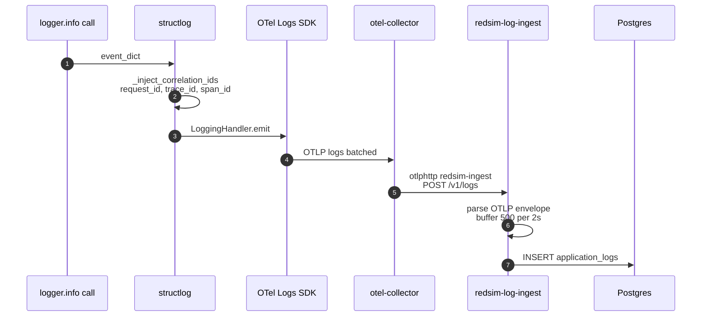
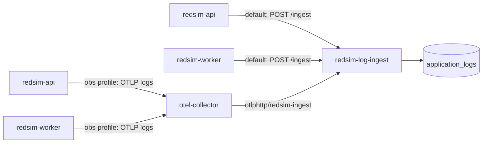
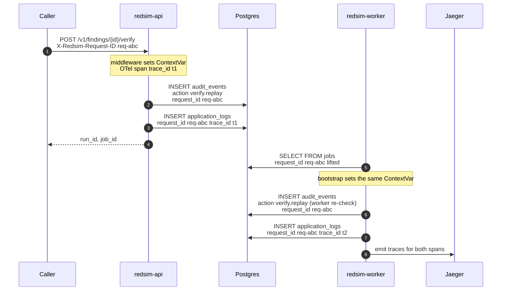

# Observability

Redsim emits three telemetry streams — **logs**, **traces**, and
**metrics** — and ships them through one OpenTelemetry Collector. The
log path additionally has an always-on Postgres mirror so
`SELECT * FROM application_logs WHERE run_id = '…'` works even when
Loki / Elasticsearch aren't up.


The default profile gives you in-app queries with zero ops overhead;
adding `obs` brings ad-hoc query (Loki) + traces (Jaeger) without
adding a new datastore. `obs-search` is for full-text search workloads
where Loki's label model isn't enough.

---

## Logs

Every log line carries a structlog payload that's auto-enriched with:

- `request_id` — propagated via the `X-Redsim-Request-ID` header
  (request_id_middleware). Set on the API; forwarded by the worker
  via the Job's detail row.
- `trace_id` / `span_id` — from the active OTel span when one is
  active.
- `severity`, `service`, plus whatever structured kwargs the caller
  passed.

The structlog processor that does the enrichment lives in
`redsim.observability._inject_correlation_ids`. The OTel handler that
ships the events to the Collector is wired by
`_configure_otel_logs(service_name)` and only activates when
`OTEL_EXPORTER_OTLP_ENDPOINT` is set — so the Phase 2 offline path
continues to log to stdout.



### `application_logs` table

Indexed for the queries that actually happen:

| Index                     | Query it supports                          |
|---------------------------|--------------------------------------------|
| `ix_logs_run_ts`          | per-run timeline (newest first)            |
| `ix_logs_project_ts`      | per-project tail                           |
| `ix_logs_request`         | correlate API + worker + sandbox child by request_id |
| `ix_logs_trace`           | correlate with a Jaeger trace              |
| `ix_logs_severity_ts`     | filter (e.g. severity=error) + newest first |
| `ix_logs_service`         | service name filter                        |
| `ix_logs_ts`              | global timeline                            |

Schema lives in `redsim/db/models.py::ApplicationLog`; the Alembic
migration that creates it is `0003_application_logs`.

### Ingress paths



Two paths converge on the same `LogIngestWriter`:

- `POST /ingest` — JSON batch (`{ "records": [...] }`). Used by the
  default profile when no Collector is up. Easy to hand-test.
- `POST /v1/logs` — OTLP/Logs over HTTP-JSON. What the Collector's
  `otlphttp/redsim-ingest` exporter posts. The receiver decodes the
  `resourceLogs → scopeLogs → logRecords` envelope without pulling in
  the protobuf SDK.

The writer batches `~500 records / 2s` and exposes counters via
`/metrics` (`redsim_log_ingest_buffered`, `…_inserted_total`,
`…_last_flush_ms`).

### Querying logs

| Where      | How                                                                 |
|------------|---------------------------------------------------------------------|
| In-app     | `GET /v1/logs?run=…&severity=…&since=…` (admin); web `/logs` page    |
| Postgres   | `SELECT … FROM application_logs WHERE …`                            |
| Loki       | `{service="redsim-api"} \| json` (under `obs`)                       |
| Kibana     | Discover, index pattern `redsim-*` (under `obs-search`)              |

Every `/v1/logs` query emits a `logs.queried` audit event so a
forensic review can answer "who looked at what" — see
[`audit-chain.md`](audit-chain.md).

---

## Traces

The Collector receives OTLP/Traces from the API + worker and exports
to Jaeger (`obs` profile). Spans carry the same `request_id` as the
log stream, so a slow API call ⇒ Jaeger trace ⇒ Postgres log query
chains together by a single id.

Wired in `redsim.observability.configure_otel`:

```python
configure_otel(service_name="redsim-api")
```

— invoked from API + worker bootstrap. No-op when
`OTEL_EXPORTER_OTLP_ENDPOINT` is unset.

---

## Metrics

Prometheus exposition format on `/metrics`. The current counters /
gauges (defined in `redsim.observability._make_counters`):

| Metric                      | Type    | Labels         | Owner                  |
|-----------------------------|---------|----------------|------------------------|
| `redsim_scans_total`         | Counter | `status`       | admission              |
| `redsim_fix_success_total`   | Counter | —              | execution              |
| `redsim_verify_status_total` | Counter | `status`       | execution              |
| `redsim_jobs_active`         | Gauge   | —              | bootstrap              |
| `redsim_rate_limited_total`  | Counter | —              | rate-limit middleware  |
| `redsim_log_ingest_buffered` | Gauge   | —              | log-ingest             |
| `redsim_log_ingest_inserted_total` | Counter | —          | log-ingest             |
| `redsim_log_ingest_last_flush_ms`  | Gauge   | —           | log-ingest             |

When `prometheus_client` isn't installed (Phase 2 offline path),
`/metrics` returns `{"detail": "prometheus_client not installed"}`
so a curl probe doesn't crash.

---

## Run events & worker queues

Beyond the three telemetry streams, the worker emits a **live
job-lifecycle event stream** the dashboard consumes, and runs its tasks
across two Celery queues so a 30-minute scan can't block a CI gate.

### Live run events (Redis pub/sub → WebSocket)

```mermaid
sequenceDiagram
    autonumber
    participant W as redsim-worker
    participant DB as Postgres
    participant R as Redis pub/sub
    participant API as redsim-api (WS)
    participant Web as @redsim/web

    Note over W: task_context runs the job body
    W->>R: publish run:{run_id}:events<br/>{type:job, status:"running"}
    W->>DB: UPDATE jobs … (succeeded / failed)
    Note over W,DB: terminal event published AFTER the commit
    W->>R: publish {type:job, status:"succeeded"|"failed"}
    Web->>API: WS GET /v1/runs/{run_id}/events
    API->>R: SUBSCRIBE run:{run_id}:events
    R-->>API: event frames
    API-->>Web: send_json(event)
    Note over Web: useRunEvents → mutate(); SWR poll is the fallback
```

The worker publishes a job-transition frame
(`running` / `succeeded` / `failed`) to the Redis channel
`run:{run_id}:events` via `publish_job_event` in
`redsim/workers/events.py`. The WebSocket endpoint
`GET /v1/runs/{run_id}/events` (`redsim/api/ws.py`) subscribes to that
channel and streams each frame to the frontend; the web `useRunEvents`
hook (`web/src/hooks/useRunEvents.ts`) consumes them live and revalidates
its SWR data, with the existing SWR poll as the fallback when the socket
is down. Heartbeat frames (emitted when no broker is configured) are
ignored.

Two load-bearing details:

- **Publishing is best-effort.** A broker hiccup must never fail or retry
  the job that triggered the event — Postgres stays the source of truth
  for status; the event stream is a real-time convenience on top of it.
  Every publish failure is swallowed and logged.
- **Terminal events are published after the DB commit.** The worker's
  `task_context` (`redsim/workers/bootstrap.py`) emits the `succeeded` /
  `failed` frame only once `get_session()` has committed the status row,
  so a consumer reacting to the event always sees a durable row.

### Celery queue routing

`redsim/workers/celery_app.py` routes tasks across two queues so the
worker pools don't contend:

| Queue | Tasks | Why |
|-------|-------|-----|
| `scans` | `redsim.scan_start`, `redsim.verify_replay` today. The ML tasks `attack.run`, `explain.run` and `model.validate` join it with WS4. | Long attack / explain / verify work (minutes). |
| `default` | `redsim.report_render`, `redsim.reap_stale_jobs`, `redsim.verify_tenant_integrity`, `redsim.export_chains_to_worm`. `harden.recommend` joins it with WS4, so the Pythia call never shares a pool with model loading. | Fast bookkeeping, kept off the `scans` pool so a long campaign cannot starve it. |

[`deploy/docker-compose.yml`](https://github.com/IntelliBridge/ndia-red-team-simulator/blob/main/deploy/docker-compose.yml)
runs **a dedicated worker pool per queue** — `redsim-worker`
(`-Q scans`) and `redsim-worker-default` (`-Q default`) — plus a separate
**`redsim-beat`** scheduler service (`celery … beat`). The beat process is
what actually fires `app.conf.beat_schedule`: the stale-job reaper every
5 minutes, the tenant integrity check hourly and the WORM export at
`REDSIM_WORM_INTERVAL` (daily by default).

### Durable status on failure

A crashed or failed task must leave a **durable** terminal row, but
`get_session()` rolls back its session on exception — a naive
`job.status = "failed"` written on that session would be discarded. So
`task_context` rolls back first (releasing the job-row lock), then
re-loads the `Job` and writes `status="failed"` + the error on a *fresh*
commit so it survives. The periodic `reap_stale_jobs` reaper is the
backstop: a task that dies hard (process killed, never reaching the
`except`) is left `status="running"` forever, so the reaper sweeps rows
past their TTL to `failed`.

---

## Correlation: a worked example

A user hits an admission route, for example
`POST /v1/findings/{id}/verify`. The full chain of ids that lets you
follow that one call across services:



Operationally: drop `request_id=req-abc` into the Logs page and you
get the API row, the worker row, and the sandbox child's stderr tail
chronologically. Drop `trace_id=t1` into Jaeger and you get the
upstream-vs-downstream span timing. Drop the same into
`application_logs.trace_id` and the same time-ordered log slice
appears in Postgres.

---

## Configuration reference

Env vars, all read by `redsim.observability` + `redsim.log_ingest`:

| Env var                                  | What it does                                                   |
|------------------------------------------|----------------------------------------------------------------|
| `OTEL_EXPORTER_OTLP_ENDPOINT`            | Activates the OTel SDK. Without it, logs go to stdout only.    |
| `OTEL_RESOURCE_ATTRIBUTES`               | Free-form `key=value,key=value` for the OTel Resource.         |
| `REDSIM_LOG_INGEST_URL`                   | Direct-mode endpoint (default `http://redsim-log-ingest:4319`). |
| `REDSIM_LOG_INGEST_BATCH_SIZE`            | Writer batch size (default `500`).                             |
| `REDSIM_LOG_INGEST_FLUSH_SECONDS`         | Writer flush interval (default `2`).                           |

Collector config lives in `deploy/otel/config.yaml`; pipelines:

- `logs/loki` → Loki
- `logs/redsim-ingest` → redsim-log-ingest (always)
- `traces` → Jaeger
- `logs/security` → redsim-log-ingest + Loki (host/OS audit sources)

The first three carry the application's own OTLP signal. `logs/security`
is a separate ingestion path for **host/OS audit telemetry** —
`filelog` (`/var/log/auth.log`, `/var/log/secure`), `journald`
(sshd/sudo/kernel), `rfc5424` syslog over tcp, and the `k8sobjects`
event watcher. Its records pass through **two** redaction stages before
any batching or export: a `redaction` processor that masks secret-like
attribute **values**, followed by a `transform/redact_body` processor
that scrubs the same secret patterns (passwords, api keys, tokens,
bearer/auth headers, AWS keys) from the raw log **body** — where host
log lines actually land. Then a `filter` stage drops debug/health-probe
noise and sub-`INFO` records. Both redaction stages run ahead of the
exporters, so scrubbed values never reach Postgres or Loki. The `osquery` receiver and `isolationforest` anomaly processor are
left commented — they are not standard collector-contrib components and
would fail Collector startup unless your distro ships them.

The Elasticsearch exporter in the Collector config is commented; un-
comment when `obs-search` is permanently in your deployment shape.

---

## Operational concerns

- **Ingest lag**: watch `redsim_log_ingest_buffered`. Steady-state
  should be under one batch; persistent growth ⇒ Postgres write
  contention or a flooding producer.
- **Postgres retention**: not enforced by the platform — wire up
  `pg_cron` or `pg_partman` if you need it. Loki defaults to 7 days
  retention via `deploy/loki/config.yaml`.
- **Backpressure**: the writer is fire-and-forget by design (the
  producer doesn't block on Postgres). If `application_logs` is
  unreachable, rows stay buffered up to the batch size, then drop —
  the metric counter exposes the drop rate.
- **Sensitive data**: Redsim already runs `redact_audit_detail` on
  audit detail before write. The application OTLP log path
  (`logs/loki`, `logs/redsim-ingest`) does **not** auto-redact — treat
  `attrs` like any other JSON field and avoid logging tokens. The
  `logs/security` host-audit pipeline is the exception: a `redaction`
  processor masks secret-like attribute values and a
  `transform/redact_body` processor scrubs secrets from the raw log body
  before export, since host log lines (e.g. a password or token captured
  in `/var/log/auth.log`) are outside the app's control.

For the production deployment runbook (Dockerfile, image build,
service registration) see [`docs/ops/deploy.md`](../ops/deploy.md).
