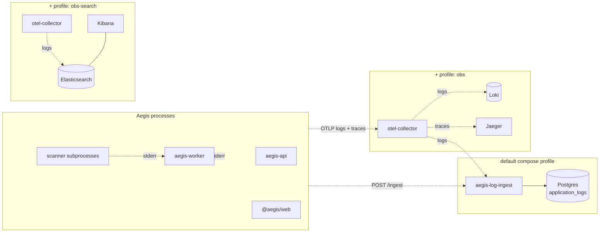
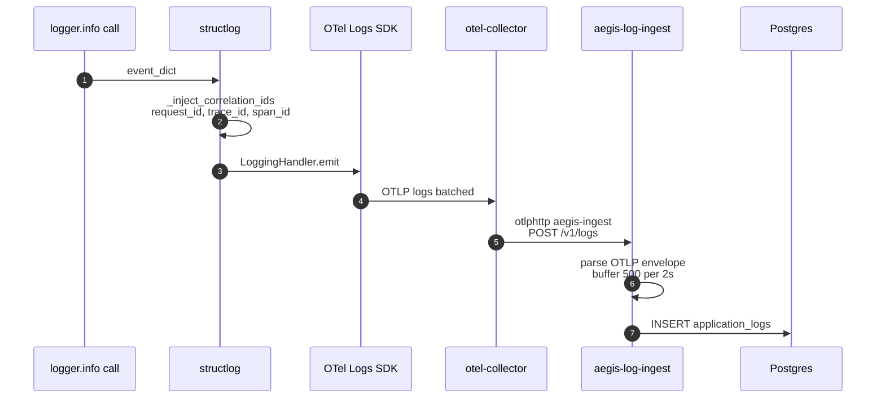
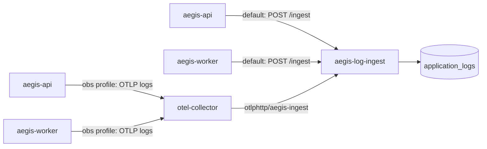
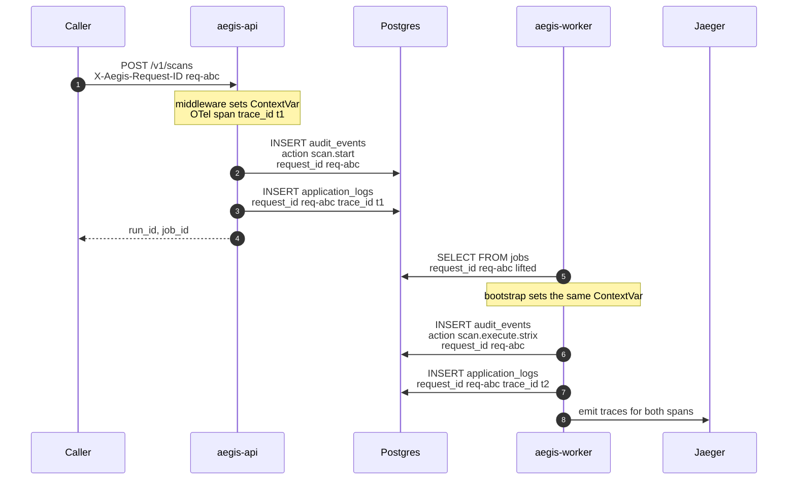

# Observability

Aegis emits three telemetry streams — **logs**, **traces**, and
**metrics** — and ships them through one OpenTelemetry Collector. The
log path additionally has an always-on Postgres mirror so
`SELECT * FROM application_logs WHERE run_id = '…'` works even when
Loki / Elasticsearch aren't up.



The default profile gives you in-app queries with zero ops overhead;
adding `obs` brings ad-hoc query (Loki) + traces (Jaeger) without
adding a new datastore. `obs-search` is for full-text search workloads
where Loki's label model isn't enough.

---

## Logs

Every log line carries a structlog payload that's auto-enriched with:

- `request_id` — propagated via the `X-Aegis-Request-ID` header
  (request_id_middleware). Set on the API; forwarded by the worker
  via the Job's detail row.
- `trace_id` / `span_id` — from the active OTel span when one is
  active.
- `severity`, `service`, plus whatever structured kwargs the caller
  passed.

The structlog processor that does the enrichment lives in
`aegis.observability._inject_correlation_ids`. The OTel handler that
ships the events to the Collector is wired by
`_configure_otel_logs(service_name)` and only activates when
`OTEL_EXPORTER_OTLP_ENDPOINT` is set — so the Phase 2 offline path
continues to log to stdout.



### `application_logs` table

Indexed for the queries that actually happen:

| Index                     | Query it supports                          |
|---------------------------|--------------------------------------------|
| `ix_logs_run_ts`          | per-run timeline (newest first)            |
| `ix_logs_project_ts`      | per-project tail                           |
| `ix_logs_request`         | correlate API + worker + scanner by request_id |
| `ix_logs_trace`           | correlate with a Jaeger trace              |
| `ix_logs_severity_ts`     | filter (e.g. severity=error) + newest first |
| `ix_logs_service`         | service name filter                        |
| `ix_logs_ts`              | global timeline                            |

Schema lives in `aegis/db/models.py::ApplicationLog`; the Alembic
migration that creates it is `0003_application_logs`.

### Ingress paths



Two paths converge on the same `LogIngestWriter`:

- `POST /ingest` — JSON batch (`{ "records": [...] }`). Used by the
  default profile when no Collector is up. Easy to hand-test.
- `POST /v1/logs` — OTLP/Logs over HTTP-JSON. What the Collector's
  `otlphttp/aegis-ingest` exporter posts. The receiver decodes the
  `resourceLogs → scopeLogs → logRecords` envelope without pulling in
  the protobuf SDK.

The writer batches `~500 records / 2s` and exposes counters via
`/metrics` (`aegis_log_ingest_buffered`, `…_inserted_total`,
`…_last_flush_ms`).

### Querying logs

| Where      | How                                                                 |
|------------|---------------------------------------------------------------------|
| In-app     | `GET /v1/logs?run=…&severity=…&since=…` (admin); web `/logs` page    |
| Postgres   | `SELECT … FROM application_logs WHERE …`                            |
| Loki       | `{service="aegis-api"} \| json` (under `obs`)                       |
| Kibana     | Discover, index pattern `aegis-*` (under `obs-search`)              |

Every `/v1/logs` query emits a `logs.queried` audit event so a
forensic review can answer "who looked at what" — see
[`audit-chain.md`](audit-chain.md).

---

## Traces

The Collector receives OTLP/Traces from the API + worker and exports
to Jaeger (`obs` profile). Spans carry the same `request_id` as the
log stream, so a slow API call ⇒ Jaeger trace ⇒ Postgres log query
chains together by a single id.

Wired in `aegis.observability.configure_otel`:

```python
configure_otel(service_name="aegis-api")
```

— invoked from API + worker bootstrap. No-op when
`OTEL_EXPORTER_OTLP_ENDPOINT` is unset.

---

## Metrics

Prometheus exposition format on `/metrics`. The current counters /
gauges (defined in `aegis.observability._make_counters`):

| Metric                      | Type    | Labels         | Owner                  |
|-----------------------------|---------|----------------|------------------------|
| `aegis_scans_total`         | Counter | `status`       | admission              |
| `aegis_fix_success_total`   | Counter | —              | execution              |
| `aegis_verify_status_total` | Counter | `status`       | execution              |
| `aegis_jobs_active`         | Gauge   | —              | bootstrap              |
| `aegis_rate_limited_total`  | Counter | —              | rate-limit middleware  |
| `aegis_log_ingest_buffered` | Gauge   | —              | log-ingest             |
| `aegis_log_ingest_inserted_total` | Counter | —          | log-ingest             |
| `aegis_log_ingest_last_flush_ms`  | Gauge   | —           | log-ingest             |

When `prometheus_client` isn't installed (Phase 2 offline path),
`/metrics` returns `{"detail": "prometheus_client not installed"}`
so a curl probe doesn't crash.

---

## Correlation: a worked example

A user hits `POST /v1/scans`. The full chain of ids that lets you
follow that one call across services:



Operationally: drop `request_id=req-abc` into the Logs page and you
get the API row, the worker row, and the scanner stderr tail
chronologically. Drop `trace_id=t1` into Jaeger and you get the
upstream-vs-downstream span timing. Drop the same into
`application_logs.trace_id` and the same time-ordered log slice
appears in Postgres.

---

## Configuration reference

Env vars, all read by `aegis.observability` + `aegis.log_ingest`:

| Env var                                  | What it does                                                   |
|------------------------------------------|----------------------------------------------------------------|
| `OTEL_EXPORTER_OTLP_ENDPOINT`            | Activates the OTel SDK. Without it, logs go to stdout only.    |
| `OTEL_RESOURCE_ATTRIBUTES`               | Free-form `key=value,key=value` for the OTel Resource.         |
| `AEGIS_LOG_INGEST_URL`                   | Direct-mode endpoint (default `http://aegis-log-ingest:4319`). |
| `AEGIS_LOG_INGEST_BATCH_SIZE`            | Writer batch size (default `500`).                             |
| `AEGIS_LOG_INGEST_FLUSH_SECONDS`         | Writer flush interval (default `2`).                           |

Collector config lives in `deploy/otel/config.yaml`; pipelines:

- `logs/loki` → Loki
- `logs/aegis-ingest` → aegis-log-ingest (always)
- `traces` → Jaeger

The Elasticsearch exporter in the Collector config is commented; un-
comment when `obs-search` is permanently in your deployment shape.

---

## Operational concerns

- **Ingest lag**: watch `aegis_log_ingest_buffered`. Steady-state
  should be under one batch; persistent growth ⇒ Postgres write
  contention or a flooding producer.
- **Postgres retention**: not enforced by the platform — wire up
  `pg_cron` or `pg_partman` if you need it. Loki defaults to 7 days
  retention via `deploy/loki/config.yaml`.
- **Backpressure**: the writer is fire-and-forget by design (the
  producer doesn't block on Postgres). If `application_logs` is
  unreachable, rows stay buffered up to the batch size, then drop —
  the metric counter exposes the drop rate.
- **Sensitive data**: Aegis already runs `redact_audit_detail` on
  audit detail before write. The log path does **not** auto-redact —
  treat `attrs` like any other JSON field and avoid logging tokens.

For the production deployment runbook (Dockerfile, image build,
service registration) see [`docs/ops/deploy.md`](../ops/deploy.md).
