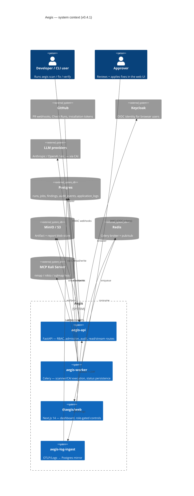
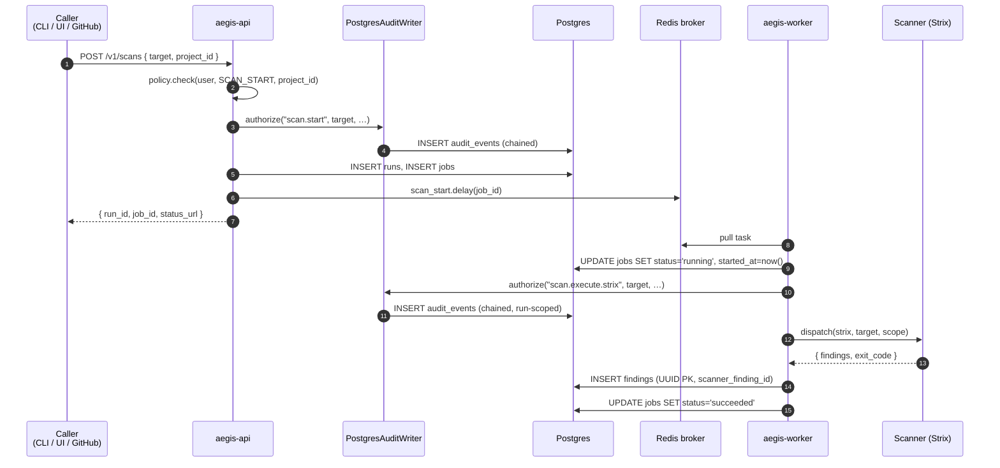
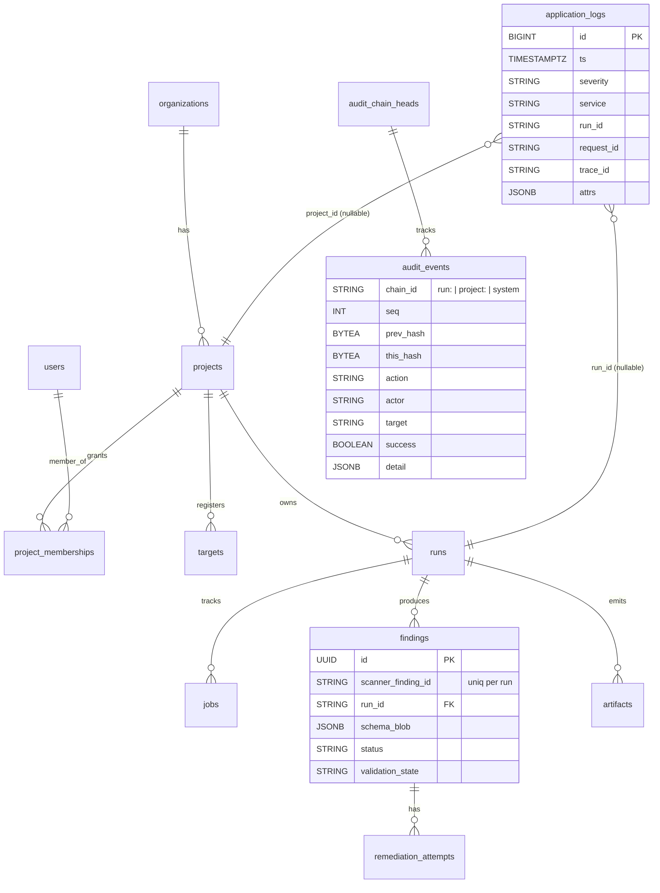

# Architecture overview

This doc is the entry point to "how does Aegis fit together." For the
auth flow, audit chain, observability pipeline, and HTTP API each get
their own dedicated doc; this file is the shared mental model.

- [Auth flows](auth.md)
- [Audit chain](audit-chain.md)
- [Observability](observability.md)
- [`/v1/*` HTTP API](../api/v1.md)

---

## System context



## Deployment topology

Three compose profiles ship out of the box:

```mermaid
flowchart TB
  subgraph default["compose profile: default"]
    direction LR
    api[aegis-api]
    worker[aegis-worker]
    web[aegis-web]
    li[aegis-log-ingest]
    pg[(Postgres)]
    redis[(Redis)]
    kc[Keycloak]
    minio[(MinIO)]
    kali[mcp-kali]
    api & worker & li --- pg
    api & worker --- redis
    web --- api
    api --- minio
    api --- kc
    worker --- kali
    api & worker -. POST /ingest .-> li
  end

  subgraph obs["+ profile: obs"]
    col[otel-collector]
    loki[(Loki)]
    jaeger[Jaeger]
    api2[aegis-api] & worker2[aegis-worker] -. OTLP .-> col
    col -. logs .-> loki
    col -. logs .-> li
    col -. traces .-> jaeger
  end

  subgraph search["+ profile: obs-search"]
    es[(Elasticsearch)]
    kibana[Kibana]
    col2[otel-collector] -. logs .-> es
    kibana --- es
  end

  default --> obs --> search
```

- **default** — everything you need to demo the platform locally.
  `aegis-log-ingest` runs in this profile so
  `SELECT * FROM application_logs WHERE run_id = '…'` works even
  without Loki up.
- **`obs`** — adds the OTel Collector + Loki + Jaeger. Logs fan out:
  Loki for ad-hoc kibana-style queries, `aegis-log-ingest` for the
  Postgres mirror, Jaeger for traces.
- **`obs-search`** — adds Elasticsearch + Kibana on top of `obs`.

For a per-service walkthrough of the compose stack, see
[`docs/dev/local-stack.md`](../dev/local-stack.md). For the production
deployment runbook (env vars, key rotation, image build), see
[`docs/ops/deploy.md`](../ops/deploy.md).

## Service shapes

| Service             | Language | What it owns                                                   |
|---------------------|----------|----------------------------------------------------------------|
| `aegis-api`         | Python   | FastAPI app: RBAC, admission services, read/stream routes      |
| `aegis-worker`      | Python   | Celery: scanner + CAI execution; persists `Finding.status` etc. |
| `aegis-log-ingest`  | Python   | OTLP/Logs receiver → `application_logs` Postgres rows           |
| `@aegis/web`        | TS/Next  | App-router UI; cookie-aware `api()` helper                     |
| `@aegis/design-system` | TS    | Workspace package with shadcn-derived primitives + Aegis-branded compositions |
| `mcp-kali`          | (image)  | nmap / nikto / sqlmap host                                     |

The Python services share `aegis/services/` so the same admission +
execution code paths run regardless of which entry point invoked them
(CLI, API, worker).

## Request flow: `aegis scan` (admission + execution)



The load-bearing invariant: the audit row for `scan.start` is on the
chain **before** Redis is touched. A worker crash mid-enqueue leaves a
chained audit event plus a `queued` job — never a half-state where the
job ran without a matching audit trail.

## Data model (Postgres)



Two design choices worth highlighting:

- **Finding PK is an internal UUID** (since v0.3.1 F9). The scanner's
  upstream identifier lives in `scanner_finding_id`, uniquely
  constrained per-run. Two parallel runs can both emit
  `vuln-0001` from Strix without colliding.
- **`audit_events.chain_id` is the partition key**, not a project id.
  Chains are tracked at the run level (most common), the project
  level (admission), and a single `system` chain for global events.
  This makes verification a per-chain walk; no global lock is needed.

## Layered service architecture

```mermaid
flowchart TB
  subgraph Entry["Entry points"]
    cli[aegis CLI]
    api[/v1/* HTTP routes]
    worker[Celery tasks]
  end

  subgraph Services["aegis/services/ — admission + execution"]
    direction LR
    create["create_*_job<br/>(admission)"]
    execute["start_scan / generate_fix /<br/>verify / render_reports<br/>(execution)"]
  end

  subgraph Primitives["Primitives"]
    direction LR
    safety["safety.authorize<br/>(emits audit)"]
    chain["audit/chain.py<br/>(JsonlAuditWriter,<br/>PostgresAuditWriter)"]
    state["state, state_pg<br/>(RunState)"]
    schema["schema.AegisFinding"]
    scanners["scanners/<br/>(Strix, Trivy, …)"]
    remediate["remediate/<br/>(cai_runner, patch_workflow)"]
  end

  cli --> create
  cli --> execute
  api --> create
  worker --> execute
  create --> safety
  execute --> safety
  safety --> chain
  create --> state
  execute --> state
  execute --> schema
  execute --> scanners
  execute --> remediate
```

The split is the v0.3.1 F6 contract: **API routes call admission
only**; **Celery tasks call execution only**. Admission is cheap and
request-scoped; execution is the long-running scanner / CAI work.

## Phase 4 release map

```mermaid
graph TD
    subgraph v031["v0.3.1 — Stabilization"]
      f1[F1 detach CIGate]
      f2[F2 lock files + markers]
      f5[F5 cmd_migrate fix]
      f9[F9 Finding PK UUID]
      f7[F7 retire _append_audit]
      f8[F8 retire tool-calls.jsonl]
      f3[F3 CLI thru services]
      f6[F6 admission + audit-before-enqueue]
      f11[F11 worker persists status]
      f4[F4 --api dispatch]
      f12[F12 project-access on read]
      f10[F10 cai_loader + llm.router]
      fw[FW worker SA + rotation]
      fp[FP membership endpoints]
    end

    subgraph v040["v0.4.0 — Identity & UX"]
      f14a[F14a session cookie]
      f14b[F14b CSRF + CORS]
      f14c[F14c WS Origin + subproto]
      f14d[F14d report CSP]
      f13[F13 NextAuth]
      f15[F15 vendor shadcn/ui]
      f16[F16 design-system + Storybook]
      f17[F17 pages rebuilt]
      f18[F18 api() helper + useRoles]
    end

    subgraph v041["v0.4.1 — Observability & GitHub"]
      f19[F19 vendor OTel contrib]
      f20a[F20a obs profile]
      f20c[F20c log-ingest]
      f21[F21 structlog → OTel]
      f22[F22 /v1/logs]
      f23a[F23a PRScope]
      f23b[F23b PR scans]
      f23c[F23c fork restricted]
    end

    v031 --> v040 --> v041
```

## What's deferred

The Phase-4 plan called out items intentionally pushed past v0.4.1.
Live-current list:

- Cross-org row-level multi-tenancy.
- Per-tenant cost dashboards / chargeback.
- Sandbox isolation per scan (gVisor / Firecracker).
- SOC 2 / ISO 27001 / FedRAMP evidence pack.
- PII / content scrubbing inside diffs and patches.
- LLM prompt-injection / output filtering.
- Iterative agent loops with test execution.
- Vulnerability-fixer agentic invocation.
- Native MCP protocol.
- Additional scanners (ZAP, CodeQL, Bandit, Grype, Checkov,
  Trufflehog).
- Authenticated DAST flows.
- Worker autoscaling / multi-region DR.

The CHANGELOG entry for each release also enumerates its deferred
items if they were called out at the time.
