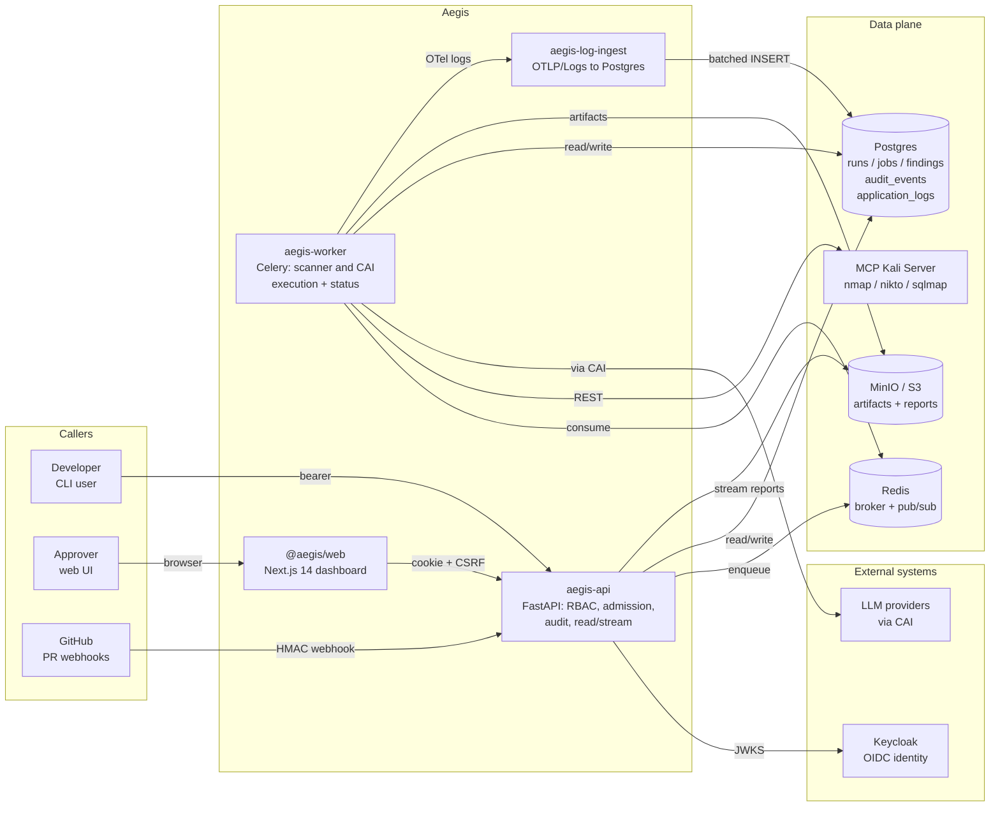
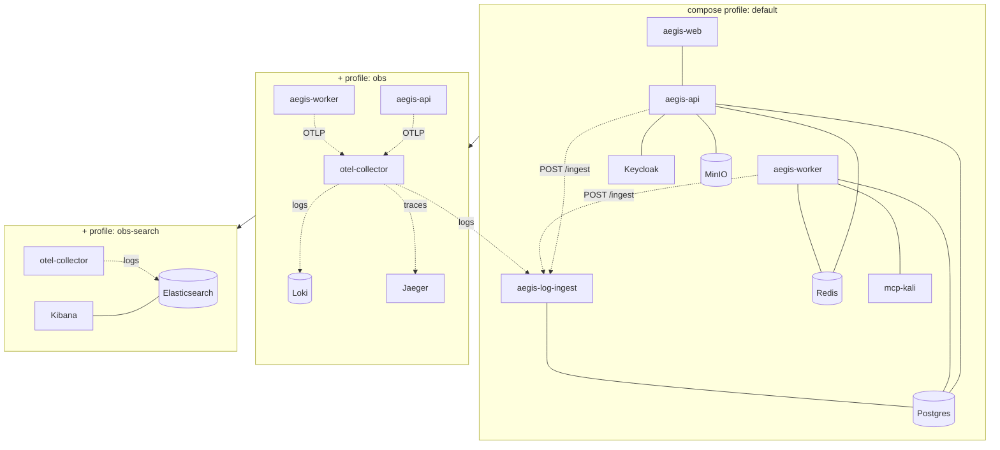
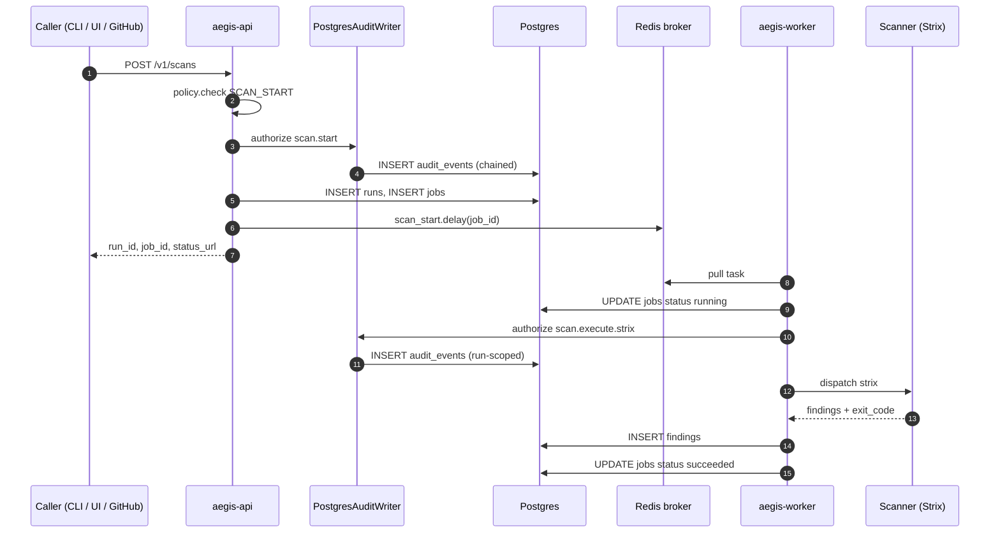
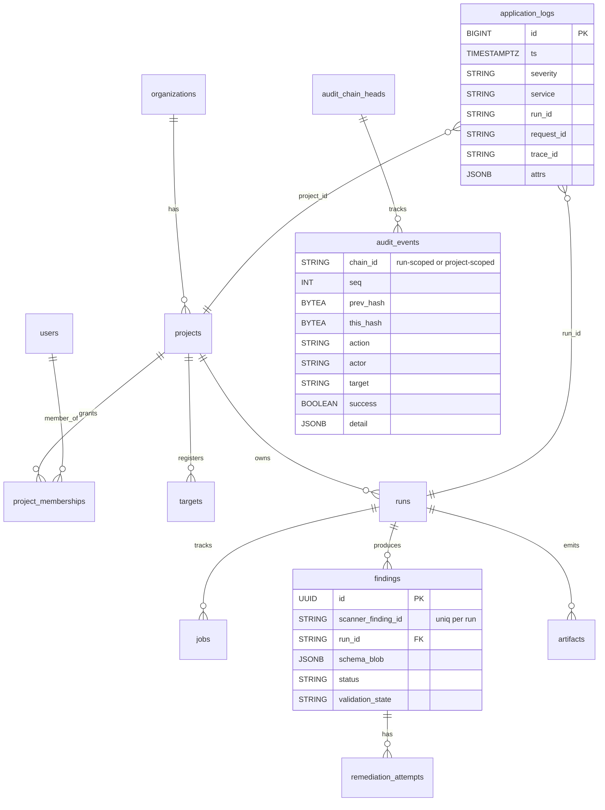
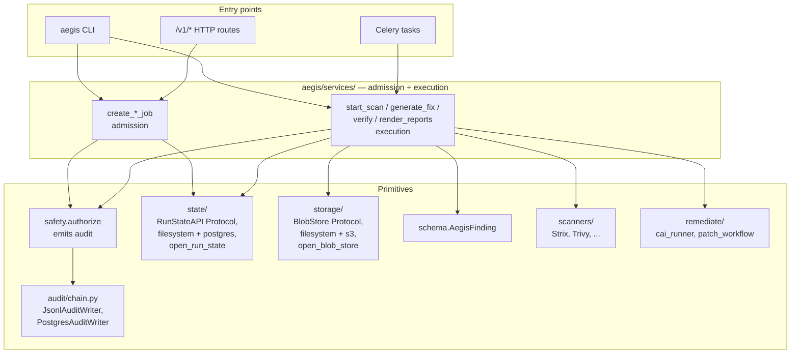

# Architecture overview

This doc is the entry point to "how does Aegis fit together." For the
auth flow, audit chain, observability pipeline, and HTTP API each get
their own dedicated doc; this file is the shared mental model.

- [Auth flows](auth.md)
- [Audit chain](audit-chain.md)
- [Observability](observability.md)
- [`/v1/*` HTTP API](../api/v1.md)

---

## System context



## Deployment topology

Three compose profiles ship out of the box:



- **default** — everything you need to demo the platform locally.
  `aegis-log-ingest` runs in this profile so
  `SELECT * FROM application_logs WHERE run_id = '…'` works even
  without Loki up.
- **`obs`** — adds the OTel Collector + Loki + Jaeger. Logs fan out:
  Loki for ad-hoc kibana-style queries, `aegis-log-ingest` for the
  Postgres mirror, Jaeger for traces. A dedicated `logs/security` pipeline
  ingests host/OS audit sources (`filelog`, `journald`, `syslog`,
  `k8sobjects`) and runs them through two redaction stages — the `redaction`
  processor masks secret-like attribute values and a `transform/redact_body`
  processor scrubs secrets from the raw log body — **before** batch or export,
  so secrets never leave the collector, then fans the result out to the
  Postgres mirror + Loki.
- **`obs-search`** — adds Elasticsearch + Kibana on top of `obs`.

For a per-service walkthrough of the compose stack, see
[`docs/dev/local-stack.md`](../dev/local-stack.md). For the production
deployment runbook (env vars, key rotation, image build), see
[`docs/ops/deploy.md`](../ops/deploy.md).

## Service shapes

| Service             | Language | What it owns                                                   |
|---------------------|----------|----------------------------------------------------------------|
| `aegis-api`         | Python   | FastAPI app: RBAC, admission services, read/stream routes      |
| `aegis-worker`      | Python   | Celery: scanner + CAI execution; persists `Finding.status` etc. |
| `aegis-log-ingest`  | Python   | OTLP/Logs receiver → `application_logs` Postgres rows           |
| `@aegis/web`        | TS/Next  | App-router UI; cookie-aware `api()` helper                     |
| `@aegis/design-system` | TS    | Workspace package: shadcn base primitives in `src/primitives/` (table/card/alert/input/…) under Aegis-branded domain compositions |
| `mcp-kali`          | (image)  | nmap / nikto / sqlmap host                                     |

The Python services share `aegis/services/` so the same admission +
execution code paths run regardless of which entry point invoked them
(CLI, API, worker).

## Request flow: `aegis scan` (admission + execution)



The load-bearing invariant: the audit row for `scan.start` is on the
chain **before** Redis is touched. A worker crash mid-enqueue leaves a
chained audit event plus a `queued` job — never a half-state where the
job ran without a matching audit trail.

## Data model (Postgres)



Two design choices worth highlighting:

- **Finding PK is an internal UUID** (since v0.3.1 F9). The scanner's
  upstream identifier lives in `scanner_finding_id`, uniquely
  constrained per-run. Two parallel runs can both emit
  `vuln-0001` from Strix without colliding.
- **`audit_events.chain_id` is the partition key**, not a project id.
  Chains are tracked at the run level (most common), the project
  level (admission), and a single `system` chain for global events.
  This makes verification a per-chain walk; no global lock is needed.

## Layered service architecture



The split is the v0.3.1 F6 contract: **API routes call admission
only**; **Celery tasks call execution only**. Admission is cheap and
request-scoped; execution is the long-running scanner / CAI work.

## Execution surface: scanners, capabilities, and agents

Aegis discovers two kinds of pluggable component at startup, both backed
by the same generic `aegis.registry.Registry[T]` (see
[ADR 0002](../adr/0002-registry-seam-and-runners.md) and
[Extending Aegis](../dev/extending.md)): **scanner adapters** wrap a
security tool and emit `AegisFinding`s; **agent adapters** wrap a CAI
agent. First-party adapters register eagerly at import; third-party
adapters register through the entry-point groups `aegis.scanners` /
`aegis.agents`, discovered only when `AEGIS_PLUGINS=1` (off by default,
so the offline test path stays deterministic). This seam is the
**scanner-adapter marketplace**: discovered plugins are validated against
their Protocol (a bad one is rejected, never fatal) and gated by the
`AEGIS_PLUGINS_ALLOW` distribution allowlist; `aegis plugins list` shows
what loaded. See [Extending Aegis](../dev/extending.md) §
"Third-party plugins (marketplace)".

### Scanner adapters (14)

Each adapter declares one or more **capabilities**; `dispatch` accepts
either an adapter name or a capability tag.

| Adapter | Capability | Wraps |
|---------|------------|-------|
| `strix` | `dast` | AI-driven pentester (the reference adapter) |
| `nuclei` | `dast` | Template-based vulnerability scanner |
| `zap` | `dast` | OWASP ZAP web-app scanner |
| `semgrep` | `sast` | Pattern-based static analysis |
| `codeql` | `sast` | Semantic code analysis (SARIF) |
| `bandit` | `sast` | Python security linter |
| `sonarqube` | `sast` | Code-quality + security analysis |
| `trivy` | `dependency` | Vulnerability + dependency scanner |
| `grype` | `dependency` | Dependency vulnerability scanner |
| `checkov` | `iac` | IaC misconfiguration scanner |
| `trufflehog` | `secret` | Secret scanner (raw material redacted) |
| `syft` | `sbom` | SBOM generator (CycloneDX; inventory, not findings) |
| `bumblebee` | `supply_chain` | Supply-chain / MCP-host exposure scanner |
| `deepsec` | `code_audit` | AI whole-repo code auditor (owner PII stripped) |

The reference `strix` adapter surfaces the vendored CLI's deeper code-scan
controls as optional `ScanOptions` fields: `targets` (a multi-target sweep
alongside the single `target`), `instruction_file` (read in lieu of an inline
`instruction`), and `scope_mode` (`auto | diff | full`) + `diff_base` for
PR-diff-scoped review. White-box source review needs no flag — strix derives
it from local-path targets. All are optional and soft-degrade; the
single-target default path is unchanged. These knobs live on `ScanOptions`
(programmatic / registry-dispatch callers); the HTTP `POST /v1/scans` body
forwards only `target` + `instruction`, as it does for `scan_mode`.

### Capabilities (8)

`KNOWN_CAPABILITIES` is an **open vocabulary** validated at
registration: `dast`, `sast`, `dependency`, `iac`, `secret`, `sbom`,
`supply_chain`, `code_audit`. A declared capability outside the set logs
a warning but still registers, so a third-party plugin can add its own
without patching core. Promoting one to first-party is a one-line append
— how `supply_chain` landed in v0.5.1 and `code_audit` in v0.7.0.

### CAI agents (36 wired + 5 multi-agent patterns)

Agent adapters dispatch by name. Every registered agent is **wired**
(executable, not a stub), spanning all six `Domain` values. The roster comes
from three sources, all in `aegis/agents/cai/`:

- **The original 16 wrapped CAI agents** (`builtins.py`, `by_name=False`) —
  each resolves off a typed `CAIBundle` field.
- **8 newly-wired breadth CAI agents** (`builtins.py`, `by_name=True`) —
  resolved generically by their upstream registry key via
  `resolve_cai_agent` (CAI's `get_agent_by_name`), so wiring an additional
  CAI agent needs no per-agent `CAIBundle` field: `ctf_agent`,
  `app_logic_mapper`, `dns_smtp_agent`, `flag_discriminator`,
  `prompt_injection_detector`, `thought_agent`, `usecase_agent`,
  `memory_query`.
- **12 Aegis-native authored specialists** (`authored.py`) — where the
  builtins *wrap* agents CAI ships, these *compose* brand-new specialists
  from the vendored CAI tool catalog: each is a substantive scoped system
  prompt plus a real toolbelt drawn from `cai.tools.*` (and the Camoufox
  OSINT search tool, below). Each carries its own `domain` + `effect`.

| Domain | Agents |
|--------|--------|
| `offensive` | `bug_bounter`, `red_teamer`, `web_pentester`, `android_sast_agent`, `subghz_sdr_agent`, `wifi_security_tester`, `replay_attack_agent`, `ctf_agent`, `app_logic_mapper`, `api_security_tester`, `web_surface_mapper`, `ssl_tls_auditor` |
| `forensic` | `dfir`, `memory_analysis`, `network_traffic_analyzer`, `reverse_engineering`, `memory_query`, `secrets_hunter`, `crypto_analyst`, `log_triage` |
| `audit` | `retester`, `reporter`, `flag_discriminator`, `thought_agent`, `usecase_agent` |
| `defensive` | `blueteam_agent`, `prompt_injection_detector`, `iac_auditor`, `container_security` |
| `remediation` | `codeagent` |
| `recon` | `recon` (read-only: nmap, shodan, curl, netcat, netstat), `dns_smtp_agent`, `cloud_recon`, `osint_collector`, `threat_intel`, `dns_enumerator` |

Beyond the 36 single agents, five **multi-agent patterns** join the
registry as explicitly-dispatchable entries — `offsec_pattern` (a parallel
offensive sweep), the `redteam_swarm` / `bb_triage_swarm` handoff swarms,
and two red/blue parallel patterns (`red_blue_shared_context`,
`red_blue_split_context`) that coordinate a red-team attack alongside a
blue-team responder — for **41** dispatchable entries in all. A pattern runs
**only when dispatched by name**; a normal single-agent run never triggers
one (no auto-swarm). All five are `active`-effect, so they clear the same
gate as any offensive agent. When executed (post-approval), the active
offensive specialists (`bug_bounter`, `red_teamer`, `web_pentester`) reach
the live Kali tool belt over an SSE MCP connection to `config.mcp_kali_url`;
the read-only `recon` agent is excluded by design (the belt carries active
tools, and recon stays read-only).

**Effect is per-agent, not per-domain.** The breadth and authored agents are
classified conservatively: a `recon`-domain agent that egresses to a
third-party (DNS/SMTP/Shodan/web) is `external`; one that runs shell/exec
tools against a target is `active`; pure analysis, classification, and
read-only filesystem work is `read`. So `dns_smtp_agent` (recon) is
`external`, `prompt_injection_detector` (defensive) is `read`, and
`container_security` (defensive) is `active`.

### Kali toolbelt (10, via MCP)

Beyond the registered scanners, the worker reaches a Kali host over MCP
for classic offensive tooling: `nmap`, `sqlmap`, `nikto`, `hydra`,
`gobuster`, `dirb`, `john`, `wpscan`, `enum4linux`, `metasploit`. Every
invocation lands on the audit chain at the service boundary (see
[Audit chain](audit-chain.md)). Each tool carries an effect class (below):
the `read` recon tools run at `remediator`, while the `active` ones
(`sqlmap`, `hydra`, `metasploit`, `wpscan`) are gated behind
`execute=true` + `approver`. The Kali allowlist is deliberately **not**
expanded beyond these 10 — the bundled *mcp-kali* server only routes those
names, so adding more would mint non-functional tools. Breadth comes from
the unified tool catalog instead (below).

Each wrapper sends the exact parameter keys the vendored mcp-kali server
reads (gobuster/dirb use `url`; hydra uses `username_file`/`password_file`;
metasploit folds `RHOSTS` into `options`) and exposes structured subcommand
controls — gobuster `mode` (`dir | dns | vhost | fuzz`), hydra user/password
values and list files, metasploit `module` + `options`, john `format`. Every
value still passes the allowlist `_check`, and no wrapper exposes a freeform
argument passthrough: the generic `command` surface stays closed (403, all
roles).

### The unified tool catalog (42 tools)

`aegis/tools/catalog.py` (`TOOL_CATALOG` / `list_tools()`) is the single,
honest registry of every tool the platform can expose to agents — **42
today**, drawn from four sources:

| Source | Count | What it is |
|--------|-------|------------|
| `kali` | 10 | The mcp-kali allowlist (above), categorized; effect comes authoritatively from `aegis.effects.kali_tool_effect`. |
| `scanner` | 14 | The registered scanner adapters from `list_scanners()`. `read` except the DAST adapters (`zap`/`nuclei`/`strix`), which actively probe → `active`. |
| `cai` | 17 | The real `@function_tool`s vendored under `project_repos/cai/src/cai/tools/` (recon/web/network/crypto/misc). Catalog names are namespaced `cai_*` to stay unique alongside the bare Kali `nmap` etc.; the bare CAI name is recorded in `CAI_TOOL_NAMES` for toolbelt wiring. |
| `osint` | 1 | The Camoufox OSINT search tool (below). |

Each tool carries an **effect** (`read` / `active` / `external`) that is
authoritative in the catalog: `aegis.effects.tool_effect()` consults it
(falling back to the Kali map), so the catalog and the human gate never
drift. Effects are classified conservatively — enumeration/analysis is
`read`, command execution or active probing is `active`, and anything that
reaches a third party is `external` (e.g. `cai_shodan_search`, `osint_search`).
An unknown name fails **safe** to `active`. The module is import-light so it
never pulls in CAI at import time: it lists what the platform *can* expose,
independent of whether the optional CAI / Camoufox stacks are installed.

### Camoufox OSINT search (web search, `external`)

`aegis/tools/osint_search.py` provides live web OSINT **instead of** a
Google / SerpAPI search tool. It drives **DuckDuckGo's HTML-only endpoint**
through **Camoufox** — a patched, anti-fingerprint Firefox — and extracts
article text with trafilatura. DuckDuckGo + Camoufox is chosen over a Google
API because it needs **no API key** and carries low detection risk. Vendored
and adapted from `c3-e/c3cdao-pipeassist`.

Because Camoufox ships a patched Firefox binary that must be fetched out of
band, it lives behind the optional `osint` extra:

```bash
pip install -e ".[osint]" && camoufox fetch
```

Every entry point **degrades to a clear, structured error** when Camoufox or
trafilatura is absent, so importing the module is always safe and the offline
test path never launches a browser. The search tool is classified
`external` (it reaches third-party sites), so it clears the same
human-in-the-loop gate as any other external-effect capability.
`build_osint_search_tool()` returns the CAI `@function_tool` the authored
recon/OSINT specialists add to their toolbelt in place of a Google search,
or `None` when the CAI SDK isn't importable (offline) — in which case
composition simply skips it.

### Capability matrix

The three seams above each reach the runtime through a different dispatch
path. This matrix is the single view of *what exists*, *what consumes
it*, and *where the wiring is still thin* — the map a new capability
slots into without diverging from the architecture (most recently the
`code_audit` adapter `deepsec`, added through this seam in v0.7.0).

| Seam | Vocabulary | Registered | Runtime consumer | Dispatch |
|------|-----------|-----------|------------------|----------|
| Scanners | 8 capabilities | 14 adapters | `scan_start` Celery task | one adapter per job via `dispatch(name \| capability)`; defaults to `strix` |
| Agents | 6 `Domain`s | 41 adapters (36 agents + 5 patterns) | `agent_run` Celery task | `POST /v1/agents/{name}/run` → admission → task → `dispatch(name)`; remediation may still call `cai.Runner` directly for `codeagent` / `blueteam_agent` |
| Kali tools | 10 named tools | 10 (over MCP) | `run_kali_tool` service | per-tool REST call, audited at the service boundary |
| Tool catalog | 4 sources (kali/scanner/cai/osint), 3 effects | 42 tools | agent toolbelts + `tool_effect()` gate | `TOOL_CATALOG` / `list_tools()`; effect is authoritative here and consulted by `aegis.effects.tool_effect` |

One interconnection fact the matrix still makes explicit, tracked as a
gap rather than intent: scanners run **one adapter per job** (there is
no capability-sweep that fans a target across every adapter claiming a
capability). The former agent-registry gap is now **closed** — as of
v0.6.0 the registry has a runtime dispatch path: `POST
/v1/agents/{name}/run` admits the job (authorize → audit-before-enqueue
→ Run/Job rows → enqueue) and the `agent_run` Celery task re-authorizes
and calls `dispatch(name)`, so every registered adapter is reachable.

### The human-in-the-loop gate (effect classes)

Aegis's purpose is the full loop — **scan → pentest → remediate** — with
a human in the loop on anything that changes the world. Since v0.8.0 that
gate is **one** abstraction, the *effect class* (`aegis/effects.py`,
[ADR 0004](../adr/0004-unified-effect-class-gate.md)), applied at every
seam above rather than re-invented per adapter:

| Effect | Meaning | Gate |
|--------|---------|------|
| `read` | recon, enumeration, static analysis, SBOM, generating a diff/plan, dry-run | none beyond the target allowlist — runs freely |
| `active` | attack / state-changing against a live system: exploitation, brute-force, an exploit module, live hardening | gated |
| `external` | leaves the sandbox: pushing a branch, opening a PR, egress | gated |

The gate is one rule: an `active` / `external` capability performs its
irreversible step **only** when the caller explicitly opts in
(`execute=true` / `apply=true` / `open_pr=true`) **and** holds the
`approver` role; otherwise it returns a reviewable **proposal** (an attack
plan, a hardening plan, or a diff) and the underlying agent/tool is never
run. It is enforced at the **chokepoints** — `agents.registry.dispatch()`
(covers built-ins *and* plugins), the Kali tool route, and the fix
service — so a new adapter inherits the gate for free.

**Effect is not a function of domain.** An `android_sast_agent` is
offensive-by-domain but only reads bytecode → `read`; a `retester` is
audit-by-domain but re-fires exploits → `active`. So effect is an explicit
per-agent column in the wiring table, with `domain_default_effect()` as
the fallback; an unknown domain or unlisted Kali tool defaults to `active`
— it fails **safe** (gated), never open.

**Remediation engines, all behind the same gate:** `codeagent` produces
code-fix diffs (`patch`/`deps` strategies); `blueteam_agent` applies live
hardening (`live` strategy, gated on `apply`); the vendored
vulnerability-fixer drives the `agentic` strategy — propose → diff, then
`apply` for a rollback-safe local commit, then `apply + open_pr` to let the
engine open the **human-reviewed PR itself** (the PR review *is* the gate).

## LLM guardrails

The effect-class gate decides *whether* a model-driven action runs; the LLM
guardrails govern *what crosses the LLM trust boundary* in either direction.
Two layers live in `aegis/llm/guardrails.py`, applied at the points where
untrusted text reaches a model and where model output leaves the platform.
Both are config-gated and fail **safe** (default on; on any guardrail error
the input is treated as unsafe), and every log line / raised error is
secret-free — a block never echoes the offending text or a matched secret.

| Layer | What it does | Where |
|-------|--------------|-------|
| **Secret scrubbing** | Runs generated diffs/patches and LLM outputs through the audit redactor's secret/token regex (`aegis/audit/redact.py`), replacing matches with `***REDACTED***` | the canonical diff in `extract_unified_diff` (so the persisted `.diff`, PR body, and remediation log all inherit it) + the remediation/agent output chokepoints |
| **Prompt-injection detection** | Scores untrusted input for injection — tiered risk (`none`/`low`/`medium`/`high`) with categories (`instruction_override`, `role_switch`, `exfiltration`, …); at/above the block threshold the input is rejected | finding title/description/remediation-steps/PoC/code-snippets + agent prompts, scored **before** the model call |

**Trust boundaries / hook points.** Scanner-derived findings, PR diffs, and
caller prompts are all *untrusted input*; model-authored diffs and responses
are *untrusted output*. The guardrails are wired at three chokepoints so a
new caller inherits them for free:

- **Remediation LLM boundary** — `aegis/remediate/cai_runner.py` (input
  detection + output filter on the fix path).
- **Diff extraction** — `aegis/remediate/patch_workflow.py`
  (`extract_unified_diff` scrubs the canonical diff once, upstream of every
  consumer).
- **Agent API boundary** — `aegis/agents/cai/builtins.py` /
  `patterns.py` (prompt detection before dispatch).

A blocked input surfaces as a clean, secret-free error: a **failed
`FixOutcome`** in the fix flow, a **blocked `AgentResult`** in the agent
flow — never a half-run against a poisoned prompt.

**Config knobs (env vars).** All default on; the master switch turns the
whole layer off for debugging only.

| Var | Default | Effect |
|-----|---------|--------|
| `AEGIS_LLM_GUARDRAILS` | on | Master switch for both layers |
| `AEGIS_LLM_SCRUB_DIFF` | on | Secret-scrub generated diffs/patches |
| `AEGIS_LLM_DETECT_INJECTION` | on | Prompt-injection detection on untrusted input |
| `AEGIS_LLM_FILTER_OUTPUT` | on | Secret-scrub LLM output |
| `AEGIS_LLM_INJECTION_BLOCK_RISK` | `high` | Block threshold; `off` = detect-and-log only |

## Release map

```mermaid
flowchart TD
    subgraph v031["v0.3.1 — Stabilization"]
      f1["F1 detach CIGate"]
      f2["F2 lock files + markers"]
      f5["F5 cmd_migrate fix"]
      f9["F9 Finding PK UUID"]
      f7["F7 retire _append_audit"]
      f8["F8 retire tool-calls.jsonl"]
      f3["F3 CLI thru services"]
      f6["F6 admission + audit-before-enqueue"]
      f11["F11 worker persists status"]
      f4["F4 --api dispatch"]
      f12["F12 project-access on read"]
      f10["F10 cai_loader + llm.router"]
      fw["FW worker SA + rotation"]
      fp["FP membership endpoints"]
    end

    subgraph v040["v0.4.0 — Identity & UX"]
      f14a["F14a session cookie"]
      f14b["F14b CSRF + CORS"]
      f14c["F14c WS Origin + subproto"]
      f14d["F14d report CSP"]
      f13["F13 NextAuth"]
      f15["F15 vendor shadcn/ui"]
      f16["F16 design-system + Storybook"]
      f17["F17 pages rebuilt"]
      f18["F18 api() helper + useRoles"]
    end

    subgraph v041["v0.4.1 — Observability & GitHub"]
      f19["F19 vendor OTel contrib"]
      f20a["F20a obs profile"]
      f20c["F20c log-ingest"]
      f21["F21 structlog to OTel"]
      f22["F22 /v1/logs"]
      f23a["F23a PRScope"]
      f23b["F23b PR scans"]
      f23c["F23c fork restricted"]
    end

    subgraph v042["v0.4.2 — Agent + scanner breadth"]
      a1["7 agents wired (8 → 15)"]
      a2["8 scanner adapters: zap, codeql,<br/>bandit, grype, checkov,<br/>trufflehog, sonarqube, syft"]
      a3["sbom capability"]
    end

    subgraph v050["v0.5.0 — Registry seam hardening"]
      r1["generic Registry[T]"]
      r2["entry-point plugin discovery<br/>(AEGIS_PLUGINS=1)"]
      r3["KNOWN_CAPABILITIES open vocab"]
      r4["wired_in_phase_3 → wired"]
      r5["adapters/ → runners/"]
    end

    subgraph v051["v0.5.1 — Supply chain"]
      b1["bumblebee adapter (13th)"]
      b2["supply_chain capability"]
    end

    subgraph v052["v0.5.2 — Scanner bug fixes"]
      c1["bumblebee speaks real CLI/NDJSON"]
      c2["strix reads strix_runs/ events<br/>+ scan_mode"]
    end

    subgraph v060["v0.6.0 — Agent seam end-to-end"]
      d1["6 specialists un-fallbacked<br/>+ recon agent (16th)"]
      d2["POST /agents/{name}/run<br/>(admission-only)"]
      d3["agent_run task (execution-only)"]
      d4["Kali wrappers 3 → 10"]
    end

    subgraph v070["v0.7.0 — AI code audit"]
      e1["deepsec adapter (14th)"]
      e2["code_audit capability"]
      e3["owner PII stripped<br/>+ AI process opt-in"]
    end

    subgraph v080["v0.8.0 — Unified human gate"]
      g1["effect-class gate spine<br/>(read/active/external)"]
      g2["agent + Kali tool gate<br/>(execute=true + approver)"]
      g3["agentic remediation strategy<br/>(vuln-fixer opens the PR)"]
      g4["multi-format finding ingestion<br/>(Snyk/Veracode/Trivy/SARIF)"]
    end

    subgraph v090["v0.9.0 — Live belt + multi-agent"]
      h1["live Kali belt over MCP<br/>(active specialists)"]
      h2["3 multi-agent patterns<br/>(16 → 19, no auto-swarm)"]
    end

    subgraph v0100["v0.10.0 — Deeper scan surfaces"]
      i1["strix code-scope depth<br/>(multi-target / scope-mode / diff-base)"]
      i2["Kali wrappers speak real<br/>mcp-kali args (gobuster/hydra/msf)"]
    end

    subgraph v0110["v0.11.0 — Security telemetry + UI primitives"]
      j1["OTel logs/security pipeline<br/>(host audit -> redact -> mirror+Loki)"]
      j2["design-system base primitives<br/>(shadcn table/card/alert/input/…)"]
    end

    v031 --> v040 --> v041 --> v042 --> v050 --> v051 --> v052 --> v060 --> v070 --> v080 --> v090 --> v0100 --> v0110
```



## What's deferred

See the consolidated [Roadmap](../roadmap.md) for the full
forward-looking list organized by milestone. The Phase-4 plan called
out items intentionally pushed past v0.4.1. Live-current list:

- Sandbox isolation per scan (gVisor / Firecracker).
- SOC 2 / ISO 27001 / FedRAMP evidence pack.
- Iterative agent loops with test execution.
- Native MCP protocol.
- Worker autoscaling / multi-region DR.

The CHANGELOG entry for each release also enumerates its deferred
items if they were called out at the time.
