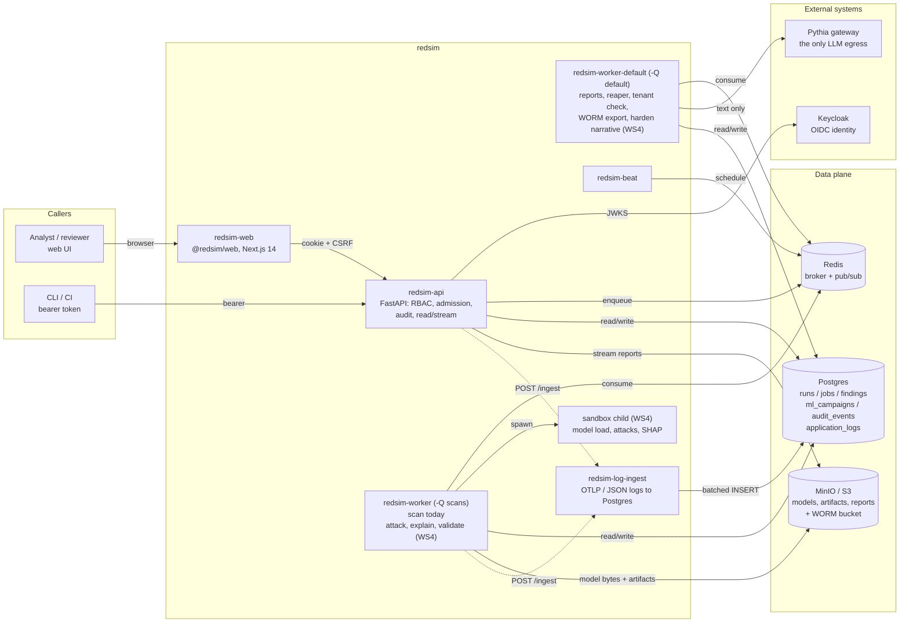
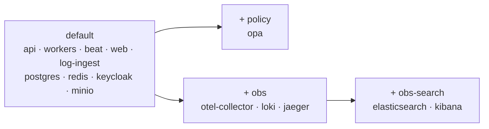
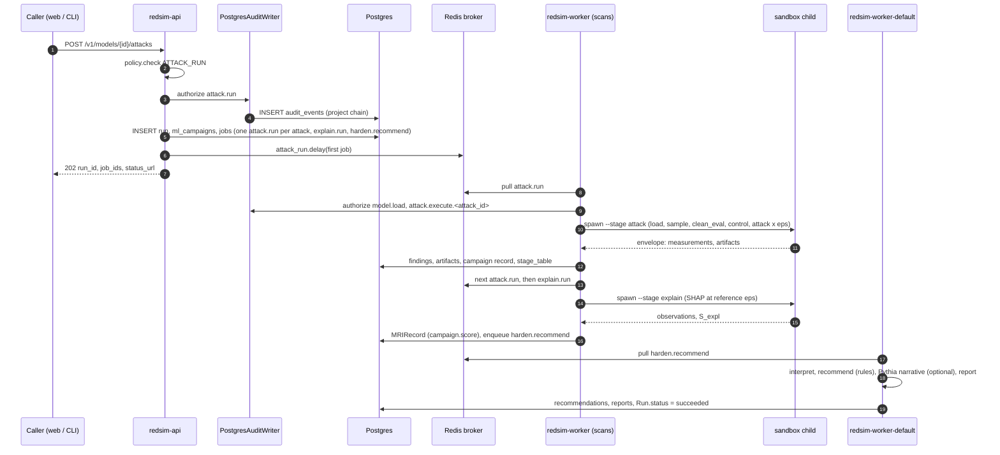
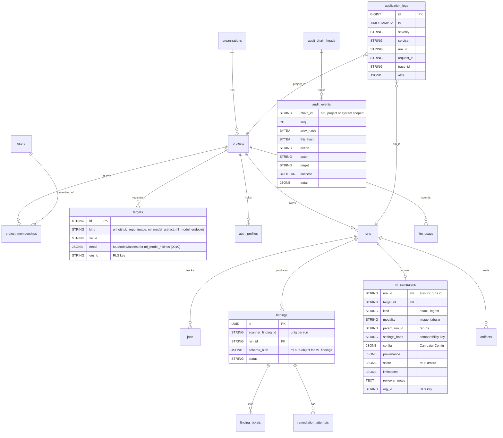
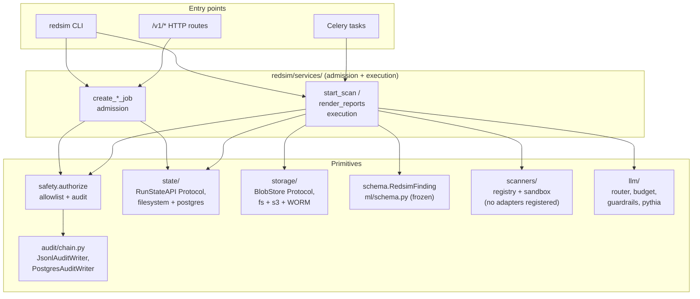

# Architecture overview

This doc is the entry point to "how does redsim fit together". Auth, the
audit chain, multi-tenancy, observability, the ML vertical and the HTTP
API each have their own page. This file is the shared mental model.

- [Auth flows](auth.md)
- [Audit chain](audit-chain.md)
- [Multi-tenancy](multi-tenancy.md)
- [Observability](observability.md)
- [ML vertical](ml-vertical.md)
- [`/v1/*` HTTP API](../api/v1.md)

Status as of 2026-09-08. Sections that describe the ML campaign flow say
which parts exist on `main` and which are planned. The
[product spec](../superpowers/specs/2026-09-08-adversarial-ml-redteam-spec.md)
is the authority where this page is silent or stale.

## Purpose

redsim is the Adversarial ML Red-Team Simulator. A user registers a
classifier (a bundled sample or an uploaded ONNX or PyTorch `state_dict`
artifact), launches an attack campaign (ART evasion attacks such as FGSM,
PGD and HopSkipJump across an ε sweep, each paired with a benign
random-noise control), and reads the SHAP explanations, the Model
Robustness Index and the candidate hardening recommendations side by side,
with every mutating step recorded on a hash-chained audit log. Every run is
a measurement in its own right. Nothing is ever applied to the stored model.

It is a non-operational proof of concept on open, unclassified, public
data. It evaluates and hardens the robustness of a classifier and nothing
else: it never trains, optimises or deploys targeting or weapons models, it
connects to no mission system, and no score or grade it produces is a
safety, readiness or certification statement. The product is one new
vertical, `redsim/ml/`, on top of a platform inherited from IntelliBridge's
aegis security scanner: the repository is a fork of
`github.com/IntelliBridge/aegis` with the penetration-testing domain
removed and every identifier renamed to redsim.

## Diagrams

Three rendered diagrams accompany this page. Open them in a browser:

- [Platform architecture](diagrams/redsim-platform.architecture.html)
- [Attack campaign sequence](diagrams/attack-campaign.sequence.html)
- [Campaign run lifecycle](diagrams/campaign-run.lifecycle.html)

## System context

Three boundaries the diagram encodes:

- **The API never opens a model.** It streams uploaded bytes to the blob
  store, records the sha256 and writes rows. Model loading, attacks and
  SHAP run only on the worker, inside a sandbox child built on the
  plugin-sandbox pattern of `redsim/scanners/sandbox.py` (spec section 9).
  The API image stays free of the `ml` extra.
- **Pythia is the only LLM egress.** redsim holds one `pk_…` gateway key
  and no provider key. The only outbound call a campaign makes is the
  optional hardening narrative from the `default` pool, and it carries
  metrics and a SHAP text summary, never images, model bytes or dataset
  rows (see [ops/pythia.md](../ops/pythia.md)).
- **Audit before enqueue.** Every admission service emits its chained
  audit event before any `Run` or `Job` row exists and before Celery is
  touched. `tests/test_admission_audit_before_enqueue.py` asserts the
  ordering for the live services, and the ML admission services are to
  join that test when they land (spec 8.2).

## Deployment topology

`deploy/docker-compose.yml` runs the developer stack. Everything below is
in the default profile unless marked:

| Service | Role |
|---|---|
| `postgres` | Postgres 16 with pgaudit (`deploy/Dockerfile.postgres`) |
| `redis` | Celery broker, result backend, run-event pub/sub |
| `keycloak` | OIDC identity, realm imported from `deploy/keycloak/realm-export.json` |
| `minio` | S3-compatible blob store (host port 9100) |
| `redsim-api` | FastAPI on 8000, dev auth mode, Pythia variables passed through from the host shell |
| `redsim-worker` | Celery `-Q scans` |
| `redsim-worker-default` | Celery `-Q default` |
| `redsim-beat` | Celery beat scheduler |
| `redsim-web` | Next.js on host port 3300 |
| `redsim-log-ingest` | log receiver on 4319, always on |
| `opa` | profile `policy`: external OPA policy engine for the role gate |
| `otel-collector`, `loki`, `jaeger` | profile `obs`: traces and ad-hoc log queries |
| `elasticsearch`, `kibana` | profile `obs-search`: full-text search on top of `obs` |

The Helm chart `deploy/helm/redsim` mirrors the compose stack for a real
cluster: `api`, `worker`, `web` and `logIngest` Deployments, in-cluster
Postgres, Redis, Keycloak and MinIO that can each be switched off for
managed equivalents, an optional gVisor `RuntimeClass` for the worker pod
(`sandbox.enabled`), and a secret guard that refuses to render the dev
placeholders when `config.env=prod`. The chart renders one worker
Deployment. The compose split into `scans` and `default` pools and the beat
process is not mirrored in it. The ECS Fargate target of spec section 20.4
is WS7 and is not on `main`.

For a per-service walkthrough of the compose stack see
[`docs/dev/local-stack.md`](../dev/local-stack.md). For the production
runbook (env vars, key rotation, image build) see
[`docs/ops/deploy.md`](../ops/deploy.md) and
[`docs/ops/kubernetes.md`](../ops/kubernetes.md).

## Service shapes

| Service | Language | What it owns |
|---|---|---|
| `redsim-api` | Python | FastAPI app factory `redsim.api.app:create_app`: RBAC, admission services, read and stream routes, the run-events WebSocket. Never imports torch, ART, onnxruntime or SHAP. |
| `redsim-worker` | Python | Celery `-Q scans`: `redsim.scan_start` today. The ML `attack.run`, `explain.run` and `model.validate` tasks land here with WS4. Installs the `ml` extra. |
| `redsim-worker-default` | Python | Celery `-Q default`: `redsim.report_render`, `redsim.reap_stale_jobs`, `redsim.verify_tenant_integrity`, `redsim.export_chains_to_worm`. `harden.recommend` (rules plus the optional Pythia narrative) lands here with WS4. |
| `redsim-beat` | Python | Fires the beat schedule: the stale-job reaper every 5 minutes, the tenant integrity check hourly, the WORM export daily. |
| `redsim-log-ingest` | Python | OTLP/Logs and JSON batch receiver writing `application_logs` rows. |
| `@redsim/web` | TS / Next | App-router UI with NextAuth and the cookie-aware `api()` helper. Pages today: `/`, `/login`, `/dashboard`, `/runs`, `/runs/[id]`, `/findings`, `/findings/[id]`, `/projects`, `/projects/[slug]/settings`, `/targets`, `/auth-profiles`, `/logs`, `/audit`, `/cost`. |
| `@redsim/design-system` | TS | Workspace package: shadcn base primitives under redsim-branded compositions, including `RoleGated`. |

The Python entry points (CLI, API, worker) share `redsim/services/`, so
the same admission and execution code runs regardless of who invoked it.

## Campaign lifecycle

The product loop is **campaign, attacks, explain, score, recommend**. The
sequence below is the target design of spec sections
10.2 and 10.3. What exists on `main` is the admission pattern (audit
before enqueue, shown for the live services in
`services/scans.py` and `services/runs.py`), the job
state machine in `redsim/workers/job_state.py`, the `task_context`
wrapper in `redsim/workers/bootstrap.py`, the run-event publisher, the
`ml_campaigns` table and the frozen `redsim/ml/schema.py` contracts. The
ML tasks, routes and sandbox child are WS4.

Rules that govern the chain:

- Every campaign `Job` row is created at admission so each has an audit
  row before it can run. The first attack job also samples the slice and
  writes the clean and control rows, and every later job reuses the same
  indices, so all denominators in a campaign are comparable.
- `score` runs at the end of the explain stage because `S_expl` needs
  SHAP. An MRI is written only when all five subscores are present.
  Otherwise the record is `partial` and names what is missing. Weights are
  never renormalised.
- A failed task cancels the remaining queued jobs of its chain and sets
  `Run.status=failed`. Nothing downstream runs on partial inputs. A retry
  is a new linked run (`ml_campaigns.parent_run_id`), never an edit.
- Stage transitions are published on `run:{run_id}:events` next to the
  job transitions the platform already emits, and the WebSocket
  `GET /v1/runs/{run_id}/events` streams them to the browser.

**Recommendations are candidates.** `POST /v1/findings/{id}/harden`
returns rule candidates plus the optional Pythia narrative. Each
recommendation carries `status: candidate` and no gain figure. It may
cite ART classes and papers as plain text. None is evaluated against the
model, and that requires a separate campaign. Two campaign runs are read
side by side through `GET /v1/runs/{id}/compare?with=`. The stored model
is never modified and nothing is deployed. The verify paradigm was removed
on 2026-09-09 (product owner decision, `docs/project-brief.md`). The
details are in [ml-vertical.md](ml-vertical.md).

## Data model (Postgres)

Design choices worth highlighting:

- **Finding PK is an internal UUID.** The producer's own identifier lives
  in `scanner_finding_id`, uniquely constrained per run, so two parallel
  runs can both emit the same upstream id without colliding.
- **`audit_events.chain_id` is the partition key**, not a project id.
  Chains are tracked at the run level (most events), the project level
  (admission) and a single `system` chain for global events. Verification
  is a per-chain walk with no global lock.
- **`ml_campaigns` is one row per ML run** and carries the frozen
  `CampaignConfig`, the provenance, the `MRIRecord`, the limitations and
  the lineage columns. Migration `0010_ml_vertical` creates it with the
  same RLS policy and trigger pair as the other scoped tables. The ORM
  mapping for it and for `targets.detail` is not on `main` yet.
- **Alembic migrations `0001` to `0010`** are the schema history:
  initial, findings UUID PK, `application_logs`, append-only audit
  trigger, auth profiles, tenant RLS, org cost and routing, finding
  tickets, the `org_id` update guard, and the ML vertical.

## Layered service architecture

The split is the platform contract: **API routes call admission only**
and **Celery tasks call execution only**. Admission is cheap and
request-scoped (authorize, insert `Run` and `Job` rows, enqueue).
Execution is the long-running work. The ML vertical adds
`services/ml_models.py`, `services/ml_campaigns.py` and
`services/ml_findings.py` in the same shape (spec 8.3), and the `redsim
ml` CLI mirrors `services.scans.start_scan` for the offline path
(filesystem `RunState`, `JsonlAuditWriter`, the same sandbox child).

## Execution surface

Redsim discovers pluggable adapters at startup through the generic
`redsim.registry.Registry[T]` ([ADR 0002](../adr/0002-registry-seam-and-runners.md),
[Extending Redsim](../dev/extending.md)). The scanner registry in
`redsim/scanners/registry.py` keeps the `ScannerAdapter` protocol, the
open `KNOWN_CAPABILITIES` vocabulary (`dast`, `sast`, `dependency`,
`iac`, `secret`, `sbom`, `supply_chain`, `code_audit`, with a warning
rather than a rejection for an unknown capability), entry-point discovery
under `redsim.scanners` gated by `REDSIM_PLUGINS=1`, the
`REDSIM_PLUGINS_ALLOW` distribution allowlist, the optional Ed25519
signature gate ([supply chain](../security/supply-chain.md)) and the
out-of-process plugin sandbox. No adapter is registered on `main`: the
pentest built-ins left with the pentest domain, `GET /v1/scanners`
returns an empty roster, and `POST /v1/scans` was unmounted at M0.
Campaigns start with `POST /v1/models/{id}/attacks` once WS4 lands.

The ML attack adapters (`fgsm`, `pgd`, `noise_control`, `hopskipjump` on
PR #8) implement the `AttackAdapter` protocol of
`redsim/ml/attacks/base.py` and register through the same generic
registry under the entry-point group `redsim.ml.attacks`, so
`redsim plugins list` and the signature gate cover them too. A
`CampaignScannerAdapter` façade (`name="ml-campaign"`, capabilities
`adversarial_ml` and `explainability`) is planned so that
`list_scanners()` and the offline CLI see the vertical (spec 8.3).

## LLM path

Every LLM call goes through `redsim/llm/pythia.py`. There is no litellm
path and no provider client. The layers, bottom up:

| Layer | Module | What it does |
|---|---|---|
| Transport | `redsim/llm/pythia.py` | `PythiaSettings.from_env()` (environment layered over `.env`, TLS through the OS trust store or a PEM bundle), `chat_text` for one non-streaming completion, `list_models`. `python -m redsim.llm.pythia_check` proves connectivity. |
| Routing and budgets | `redsim/llm/router.py`, `redsim/llm/budget.py`, `redsim/llm/pricing.py` | `route(task, ...)` picks the model per task with the organisation override winning, then enforces the project daily cap and the organisation monthly cap through `DbBudgetChecker`. Usage lands in `llm_usage` and the `/cost` page. |
| Guardrails | `redsim/llm/guardrails.py` | `guard_input` (prompt-injection detection), `guard_output` and `filter_output` (secret scrubbing with the audit redactor's signatures), `scrub_secrets`, `detect_prompt_injection`. Gated by `RedsimConfig` (`REDSIM_LLM_GUARDRAILS`, `REDSIM_LLM_DETECT_INJECTION`, `REDSIM_LLM_FILTER_OUTPUT`, `REDSIM_LLM_INJECTION_BLOCK_RISK`) and fail safe. |
| Consumer | `harden.recommend` (WS4) | The hardening narrative, task `ml.harden_narrative`, model from `REDSIM_ML_LLM_MODEL`. Text only, rule output in, prose out, never a new claim or number. Skipped and recorded as `narrative_source="rules"` when Pythia is unset, `REDSIM_DISABLE_LLM=1`, the budget is exhausted or a post-check rejects the text. |

## Security and isolation

- **Identity and RBAC.** Keycloak OIDC for the web (NextAuth mints the
  `redsim_api_session` cookie), bearer JWTs for CLI and CI, rotating HMAC
  tokens for workers. Five ranked roles (`viewer` through `admin`) and
  thirteen actions in `redsim/api/policy.py`, pluggable across static,
  OPA and Cedar engines. See [auth.md](auth.md).
- **Tenancy.** Postgres RLS on `projects`, the eight scoped tables and
  `ml_campaigns`, keyed on a transaction-local GUC the API sets per
  request. See [multi-tenancy.md](multi-tenancy.md).
- **Audit.** Hash-chained events, append-only at the database, exported
  to an Object Lock bucket. See [audit-chain.md](audit-chain.md).
- **Untrusted model files.** ONNX and `weights_only` state dicts only,
  pickles refused, loading confined to the sandbox child on the worker.
  See [ml-vertical.md](ml-vertical.md#model-loading).
- **Supply chain.** Signed plugins, cosign-signed release images with a
  CycloneDX SBOM and SLSA provenance. See
  [supply-chain.md](../security/supply-chain.md).

## History and what is deferred

The platform came from IntelliBridge's aegis, whose release history is in
the
[CHANGELOG](https://github.com/IntelliBridge/ndia-red-team-simulator/blob/main/CHANGELOG.md)
and whose architecture decisions are kept as history under `docs/adr/`
with a provenance banner on each. ADR 0001 (vendored submodules) and ADR
0004 (the effect-class gate on agents and tools) describe upstream
mechanisms that left with the pentest domain. ADR 0002 (the registry seam)
still describes the code. ADR 0005 (worker autoscaling and DR) and ADR
0008 (Nix reproducible builds) remain open spikes.

Not on `main` as of 2026-09-08:

- WS4: the ML Celery tasks, the sandbox child and the `/v1/models`,
  `/v1/attacks`, campaign, artifact and compare routes.
- WS5: the `/models` pages and the campaign and finding review panels
  (proposed in PR #16).
- WS7: the ECS Fargate deployment (a Terraform-only foundation in draft
  PR #19).
- Datasets and bundled models: none fetched or trained yet.
- Phase B of the spec: black-box endpoint targets, further attacks and
  modalities, ATLAS tagging and the interoperability work of section 27.
