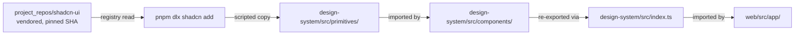

# Frontend development

This doc covers the Next.js app, the design-system workspace, and
Storybook. For the deep auth flow (NextAuth + Redsim-signed cookie),
see [`docs/architecture/auth.md`](../architecture/auth.md); for the
API surface the SPA consumes, see
[`docs/api/v1.md`](../api/v1.md).

## Workspace layout

```
pnpm-workspace.yaml             # root manifest
web/                            # @redsim/web — Next.js 14 app
  src/
    app/                        # App Router pages
    lib/                        # api(), auth helpers
    hooks/                      # useRoles, …
    server/                     # server-only modules (RSA mint)
  .storybook/                   # main.ts, preview.ts
  components.json               # shadcn registry config (points at vendored clone)
  tsconfig.json
  package.json
project_repos/
  design-system/                # @redsim/design-system — shared components
    src/
      components/               # Redsim-branded compositions + .stories.tsx
      primitives/               # dependency-free shadcn leaves (table/card/skeleton/alert/input/textarea)
      lib/utils.ts              # cn(...)
      index.ts                  # public surface
  shadcn-ui/                    # vendored upstream, pinned SHA (F15)
```

Everything is one workspace. From the repo root:

```bash
pnpm install --frozen-lockfile      # honours web/pnpm-lock.yaml
pnpm --filter @redsim/web dev        # next dev -p 3000
pnpm --filter @redsim/web typecheck
pnpm --filter @redsim/web build
pnpm --filter @redsim/web storybook
```

The web tsconfig's `paths` resolves `@redsim/design-system` to the
source folder so a `next dev` hot-reload picks up DS edits without a
build step.

## Design-system principles

- **Composed, not imported.** shadcn primitives live in
  `project_repos/design-system/src/primitives/`, then are wrapped by
  Redsim-branded compositions in `src/components/`. The web app imports
  only from `@redsim/design-system`'s public surface (`src/index.ts`),
  never from the vendored upstream directly.

- **Base primitive set.** The dependency-free shadcn leaves —
  `table`, `card`, `skeleton`, `alert`, `input`, `textarea` — are
  ported into `src/primitives/` and re-exported from `index.ts`
  alongside `ComponentProps<…>` type aliases (`TableProps`,
  `CardProps`, …). Their imports are rewritten to the workspace-local
  `../lib/utils`.

- **Radix / `cmdk` primitives.** The interactive leaves that pull a
  runtime dependency — `alert-dialog` and `tooltip`
  (`@radix-ui/react-alert-dialog`, `@radix-ui/react-dialog`,
  `@radix-ui/react-tooltip`) and `command` (`cmdk`) — now ship too.
  Those packages are in `web/pnpm-lock.yaml`, so `pnpm install
  --frozen-lockfile` resolves them in CI; the old lockfile gate is
  lifted. They back the confirm dialogs on destructive actions, the
  hover `Tooltip`s, and the Cmd/Ctrl-K command palette.

- **Storybook is the spec.** Every component exported from
  `index.ts` must have a story file co-located (`*.stories.tsx`). The
  CI `web-build` job now enforces a blocking `@redsim/design-system`
  typecheck plus the `@redsim/web` vitest suite, so the component layer
  must type-check and pass tests on every PR.

- **CSP-friendly.** No inline scripts in components. CSS-only badges
  and visual states pair with the v0.4.0 F14d report CSP that
  disallows script sources entirely.



## Component inventory

The first eight components shipped in `@redsim/design-system`. Each has
a story; every page in the web app uses at least one of them:

| Component         | Where it appears                                  |
|-------------------|---------------------------------------------------|
| `SeverityChip`    | dashboard, runs, findings                         |
| `RunStatusBadge`  | dashboard, runs                                   |
| `AuditChainBadge` | audit                                             |
| `FindingCard`     | findings detail                                   |
| `StageTimeline`   | runs detail (driven by the WS event stream)       |
| `EvidenceDiff`    | findings detail (when a patch is generated)       |
| `RoleGated`       | findings detail (Apply Patch / Verify buttons)    |
| `ToastList`       | global transient notifications                    |

The Radix / `cmdk` primitive leaves now back the interactive surfaces
added in the frontend-completion batch:

| Primitive     | Backing package(s)                                 | Where it appears                                              |
|---------------|----------------------------------------------------|--------------------------------------------------------------|
| `AlertDialog` | `@radix-ui/react-alert-dialog`, `react-dialog`     | confirm dialogs on destructive/active actions (cancel run, delete target, active agents/Kali tools) |
| `Tooltip`     | `@radix-ui/react-tooltip`                          | header controls, gated-button affordances                    |
| `Command`     | `cmdk`                                             | the Cmd/Ctrl-K command palette                               |

Each component carries `forwardRef`-free signatures and accepts
`className` for last-wins Tailwind merging via the `cn()` helper.

## Page inventory

| Page                       | Surfaces                                                                                                  |
|----------------------------|-----------------------------------------------------------------------------------------------------------|
| `/dashboard`               | run + finding overview                                                                                     |
| `/runs`, `/runs/[id]`      | run list + detail; **Cancel run** (`POST /v1/runs/{id}/cancel`, `remediator`); `report.json` / `report.md` download links + **Vulnfixer export** (`GET /v1/runs/{id}/exports/vulnfixer`) |
| `/findings`, detail        | finding list + detail; Apply Patch / Verify (`RoleGated`)                                                  |
| `/targets`                 | target list; **Delete target** (`DELETE /v1/targets/{id}`, `admin`, confirm dialog)                        |
| `/agents`                  | invoke a wired agent with a prompt (`POST /v1/agents/{name}/run`); `read` agents need `remediator`, active/offensive agents need `approver` + an explicit confirm |
| `/tools`                   | run a Kali tool (`POST /v1/tools/kali/{tool}`); `read` tools need `remediator`, active tools (`sqlmap`/`hydra`/`metasploit`/`wpscan`) need `approver` + an **Execute** toggle + confirm |
| `/audit`                   | audit-chain visualization — each chain rendered as linked blocks with valid/broken status + per-event hashes (`AuditChainBadge`) |
| `/projects`, settings      | project list + per-project settings                                                                       |
| `/logs`                    | terminal-style log viewer (`/v1/logs`)                                                                     |

Two cross-cutting UX affordances live in the app shell:

- **Dark mode.** A header theme toggle flips a `class`-strategy
  Tailwind dark theme, persisted to `localStorage`. (This is the app's
  own toggle; the MkDocs docs site has a separate Material toggle.)
- **Command palette.** Cmd/Ctrl-K opens a `cmdk`-backed palette for
  quick navigation between the pages above.

Destructive and active actions (cancel run, delete target, active
agents, active Kali tools) confirm through an `AlertDialog` before the
mutating call fires. Every such control is also wrapped in
`<RoleGated>`, and the server re-checks RBAC — the client gate is
cosmetic.

## `api()` helper

`web/src/lib/api.ts` is the single fetch wrapper every page uses.
Behaviour summary:

```ts
api<T>(path, init?)         // GET by default
api<T>(path, { method: "POST", body: JSON.stringify(...), headers: {…} })
```

- Auto-attaches `X-Redsim-Request-ID` per call.
- Bearer wins: when `localStorage.redsim_token` (or `init.token`) is
  set, `Authorization: Bearer …` is sent and `credentials: omit`.
- Otherwise `credentials: include` so the cookie rides, and on
  mutating methods the `X-Redsim-CSRF` header is auto-attached from
  the `redsim_csrf` cookie.
- Non-2xx surfaces as `ApiError(status, body)` — pages render the
  detail directly.

`useRoles()` (in `web/src/hooks/useRoles.ts`) wraps SWR around
`/v1/projects` and returns a `{roles, projects}` pair. `<RoleGated
minRole="approver" callerRole={roles[projectId]}>` is the canonical
gate the pages use.

## NextAuth

The Keycloak code flow lives at
`web/src/app/api/auth/[...nextauth]/route.ts`. The session callback
mints two cookies via the server-only `web/src/server/redsim-session.ts`:

- `redsim_api_session` — httpOnly + secure-in-prod + sameSite=Lax;
  RS256-signed via `jose`.
- `redsim_csrf` — NOT httpOnly so the SPA can read it.

There's also `/api/auth/refresh-api-session` (POST) for re-minting
without bouncing through Keycloak, and `/api/auth/signout-redsim`
(POST) for clearing both cookies during logout.

## Adding a new page

1. Add the route file under `web/src/app/<route>/page.tsx`. Mark it
   `"use client"` if it uses hooks.
2. Use `requireAuth(router)` at the top to bounce unauthenticated
   visitors to `/login`.
3. Fetch via `useSWR(authed ? "/v1/…" : null, fetcher)`.
4. Compose UI from `@redsim/design-system` — don't write a one-off
   badge inline.
5. Wrap any mutating control in `<RoleGated minRole=… callerRole=
   {roles[projectId]}>`.

## Adding a new design-system component

1. If it's a primitive shadcn already ships, generate it:

   ```bash
   pnpm --filter @redsim/design-system exec shadcn add <component>
   ```

   This drops a file under `src/primitives/`.

   If the primitive pulls a runtime dependency (Radix, `cmdk`, …), add
   that package to the workspace **first** — CI installs with
   `--frozen-lockfile` and can't fetch anything the lockfile is missing.
   `@radix-ui/react-alert-dialog`, `@radix-ui/react-dialog`,
   `@radix-ui/react-tooltip`, and `cmdk` are already in the lockfile
   (they back `AlertDialog` / `Tooltip` / `Command`).

2. Compose the Redsim-branded wrapper under `src/components/`; export
   from `src/index.ts`. Co-locate a `*.stories.tsx` file.

3. Update the table in this doc.

4. Type-check: `pnpm --filter @redsim/design-system run typecheck`
   (`tsconfig.build.json`, stories excluded). This is the blocking CI
   gate in `web-build`; the real component + primitive source must
   compile clean.

5. Storybook: `pnpm --filter @redsim/web storybook` to preview.

## Lock-file discipline (F2)

`web/pnpm-lock.yaml` is committed. CI re-derives it with
`pnpm install --frozen-lockfile`; drift fails the build. To add a
dependency:

```bash
pnpm --filter @redsim/web add <pkg>
pnpm --filter @redsim/design-system add <pkg>
git add web/pnpm-lock.yaml web/package.json …/package.json
```

## What's deferred

- Per-finding HTML report (smaller than the run-level).
- Storybook test-runner CI gate flip (after the second batch).
- Storybook a11y "serious-or-worse" gate.

Dark mode, the command palette, the `/agents` and `/tools` surfaces,
and the audit-chain visualization page have all shipped — see the
page inventory above.
