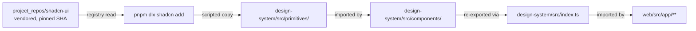

# Frontend development

This doc covers the Next.js app, the design-system workspace, and
Storybook. For the deep auth flow (NextAuth + Aegis-signed cookie),
see [`docs/architecture/auth.md`](../architecture/auth.md); for the
API surface the SPA consumes, see
[`docs/api/v1.md`](../api/v1.md).

## Workspace layout

```
pnpm-workspace.yaml             # root manifest
web/                            # @aegis/web — Next.js 14 app
  src/
    app/                        # App Router pages
    lib/                        # api(), auth helpers
    hooks/                      # useRoles, …
    server/                     # server-only modules (RSA mint)
  .storybook/                   # main.ts, preview.ts
  components.json               # shadcn registry config (points at vendored clone)
  tsconfig.json
  package.json
project_repos/
  design-system/                # @aegis/design-system — shared components
    src/
      components/               # Aegis-branded compositions + .stories.tsx
      primitives/               # generated from vendored shadcn (empty until you add)
      lib/utils.ts              # cn(...)
      index.ts                  # public surface
  shadcn-ui/                    # vendored upstream, pinned SHA (F15)
```

Everything is one workspace. From the repo root:

```bash
pnpm install --frozen-lockfile      # honours web/pnpm-lock.yaml
pnpm --filter @aegis/web dev        # next dev -p 3000
pnpm --filter @aegis/web typecheck
pnpm --filter @aegis/web build
pnpm --filter @aegis/web storybook
```

The web tsconfig's `paths` resolves `@aegis/design-system` to the
source folder so a `next dev` hot-reload picks up DS edits without a
build step.

## Design-system principles

- **Composed, not imported.** shadcn primitives are generated into
  `project_repos/design-system/src/primitives/` via `pnpm dlx shadcn
  add`, then wrapped by Aegis-branded compositions in
  `src/components/`. The web app imports only from `@aegis/design-
  system`'s public surface (`src/index.ts`), never from the vendored
  upstream directly.

- **Storybook is the spec.** Every component exported from
  `index.ts` must have a story file co-located (`*.stories.tsx`). The
  CI test-runner gate is off for v0.4.0 (incremental rollout) but
  flips on after the second batch of components lands.

- **CSP-friendly.** No inline scripts in components. CSS-only badges
  and visual states pair with the v0.4.0 F14d report CSP that
  disallows script sources entirely.



## v0.4.0 component batch

The first eight components ship in `@aegis/design-system`. Each has
a story; every page in the web app uses at least one of them:

| Component         | Where it appears                                  |
|-------------------|---------------------------------------------------|
| `SeverityChip`    | dashboard, runs, findings                         |
| `RunStatusBadge`  | dashboard, runs                                   |
| `AuditChainBadge` | audit                                             |
| `FindingCard`     | findings detail                                   |
| `StageTimeline`   | runs detail (driven by the WS event stream)       |
| `EvidenceDiff`    | findings detail (when a patch is generated)       |
| `RoleGated`       | findings detail (Apply Patch / Verify buttons)    |
| `ToastList`       | (reserved for v0.4.2 follow-on)                   |

Each component carries `forwardRef`-free signatures and accepts
`className` for last-wins Tailwind merging via the `cn()` helper.

## `api()` helper

`web/src/lib/api.ts` is the single fetch wrapper every page uses.
Behaviour summary:

```ts
api<T>(path, init?)         // GET by default
api<T>(path, { method: "POST", body: JSON.stringify(...), headers: {…} })
```

- Auto-attaches `X-Aegis-Request-ID` per call.
- Bearer wins: when `localStorage.aegis_token` (or `init.token`) is
  set, `Authorization: Bearer …` is sent and `credentials: omit`.
- Otherwise `credentials: include` so the cookie rides, and on
  mutating methods the `X-Aegis-CSRF` header is auto-attached from
  the `aegis_csrf` cookie.
- Non-2xx surfaces as `ApiError(status, body)` — pages render the
  detail directly.

`useRoles()` (in `web/src/hooks/useRoles.ts`) wraps SWR around
`/v1/projects` and returns a `{roles, projects}` pair. `<RoleGated
minRole="approver" callerRole={roles[projectId]}>` is the canonical
gate the pages use.

## NextAuth

The Keycloak code flow lives at
`web/src/app/api/auth/[...nextauth]/route.ts`. The session callback
mints two cookies via the server-only `web/src/server/aegis-session.ts`:

- `aegis_api_session` — httpOnly + secure-in-prod + sameSite=Lax;
  RS256-signed via `jose`.
- `aegis_csrf` — NOT httpOnly so the SPA can read it.

There's also `/api/auth/refresh-api-session` (POST) for re-minting
without bouncing through Keycloak, and `/api/auth/signout-aegis`
(POST) for clearing both cookies during logout.

## Adding a new page

1. Add the route file under `web/src/app/<route>/page.tsx`. Mark it
   `"use client"` if it uses hooks.
2. Use `requireAuth(router)` at the top to bounce unauthenticated
   visitors to `/login`.
3. Fetch via `useSWR(authed ? "/v1/…" : null, fetcher)`.
4. Compose UI from `@aegis/design-system` — don't write a one-off
   badge inline.
5. Wrap any mutating control in `<RoleGated minRole=… callerRole=
   {roles[projectId]}>`.

## Adding a new design-system component

1. If it's a primitive shadcn already ships, generate it:

   ```bash
   pnpm --filter @aegis/design-system exec shadcn add <component>
   ```

   This drops a file under `src/primitives/`.

2. Compose the Aegis-branded wrapper under `src/components/`; export
   from `src/index.ts`. Co-locate a `*.stories.tsx` file.

3. Update the table in this doc.

4. Storybook: `pnpm --filter @aegis/web storybook` to preview.

## Lock-file discipline (F2)

`web/pnpm-lock.yaml` is committed. CI re-derives it with
`pnpm install --frozen-lockfile`; drift fails the build. To add a
dependency:

```bash
pnpm --filter @aegis/web add <pkg>
pnpm --filter @aegis/design-system add <pkg>
git add web/pnpm-lock.yaml web/package.json …/package.json
```

## What's deferred (v0.4.2+)

- Dark mode.
- Audit chain visualisation page.
- Per-finding HTML report (smaller than the run-level).
- Storybook test-runner CI gate flip (after the second batch).
- Storybook a11y "serious-or-worse" gate.
