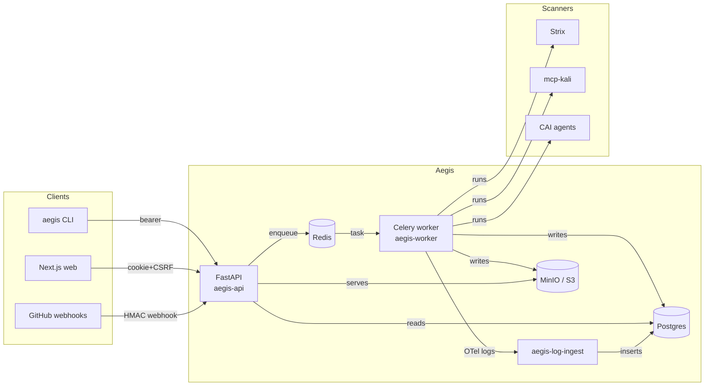

# Aegis docs

Reference documentation for the Aegis security platform. For project
overview, quickstart, and the doc map see the
[README on GitHub](https://github.com/example/aegis/blob/main/README.md);
this site is the deep reference for architecture, API, ops, and
development.

---

## Browse by topic

- :material-source-branch:{ .lg .middle } **Architecture**

    ---

    System context, deployment topology, the v0.3.1 F6 admission +
    execution split, plus deep dives on auth, the hash-chained audit
    log, and the observability pipeline.

    [Start with the overview →](architecture/overview.md)

- :material-api:{ .lg .middle } **API reference**

    ---

    Every `/v1/*` route grouped by RBAC tier — open, authenticated,
    scanner+, remediator+, approver+, admin. Plus the WebSocket
    upgrade contract and the GitHub webhook receiver.

    [Open the catalog →](api/v1.md)

- :material-server-network:{ .lg .middle } **Operations**

    ---

    Production deployment runbook: env vars by concern, image
    builds, first-deploy checklist, rotation procedures for the
    three secret materials.

    [Read the runbook →](ops/deploy.md)

- :material-code-tags:{ .lg .middle } **Development**

    ---

    Local compose profiles, the pnpm workspace + `@aegis/design-
    system`, Storybook conventions, and how to edit the docs.

    [See the local stack →](dev/local-stack.md)

- :material-shield-check:{ .lg .middle } **Security**

    ---

    Fork-PR restricted-mode policy. For the overall hardening
    posture see [SECURITY.md](https://github.com/example/aegis/blob/main/SECURITY.md)
    at the repo root.

    [Fork-PR safety →](security/fork-prs.md)

- :material-file-document-multiple:{ .lg .middle } **ADRs**

    ---

    Architectural decisions that need design rationale beyond a
    commit message.

    [Browse decisions →](adr/0001-vendored-submodules.md)

---

## Release history

| Release        | Theme                                | Tag      |
|----------------|--------------------------------------|----------|
| Phase 2        | Offline CLI: discover → fix → verify | (no tag) |
| Phase 3        | Multi-user backend platform          | `v0.3.0` |
| Phase 4 v0.3.1 | Stabilization (audit, admission)     | `v0.3.1` |
| Phase 4 v0.4.0 | Identity & UX (NextAuth, design sys) | `v0.4.0` |
| Phase 4 v0.4.1 | Observability + GitHub PR scoping    | `v0.4.1` |

[Full changelog →](https://github.com/example/aegis/blob/main/CHANGELOG.md)

---

## A snapshot of the platform

The [architecture overview](architecture/overview.md) goes into
every layer with sequence diagrams + ER diagrams.
